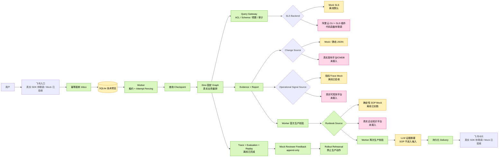

# 日志 Agent 当前能力与真实系统接入盘点

| 项目 | 内容 |
| --- | --- |
| 盘点日期 | 2026-08-24 |
| 代码基线 | 当前仓库工作树（受治理 SOP 人工核查主体代码已加入） |
| 当前结论 | 主体业务链、治理、证据、恢复、M4-B 本地可靠性治理、评测、回放、Mock Reviewer 反馈、非行动性灰度演练、LLM 摘要与额度、Mock 指标/Trace 时间线和 Mock SOP 人工核查已经实现；SOP Mock E2E 与全仓测试已各实跑通过一次，真实可观测源、真实 `RunbookSource` 与内容治理、真实方舟联调、M4-C 生产基础设施和真实试点仍未完成 |
| 数据边界 | 当前自动化路径使用合成日志、合成飞书身份、合成变更、合成指标/Trace 聚合、确定性 Mock SOP 和合成标签，不代表真实生产效果或企业知识内容 |
| 验证边界 | 第二轮严格门禁及两个 fail-closed 边界落地后的最终工作树已完成 `gofmt`、全仓测试、`go vet`、重点包乱序 20 轮、仓库链接/diff、`mock-e2e`、`demo`、两类评测与快照/replay/比较/反馈/灰度演练总检；Runbook 为 1 次调用/1 项/3 步，SLS 为 2 次观察/8 次 Provider 调用/0 次外部网络，安全复查未发现 P0–P3。race 因 `CGO_ENABLED=0` 且无 GCC 未执行 |

## 1. 一句话概括

这个项目已经是一套能完整运行的“证据驱动日志调查引擎”：它能接单、排队、查询当前/基线、生成证据、做保守判断、关联变更、整理 Mock 指标/Trace 时间线、附加 Mock SOP 人工核查、生成受约束摘要、更新飞书卡片、处理查询恢复、死信安全重放和租户成本代理治理，并对自身进行离线评测、回放、Mock 审核和灰度演练；除真实系统外，主要仍缺 M4-C 生产基础设施、真实跨信号连接器、真实企业知识连接器与内容治理。

## 2. 状态说明

本文使用四种状态，避免把“代码写了”误解成“生产已经接通”。

| 状态 | 含义 |
| --- | --- |
| 已完成 | 主体代码与离线测试已完成，不依赖真实外部系统 |
| 代码已具备，待真实联调 | 已有真实 SDK/适配器和启动入口，但仓库没有真实凭据与试点验收记录 |
| Mock 可验收 | 用合成数据替代外部系统，能够验证内部业务链和接口契约 |
| 未实现 | 只有规划或接口方向，当前不能使用 |

## 3. 当前全景图



⭐ 这里是重点：Mock 只替代“外部系统返回什么”和“消息实际发到哪里”，不会绕开真实的 Intake、SQLite 状态机、Worker、Eino Graph、Query Gateway、Evidence、Checkpoint、Delivery 和评测逻辑。

## 4. 已实现功能统计

| 功能 | 当前状态 | 怎么实现 | 主要源码 | 已达到的效果 |
| --- | --- | --- | --- | --- |
| 严格调查命令 | 已完成 | 解析 `/investigate <service> <environment> <duration>`，生成受控时间窗 | `internal/command`、`internal/adapters/feishu/receiver.go` | 用户不能直接提交 Project、LogStore、SQL 或 SPL |
| 飞书消息接收 | 代码已具备，待真实联调 | 官方飞书 Go SDK WebSocket 接收消息和卡片回调，入口只做标准化与持久化 | `internal/adapters/feishu/receiver.go` | 真实应用接入后可从单聊或群聊命令创建调查 |
| 入站幂等 | 已完成 | `(app_id, tenant_key, message_id)` 唯一接单，调查与 Job 在同一事务创建 | `internal/application/intake.go`、`internal/adapters/sqlite/store.go` | 飞书重复投递不会产生重复调查 |
| 调查任务状态机 | 已完成 | `QUEUED -> RUNNING -> SUCCEEDED/FAILED/CANCELLED/NEEDS_REVIEW` | `internal/application/worker.go`、`internal/adapters/sqlite/store.go` | 调查过程可恢复、可审计，不靠内存保存状态 |
| Worker 租约与旧进程隔离 | 已完成 | Worker ID、租约、Attempt fencing token、续租与过期重领 | `internal/application/worker.go`、`internal/adapters/sqlite/store.go` | 旧 Worker 恢复后不能覆盖新 Worker 的结果 |
| Eino 固定 Graph | 已完成 | 固定执行计划、查询、报告、变更关联节点；Eino 只负责流程编排 | `internal/adapters/eino/engine.go` | 调查逻辑可测试且不依赖 LLM 自由发挥 |
| SLS 资源目录与 ACL | 已完成；真实配置待录入 | `service/environment` 映射到受控资源，Principal 到 ResourceID 静态授权 | `internal/adapters/resourcecatalog/catalog.go` | 用户不能越权切换 Project/LogStore |
| 查询治理网关 | 已完成 | 统一做资源解析、ACL、Schema、模板、窗口、行数、调用数、并发、超时、成本代理和审计 | `internal/application/query/gateway.go` | 所有 SLS 查询必须先经过同一个安全闸门 |
| 阿里云 SLS 查询 | 代码已具备，待真实联调 | 本机 CLI + SLS 插件，固定执行 count-before、Top5 错误、Top5 实例、count-after | `internal/adapters/aliyuncli/backend.go` | 真实接入后只返回聚合证据，不返回原始日志正文 |
| 当前/基线错误分析 | 已完成 | 两个等长时间窗，每窗四次固定聚合；首尾 count 必须一致 | `internal/adapters/eino/engine.go`、`internal/domain/query.go` | 能识别突增、错误模式占比、实例集中和数据不足 |
| 近实时安全水位 | 已完成 | 查询窗口结束时间向前扣除 ingestion grace，Gateway 再次 fail closed | `internal/command`、`internal/application/query/gateway.go` | 减少日志尚未完成索引时产生的过度自信结论 |
| Evidence 证据链 | 已完成 | Finding、Recommendation、Cause Ledger 都必须引用同一报告中的 Evidence/Change ID | `internal/domain/types.go`、`internal/application/worker.go` | 每个结论都能追溯查询窗口、模板、质量和来源 |
| 保守结论门禁 | 已完成 | Incomplete、截断、非穷尽、脱敏冲突或治理身份不一致时禁止确定性根因表述 | `internal/adapters/eino/engine.go`、`internal/application/worker.go` | 数据不足时输出 `data_insufficient/INCONCLUSIVE`，不会猜根因 |
| 发布/配置变更关联 | 已完成静态切片 | 读取受控 Change Catalog，对每个候选执行 4 项支持和 3 项反证测试 | `internal/adapters/changecatalog/catalog.go`、`internal/adapters/eino/engine.go` | 输出 `SUPPORTED_CANDIDATE/REFUTED/INCONCLUSIVE`，不宣称因果 |
| 跨信号故障时间线 | Mock 已验收 | 从 Evidence 派生资源/时间，一次获取有界指标/Trace 聚合，本地计算异常并与 Change Event 稳定排序 | `internal/domain/incident_timeline.go`、`internal/adapters/eino/incident_timeline.go`、`internal/adapters/signalmock` | Mock 主链生成 1 个变更+2 个信号条目；时间相关不等于因果，真实源待接 |
| 受治理 SOP 人工核查 | Mock 可验收（安全加固后已实跑） | Worker 首次验证后，严格绑定固定模板、治理身份与可信 Job 请求窗口；baseline=0 零调用；再经 Resource Catalog ACL 和独立 5 秒边界查询 `RunbookSource`，由可信组装层写入来源并以双时钟校验条目 | `internal/application/runbook.go`、`internal/application/runbook_validation.go`、`internal/adapters/runbookmock` | Mock 形成 1 项 3 步 `HUMAN_REVIEW_ONLY/SYNTHETIC_MOCK` 指引；飞书 SOP 区块标题带“（Mock）”，无 URL、命令、按钮或自动处置，真实知识源待接 |
| 飞书结果卡片 | 代码已具备，待真实联调 | 持久化 Delivery Worker 先 Reply 创建卡片，再 Patch 同一张卡 | `internal/application/delivery.go`、`internal/adapters/feishu/sender.go` | 真实接入后可看到接单、运行、成功、失败、证据和下一步 |
| 卡片动作 | 已完成业务逻辑；真实 UI 待联调 | 查看证据、取消、扩大窗口、重新运行、成本确认重跑均做身份和状态校验 | `internal/application/actions.go`、`internal/adapters/feishu/receiver.go` | 按钮不能携带物理资源或绕过请求者权限 |
| 付费查询 Checkpoint | 已完成 | `sls.current/sls.baseline` 保存治理指纹、输入哈希和规范化结果 | `internal/application/checkpoint_executor.go`、`internal/adapters/sqlite/query_steps.go` | 崩溃恢复时复用已完成窗口，只补缺失窗口 |
| 外部结果未知保护 | 已完成 | 请求可能已到 Provider 但未落盘时转 `UNKNOWN -> NEEDS_REVIEW`，禁止自动重发 | `internal/application/checkpoint_executor.go`、`internal/adapters/sqlite/query_steps.go` | 避免静默重复付费查询；用户需明确确认成本后重跑 |
| 查询与交付审计 | 已完成 | 查询 start/terminal 审计、Evidence Ledger、Delivery 状态都持久化 | `internal/adapters/sqlite` | 能定位查询、证据、报告和卡片状态，不记录原始日志/密钥 |
| 全 Mock 端到端 | Mock 可验收（本轮已实跑） | Mock 飞书、SLS、指标/Trace、Runbook 与摘要复用真实业务链和 SQLite | `cmd/logagent/mock_e2e.go`、`internal/adapters/feishumock`、`internal/adapters/slsmock`、`internal/adapters/runbookmock` | 实测保持 2 个 SLS 观察、8 次 Provider 代理和 0 网络，并增加 1 次 Runbook 查询、1 项 3 步人工指引 |
| 合成黄金集评测 | 已完成 | 5 类严格 Fixture 运行真实 Eino Graph，对结果、证据、建议、Cause、成本和 Trace 做门禁 | `internal/evaluation`、`internal/adapters/evalmock` | 当前合成集 5/5 通过；失败门禁返回非零退出码 |
| Agent 自观测 | 已完成离线切片 | 关闭枚举的 RUN/GRAPH_NODE/TOOL Span，有界 Recorder 和版本清单 | `internal/observability`、`internal/domain/agent_trace.go` | 评测可验证固定执行路径、调用数、字节数和事件完整性 |
| 离线快照与回放 | 已完成 | append-only JSON 快照、SHA-256、严格 Schema、父引用和当前二进制重跑 | `internal/evaluation/replay`、`internal/adapters/replayfs` | 成功/失败评测可归档；重复、篡改和不兼容输入会拒绝 |
| 兼容快照比较 | 已完成 | 只读比较版本、Gate、Case、质量、成本代理、工具和 Trace；不兼容时 delta-free | `internal/evaluation/replay/compare.go`、`cmd/logagent/evaluate.go` | 可识别新增失败、恢复和固定方向回归；不执行 Graph 或网络 |
| Mock Reviewer 反馈账本 | 已完成 | 严格记录绑定快照/Case/Reviewer，内容哈希、append-only 纠正链和活动投影 | `internal/evaluation/feedback`、`internal/adapters/feedbackfs` | 两名虚拟 Reviewer 覆盖五个 Case；篡改、分叉、循环和跨边界纠正 fail closed |
| 离线灰度决策演练 | 已完成 | 组合 B3 比较、活动反馈、quorum 和版本化策略，输出关闭状态/原因码 | `internal/evaluation/rollout`、`cmd/logagent/rollout.go` | 只产生 `SYNTHETIC_MOCK` 演练结论，永远禁止生产动作 |
| LLM 证据摘要 | Mock 已验收；方舟代码待真实联调 | Worker 校验后构造隐私安全投影，模型只能引用已有 Evidence/候选/建议，失败走确定性 fallback | `internal/application/summary.go`、`internal/adapters/summarymock`、`internal/adapters/volcark` | Mock 主链 0 网络；真实启用后可生成更易读摘要，但不能改变事实、权限和处置 |
| LLM 摘要安全评测 | 已完成离线切片 | 9 类严格场景实际运行 Eino Graph 与生产 SummaryService，覆盖异常、恶意引用、危险动作和敏感出站阻断 | `internal/evaluation/summaryeval`、`internal/adapters/summaryevalmock`、`cmd/logagent/summary_evaluate.go` | 当前 9/9 通过、8 次 Mock Provider 调用、敏感 Case 0 调用、Token/凭据/网络为 0；不代表真实模型质量 |
| LLM 请求/Token 额度 | 已完成 SQLite 技术预览 | 可信租户固定窗预留请求/Token，成功结算实际用量，不确定结果保留预留成本 | `internal/application/summary.go`、`internal/adapters/sqlite/summary_quota.go` | Mock 主链 1 请求/0 Token；真实 Token、价格与生产全局额度待校准 |

## 5. 哪些部分目前用 Mock，分别负责什么

| 外部边界 | 当前 Mock | Mock 负责替代什么 | 内部仍走的真实代码 | 真实接入状态 |
| --- | --- | --- | --- | --- |
| 飞书入站 | `feishumock` 构造可信消息 | App/Tenant/User/Chat/Message 和用户命令 | Intake、幂等事务、调查/Job 创建 | 官方 SDK Receiver 已实现，待企业应用联调 |
| 飞书出站 | `feishumock.Sender` 记录 Reply/Patch | 飞书 OpenAPI 返回和远端 Message ID | Delivery Outbox、租约、顺序、卡片渲染 | 官方 SDK Sender 已实现，待真实卡片视觉与限流联调 |
| 阿里云 SLS | `slsmock` / `evalmock` 返回固定聚合 | Schema、当前/基线错误数、Top5 模式/实例、Provider usage | Resource/ACL Gateway、预算、审计、Checkpoint、Evidence、Graph | `aliyuncli` 已实现，待试点 Project/LogStore 联调 |
| 飞书身份与资源授权 | Mock Principal + Mock Catalog | 真实 AppID、TenantKey、OpenID 和资源绑定 | ACL 决策和 fail-closed 行为 | 需把真实飞书身份写入管理员资源目录 |
| 发布/配置变更 | Demo/Fixture ChangeSet，或管理员静态 JSON | 发布事件、版本、负责人、影响实例 | 七项支持/反证规则和 Evidence Ledger | 静态 JSON 可用；真实发布平台/CMDB 连接器未实现 |
| 指标/Trace 调查信号 | `signalmock` 固定错误率与 P95 延迟聚合 | ARMS/CMS/Prometheus/OTel 的受控聚合结果 | Evidence 派生查询、闭集校验、异常复算、Worker 引用门禁和飞书时间线 | 端口与 Mock 已实现；真实连接器、额度、审计和试点未实现 |
| SOP/知识指引 | `runbookmock` 固定返回版本化的一项三步人工核查条目；可信组装标记 `SYNTHETIC_MOCK` | Wiki、文档平台、错误码平台或企业搜索的受控匹配结果；可信组装标记 `ENTERPRISE_GOVERNED` | 严格 Evidence/Job 窗口绑定、Worker 首次/二次校验、Recommendation/Evidence 派生、内容指纹、独立超时、可信时钟、安全状态和带来源标题的飞书纯文本展示 | 端口、应用服务与 Mock 已实现；真实 `RunbookSource`、内容治理、租户权限、审计和质量评测未实现 |
| 历史故障与专家标签 | `synthetic-v1.json` | 历史事故、专家期望、成本代理 | 真实 Graph、结果校验、Trace、评测门禁 | 真实脱敏数据集和专家标注流程未实现 |
| Reviewer 反馈与灰度策略 | `feedback-seed` + 固定策略 | 两名虚拟 Reviewer、Verdict/Reason、quorum 与演练阈值 | 严格快照引用、append-only 纠正、B3 对比和决策状态机 | 真实 Reviewer 身份、UI、团队策略和生产动作未实现 |
| Agent Trace 后端 | 内存 `BoundedRecorder` + 本地回放文件 | 生产 Trace Collector、检索、保留和告警 | Span 合同、版本指纹、完整性检查 | 真实 OTel/AgentSight/可观测后端未实现 |
| LLM Provider | `summarymock` 生成确定性引用摘要 | 火山方舟模型响应、Token 和时延 | Worker 前后校验、严格 JSON/引用门禁、fallback、飞书渲染 | 方舟 Responses API 适配器已实现；真实 Key/模型/Prompt/留存/成本待验收 |

### 5.1 不是 Mock，但仍不能直接称为生产能力的部分

| 部分 | 当前情况 | 为什么还不能称为生产就绪 |
| --- | --- | --- |
| SQLite | 是真实持久化实现，不是 Mock | 没有正式迁移工具、生产备份恢复、多实例全局配额和数据库故障转移验收 |
| 静态 Resource Catalog | 是真实治理配置 | 尚未录入和验证公司的真实 SLS 资源、字段、RAM 权限与用户绑定 |
| 静态 Change Catalog | 是可运行的管理员配置 | 不是实时发布平台/配置中心/CMDB，存在人工同步时效问题 |
| 飞书 SDK / SLS CLI 适配器 | 是真实代码 | 没有仓库可公开保存的真实凭据、试点环境结果和真实网络故障演练 |
| Eino Graph | 是真实确定性编排 | LLM 摘要位于 Worker 后处理，不进入 Graph 决策；真实模型质量与费用仍待验收 |

## 6. 真实系统分别负责什么，应该怎么接入

### 6.1 阿里云 SLS

#### 负责什么

- 提供真实 LogStore Schema。
- 对当前窗口和基线窗口执行固定聚合。
- 返回本地执行 ID，以及 CLI 暴露的 Progress、处理行数、处理字节和耗时等查询元数据；Provider Request ID 不保证存在且不会伪造。
- 不向 Agent 返回原始日志正文。

#### 当前怎么实现

- Mock：`internal/adapters/slsmock` 和 `internal/adapters/evalmock`。
- 真实适配器：`internal/adapters/aliyuncli/backend.go`。
- 统一治理入口：`internal/application/query/gateway.go`。
- 启动组装：`cmd/logagent/sls.go` 的 `buildWorkerExecutor/buildAliyunDependencies`。

#### 怎么接入

1. 复制并填写 `config/sls-resources.example.json`，每个试点资源固定 Endpoint、Project、LogStore、selectors、error selector、error field、instance field 和 bindings。
2. 创建资源级只读 RAM 权限，通过 SSO 获取短期 STS 并写入本机 CLI `StsToken` Profile；不要把 AK/Token 写进 Catalog、环境文件或 Git。
3. 设置：

```powershell
$env:LOG_AGENT_SLS_MODE = "aliyun"
$env:LOG_AGENT_SLS_CATALOG = ".\config\sls-resources.json"
$env:LOG_AGENT_SLS_CLI_PROFILE = "default"
$env:LOG_AGENT_SLS_ECS_RAM_ROLE_NAME = "<role-name>"
```

4. 先只检查元数据：

```powershell
go run ./cmd/logagent sls-check
```

5. 再用 Catalog 中已授权的 Smoke 身份执行一个小窗口：

```powershell
$env:LOG_AGENT_SMOKE_APP_ID = "<app-id>"
$env:LOG_AGENT_SMOKE_TENANT_KEY = "<tenant-key>"
$env:LOG_AGENT_SMOKE_USER_ID = "<open-id>"
go run ./cmd/logagent sls-smoke order-service prod 10m
```

6. 检查通过后启动 `worker`，继续保留固定时间窗、4 次 API、12 行、处理字节、并发和超时门禁。

#### 预期效果

- 报告中的 120/20 等 Mock 数字替换为真实试点 LogStore 聚合结果。
- Evidence 带真实 ResourceID、Schema/模板/策略指纹、本地执行 ID 和完整性元数据；Provider Request ID 仅在 CLI 明确返回时进入查询审计。
- 越权、字段不满足统计、窗口/预算超限在请求前拒绝；Incomplete/超成本结果不生成确定性结论。

### 6.2 飞书企业自建应用

#### 负责什么

- 接收用户调查命令和按钮回调。
- 提供可信 App、Tenant、User、Chat、Message 身份。
- 展示接单、运行、结果、证据、取消、扩大窗口和重跑卡片。

#### 当前怎么实现

- Mock：`internal/adapters/feishumock`。
- 真实适配器：`internal/adapters/feishu/receiver.go` 和 `sender.go`。
- 业务用例：`internal/application/intake.go`、`actions.go`、`delivery.go`。
- 进程入口：`cmd/logagent/main.go` 的 `runFeishu`。

#### 怎么接入

1. 创建飞书企业自建应用并启用机器人。
2. 配置 WebSocket 长连接、事件 `im.message.receive_v1` 和回调 `card.action.trigger`。
3. 申请单聊、群内 @ 消息读取以及机器人发消息所需的最小权限。
4. 设置：

```powershell
$env:FEISHU_APP_ID = "<app-id>"
$env:FEISHU_APP_SECRET = "<secret>"
$env:LOG_AGENT_DB_PATH = ".\data\logagent.db"
```

5. 分别启动两个进程，并共享同一数据库：

```powershell
go run ./cmd/logagent feishu
go run ./cmd/logagent worker
```

6. 用允许范围内的用户发送 `/investigate order-service prod 30m`，验证 Reply -> Running Patch -> Terminal Patch、按钮权限和重复事件幂等。

#### 预期效果

- 用户不再通过 CLI，而是在飞书发起和查看调查。
- 同一飞书事件只创建一个调查；卡片始终更新同一个 Message。
- 用户可以查看证据、取消、扩大窗口、重跑；未知付费查询必须走成本确认按钮。

### 6.3 生产数据库

#### 负责什么

- 保存 Inbox、Investigation、Job、Evidence、Report、Ledger、Query Audit、Query Step、Delivery 和 Interaction。
- 为多进程提供事务、唯一约束、租约和 Attempt fencing。
- 提供备份恢复、迁移、容量与故障转移能力。

#### 当前怎么实现

- 当前实现：`internal/adapters/sqlite`。
- 消费接口：`ports.Store`、`ports.QueryStepStore`、`ports.QueryAuditor`、`ports.DeliveryStore`、`ports.InteractionResolver`。
- 组装位置：`cmd/logagent/main.go` 的 `runWorker/runFeishu`。

#### 怎么接入

1. 选择公司生产关系库和迁移工具，例如 PostgreSQL/MySQL + 版本化 migration。
2. 新增适配器目录，例如 `internal/adapters/<production-db>`，实现上述五组端口；不要改上层 Eino 或业务用例。
3. 把 SQLite 中的唯一键、事务边界、租约、attempt 条件和 append-only 约束逐项迁移成数据库约束。
4. 在启动组装处按配置选择 SQLite 或生产 Store。
5. 执行双连接/多实例并发、故障恢复、备份恢复、schema 升降级和容量测试。

#### 预期效果

- Worker 与飞书进程可以部署在不同实例，不依赖共享本地文件。
- 多实例领取、续租、取消、Checkpoint 和 Delivery 具备生产级一致性基础。
- 数据库升级可回滚，调查历史和审计不会因重建本地文件丢失。

### 6.4 发布平台、配置中心和 CMDB

#### 负责什么

- 提供真实发布/配置变更时间、版本、负责人和受影响实例。
- 让 Agent 验证“错误突增是否与某个变更在时间和实例上相关”。

#### 当前怎么实现

- 接口：`ports.ChangeSource`。
- 静态实现：`internal/adapters/changecatalog`。
- 未配置时：`Disabled` 返回 `UNAVAILABLE`，不破坏基础错误报告。

#### 怎么接入

1. 为公司发布平台实现新的 `ChangeSource.List` 适配器。
2. 查询的 ResourceID 和时间窗必须来自已验证 Evidence，不能来自飞书按钮或模型文本。
3. 将平台字段转换为关闭的 `RELEASE/CONFIG` 事件模型，并限制返回数量、字符串长度和影响实例规模。
4. 调用失败、分页不完整、影响范围未知时返回不完整状态，不伪造“没有变更”。
5. 在 `buildChangeSource` 增加配置驱动的实现选择。

#### 预期效果

- 报告中的变更候选来自真实发布/配置记录，而不是 Fixture。
- 仍然只输出“关联候选”，支持证据、反证和未知项同时展示。
- 变更平台故障不会让已经成立的日志事实失败。

### 6.5 业务指标与 Trace 信号源

#### 负责什么

- 为同一受控资源和观察窗口提供错误率、P95 延迟等结构化聚合。
- 让排障人员在日志和变更之外看到指标、Trace 的时间关系，但不直接输出因果结论。

#### 当前怎么实现

- 端口：`ports.OperationalSignalSource`。
- Mock：`internal/adapters/signalmock`，固定返回一个指标错误率和一个 Trace P95 延迟观察。
- 编排与验证：`internal/adapters/eino/incident_timeline.go`、`internal/application/incident_timeline_validation.go`。
- 展示：`internal/adapters/feishu/renderer.go`。

#### 怎么接入

1. 为选定的 ARMS、CMS、Prometheus 或 OTel 后端实现独立 Adapter；不要把 SDK 放入 Eino、Worker 或飞书包。
2. 只接收由 Evidence 派生的 `resource_id/start/end/limit`，通过管理员目录解析真实后端资源。
3. 把后端结果归一成关闭的错误率或 P95 延迟观察；禁止返回原始 Span、TraceID、标签、任意属性和 Provider 文案。
4. 在生产组装中显式注入 `eino.WithOperationalSignalSource`，并在启用前补齐超时、租户额度、审计、结果未知和可观测策略。
5. 用脱敏历史事故校准时间对齐与异常阈值，再进入真实飞书试点。

#### 预期效果

- 飞书报告按时间展示变更、指标和 Trace 聚合，同时保留完整 Evidence 引用。
- 可选源故障不会破坏日志事实；不完整覆盖会明确降级。
- 用户能更快定位需要下钻的方向，但系统仍不会把时间重合写成已确认根因。

### 6.6 企业 SOP 与错误码知识源

#### 负责什么

- 把已验证的确定性 Recommendation 映射为团队维护、有版本和 Owner 的人工核查步骤。
- 提供内容来源、Revision、更新时间和失效边界，但不能把匹配结果升级为根因、审批或处置授权。

#### 当前怎么实现

- 端口：`ports.RunbookSource`。
- Mock：`internal/adapters/runbookmock`，只选择 `VERIFY_ERROR_PATTERN / OBSERVE_HOT_INSTANCE / ESCALATE_SERVICE_OWNER` 三个关闭 Code；类型和展示 Instruction 由本地固定模板约束，不访问网络。
- 应用与门禁：`internal/application/runbook.go`、`internal/application/runbook_validation.go`。Worker 先验证 Eino 确定性报告，Enrich 后再次验证，再进入摘要阶段。
- Evidence 与请求绑定：current/baseline 必须使用固定 `error_analysis_v2` 模板，具备完整 Query/Schema/Policy/Governance 元数据，治理身份一致、QuerySpecHash 不同、窗口连续等长，并精确等于可信 Job 请求的当前窗口和前置等长基线窗口；只看 `Complete=true` 不足以触发查询。
- 资源与建议信任：应用用可信 Job 的 service/environment/requester 重新解析 `ResourceCatalog` 并执行 `Allowed`，要求目录资源等于 Evidence ResourceID；同时重算关闭 Recommendation 集合，只接受与报告 Code/Evidence 绑定精确一致的项。baseline 为 0 时保持 `data_insufficient`，零 Runbook Source 调用。
- 来源、超时与时钟：`RunbookGuidance.data_source` 由 `NewRunbookService` 的可信启动组装层指定为 `SYNTHETIC_MOCK / ENTERPRISE_GOVERNED`，Source 无权自报；每次 Lookup 有独立默认 5 秒子超时，返回后会在本地 cancel 前检查 Deadline，超时后的 `(set, nil)` 也拒绝。条目更新时间同时受报告时间和可信服务时钟的 5 分钟偏差上限约束。
- 展示：`internal/adapters/feishu/renderer.go` 最多展示两项、每项三步，并固定声明“仅供人工核查，不会自动执行处置”；`SYNTHETIC_MOCK` 标题明确显示“受控 SOP 参考（Mock）”。空值或非法来源只显示来源未确认的不可用文案，不展示条目。
- 当前只在 Demo、`LOG_AGENT_SLS_MODE=mock` Worker 和 `mock-e2e` 注入 Mock；真实 SLS 模式不注入，因此不会把 Mock SOP 混入真实日志调查。
- `SKIPPED_NO_TRIGGER` 只用于没有确定性错误突增；已有确定性突增但 Recommendation 缺失或治理资源不一致时零调用并返回 `UNAVAILABLE`。

#### 怎么接入

1. 先建立企业知识条目的 Owner、Revision、审批、失效、回滚、租户范围和保留制度。
2. 为选定的 Wiki/文档/错误码平台实现独立 `RunbookSource.Lookup` Adapter；只接收 Evidence 派生的逻辑 ResourceID、已有 Recommendation Code 和固定上限。
3. 复用与 SLS 查询一致的 `ResourceCatalog` 与 requester ACL；禁止 Adapter 根据用户正文、模型文本或 Provider 自报资源扩大知识空间。
4. 只返回关闭投影；首个合同继续禁止 URL、Markdown 链接、Shell/SQL、危险命令、执行参数和任意属性，步骤只能选择关闭 Code。
5. 真实接入仍由启动组装层配置显式模式、只读身份和审计，并由该可信层向 `NewRunbookService` 传入 `ENTERPRISE_GOVERNED`；禁止 Adapter 或知识条目自报来源。保留独立默认 5 秒 Lookup Deadline，真实 Adapter/传输层必须遵守并设置响应上限；未配置、Source 自身超时、权限不足、不完整或非法数据必须降级 Guidance，不能使原调查失败，只有父 Context 真正取消才传播。
6. 注入可信服务时钟并用脱敏历史事故和专家标签评估覆盖率、误匹配、内容时效和误导风险；条目更新时间晚于报告时间或可信服务时间任一方 5 分钟以上都必须拒绝。该门禁只能防未来时间伪造，不能证明内容真实、获批或未失效，评审通过前不进入真实飞书卡片。

#### 预期效果

- 值班人员在确定性建议之后看到可追溯的人工核查清单，而不是搜索一堆未经限定的文档。
- Source 故障或无匹配不改变日志事实、变更候选、跨信号时间线和调查成功状态。
- 真实企业来源使用普通“受控 SOP 参考”标题；只有合成目录使用带“（Mock）”标题，两者不能由 Source 混淆。
- 系统始终没有 Runbook Executor、执行按钮或自动处置能力。

### 6.7 生产 Agent 可观测后端

#### 负责什么

- 接收 Agent RUN/GRAPH_NODE/TOOL 事件。
- 支持查询、保留、告警、版本趋势和失败定位。

#### 当前怎么实现

- 端口：`ports.AgentObserver`。
- 当前实现：Noop、内存 `BoundedRecorder`、本地 replay 快照。
- 当前只在离线 `evaluate` 中完整接线，不是跨进程生产 Trace。

#### 怎么接入

1. 实现新的 Observer/Exporter，例如转换到 OpenTelemetry 或公司统一可观测平台。
2. 保持关闭字段模型，不增加任意 attributes、原始日志、SQL、飞书身份、错误正文或 Prompt 正文。
3. 在生产 Engine 组装时注入 Observer，并设置有界缓冲、采样、批量发送和失败降级。
4. 先在试点环境核对 Trace 完整率、丢弃率、工具调用与 Query Audit，再设告警和保留期。

#### 预期效果

- 能回答一次调查执行了哪些节点、在哪一步失败、调用了多少次工具、使用了哪个版本合同。
- 遥测失败不会改变调查结果，但自身丢事件和积压可被监控。

### 6.8 真实历史故障、专家标注和用户反馈

#### 负责什么

- 用真实事故验证准确率、安全性、时延和成本。
- 给出是否可以扩大灰度范围的团队批准依据。

#### 当前怎么实现

- 当前只有 `internal/evaluation/fixtures/synthetic-v1.json` 合成黄金集。
- 评测、Trace 和 replay 引擎已经可复用，但不能把真实数据伪装成现有 synthetic profile。

#### 怎么接入

1. 制定脱敏、授权、保留和审阅规则，从历史事故生成独立版本化数据集。
2. 由值班/领域专家标注 Outcome、Finding、Recommendation、Evidence 和 Cause，而不是自动沿用 Agent 输出。
3. 新建真实回放 Profile 和门槛，不能修改 `SYNTHETIC_MOCK` 的来源声明。
4. 加入飞书反馈、误导结论、安全事件、人工耗时和成本数据。
5. 团队审批通过后才进入真实试点群和扩大服务范围。

#### 预期效果

- 指标开始代表真实历史故障上的表现，而不只是代码回归。
- 能得到可审核的准确率、误导率、证据覆盖、时延和成本门槛。
- 灰度扩大和一键回滚有真实依据。

## 7. 推荐接入顺序


| 顺序 | 为什么这样排 | 完成标志 |
| --- | --- | --- |
| 1～3：先接 SLS | 查询字段、权限和成本是最大事实依赖，先用 CLI 隔离飞书变量 | `sls-check` 和小窗口 `sls-smoke` 通过，无原始日志输出 |
| 4：再接 Worker | 验证真实查询经过 Gateway、Checkpoint、Evidence 和报告 | 一个受控调查成功，审计和 Checkpoint 完整 |
| 5：再接飞书 | 此时问题更容易定位为入口/卡片问题，而不是查询问题 | 单用户真实卡片完整走完并通过按钮权限测试 |
| 6：再换生产库 | 先证明业务正确，再扩大多实例可靠性 | 迁移、并发、备份恢复和故障转移演练通过 |
| 7：再加变更和可观测 | 这是增强证据与运维能力，不应阻塞基础日志事实 | 真实变更失败可降级；Trace 无敏感字段且可检索 |
| 8：再接企业知识 | 人工 SOP 是增强项，必须先完成内容治理、租户授权与误导风险评测 | 真实条目版本/Owner/审批/失效可审计，卡片仍无执行入口 |
| 9：最后扩大灰度 | 合成评测不能代替真实数据与专家批准 | 真实门槛、试点范围、回滚方案得到团队确认 |

## 8. 接入后的预期整体效果

当真实 SLS、飞书、生产数据库、Change Source 和可观测后端都完成试点接入后，目标链路应是：

1. 用户在飞书发送调查命令，入口在飞书回调预算内完成幂等持久化，随后由 Delivery Worker 异步显示任务 ID。
2. Worker 在可信 Principal、资源 ACL、固定模板和预算限制下查询真实 SLS 聚合。
3. 当前/基线证据完整时输出错误突增、模式占比和实例集中；数据不足时明确降级。
4. 若有真实发布/配置变化，报告展示支持、反证和未知项，但不把相关性写成已确认根因。
5. 若存在已治理知识匹配，确定性建议后展示有版本的人工核查清单；它不进入 LLM，也没有 URL、命令、按钮或自动处置。
6. 飞书同一张卡持续更新状态、Evidence 和下一步建议，取消和重跑保持幂等。
7. 进程故障后复用已完成查询；外部结果未知时进入人工确认，不自动重复付费。
8. 每次调查留下状态、查询审计、Evidence、Ledger、Delivery 和 Agent Trace，可用于复盘和质量趋势。
9. 只有真实历史故障与专家门槛通过后，才扩大用户、服务和环境范围。

## 9. 当前仍未实现的能力

| 能力 | 当前状态 | 说明 |
| --- | --- | --- |
| M4-B SQLite 租户持久配额/成本熔断 | 离线实现 | 已有固定窗原子预留/结算和 usage-key 防重复；生产全局配额仍未实现 |
| Delivery 运维死信查询与安全重放 | CLI 与持久层已实现 | 已有安全重放门禁和审计；组织级 RBAC/操作台及真实飞书演练未实现 |
| 高风险工具审批与自动处置 | 只完成审批合同 | 已有职责分离、hash、过期和一次性消费；当前无真实工具执行器，继续只读 |
| 生产数据库与多实例全局配额 | 未实现 | SQLite 只用于本地和技术预览 |
| Trace/指标/拓扑跨信号因果分析 | Mock 时间线已实现，真实系统未接入 | 已有关闭聚合合同、异常复算、引用校验和飞书展示；真实平台、Trace 下钻、拓扑与因果评测仍未实现 |
| 真实发布平台/CMDB | 未实现 | 只有 ChangeSource 接口和静态目录 |
| 真实 SOP/错误码知识库 | Mock 合同与主体代码已实现，真实系统未接入 | 已有 `RunbookSource`、双重校验和人工展示；缺真实内容、审批/失效、租户授权、审计和检索质量验收 |
| M5-C 真实试点灰度 | 未实现 | 缺真实历史集、专家标签、团队门槛和试点验收 |
| 火山方舟真实摘要验收 | 适配器与本地额度代码已具备，未真实联调 | 缺真实 Key、批准模型/Prompt、真实 Token/价格校准、数据留存策略和 opt-in smoke；摘要仍不能决定权限、查询和事实 |

## 10. 可以和不可以对外宣称什么

### 可以宣称

- 主体 Go 架构、Eino 固定 Graph、状态机、证据链、查询治理、恢复、离线评测、回放、兼容快照比较、Mock 反馈和灰度演练已实现。
- Mock 飞书、SLS、指标/Trace 和 Runbook 具备可重复的离线端到端合同；Runbook 只产生人工核查投影。
- 真实飞书、阿里云 SLS 与火山方舟适配器已经存在，并有明确配置入口；当前只有 Mock 路径完成离线主链验收。
- 当前 Engine 合成黄金集 5/5 通过，摘要安全集 9/9 通过，Trace 合同完整，外部网络调用为 0。

### 不可以宣称

- 不可以称为生产可用、日常可用或已完成真实系统联调。
- 不可以把 Mock 的 120/20、错误模式、发布事件当成真实业务结果。
- 不可以把 `SUPPORTED_CANDIDATE` 称为已确认根因。
- 不可以把合成评测准确率当成真实事故准确率。
- 不可以称为已接企业知识库，或把 Mock SOP 匹配称为内容已批准、根因证明、执行授权和自动处置。
- 不可以宣称 Provider exactly-once、生产多实例可靠性或 `go test -race` 已通过。

## 11. 代码入口速查

| 想看什么 | 先看哪里 |
| --- | --- |
| 命令与进程入口 | `cmd/logagent/main.go` |
| Mock/真实 SLS 切换 | `cmd/logagent/sls.go` |
| 配置与环境变量 | `internal/config/config.go`、`.env.example` |
| 飞书真实适配器 | `internal/adapters/feishu` |
| SLS 真实适配器 | `internal/adapters/aliyuncli` |
| 查询安全闸门 | `internal/application/query` |
| 调查 Worker 与恢复 | `internal/application/worker.go`、`checkpoint_executor.go` |
| Eino 调查逻辑 | `internal/adapters/eino/engine.go` |
| SQLite 状态与审计 | `internal/adapters/sqlite` |
| Mock 端到端 | `cmd/logagent/mock_e2e.go` |
| 评测、Trace、回放 | `internal/evaluation`、`internal/observability`、`internal/evaluation/replay` |
| Mock 反馈与灰度演练 | `internal/evaluation/feedback`、`internal/adapters/feedbackfs`、`internal/evaluation/rollout` |
| LLM 摘要合同与 Provider | `internal/application/summary.go`、`internal/adapters/summarymock`、`internal/adapters/volcark` |
| SOP 人工核查合同与 Mock | `internal/domain/runbook.go`、`internal/application/runbook.go`、`internal/adapters/runbookmock` |
| LLM 请求/Token 额度 | `internal/domain/reliability.go`、`internal/ports/reliability.go`、`internal/adapters/sqlite/summary_quota.go` |
| LLM 摘要安全评测 | `internal/evaluation/summaryeval`、`internal/adapters/summaryevalmock`、`cmd/logagent/summary_evaluate.go` |
| 唯一当前行为规范 | `docs/spec.md` |
| 真实接入代码地图 | `docs/m6-real-system-entry-guide.md` |

## 12. 常用验证命令

```powershell
# 完全离线的飞书 + SLS 主链
go run ./cmd/logagent mock-e2e

# 完全离线的合成评测与 Trace 门禁
go run ./cmd/logagent evaluate

# 完全离线的 LLM 摘要安全门禁
go run ./cmd/logagent summary-evaluate

# 保存与回放离线评测快照
go run ./cmd/logagent evaluate --snapshot-dir .\data\evaluation-runs
go run ./cmd/logagent replay --snapshot-dir .\data\evaluation-runs --run-id evalrun_xxx

# 只读比较两个兼容快照；不兼容时输出 INCOMPARABLE 并非零退出
go run ./cmd/logagent replay-compare --snapshot-dir .\data\evaluation-runs --base-run-id evalrun_base --candidate-run-id evalrun_candidate

# 生成 Mock Reviewer 反馈并执行非行动性灰度演练
go run ./cmd/logagent feedback-seed --snapshot-dir .\data\evaluation-runs --feedback-dir .\data\evaluation-feedback --run-id evalrun_candidate
go run ./cmd/logagent rollout-rehearse --snapshot-dir .\data\evaluation-runs --feedback-dir .\data\evaluation-feedback --base-run-id evalrun_base --candidate-run-id evalrun_candidate

# 真实 SLS 接入后才运行
go run ./cmd/logagent sls-check
go run ./cmd/logagent sls-smoke order-service prod 10m

# 代码验收
gofmt -w .
go test -count=1 ./...
go vet ./...
```

`go test -race ./...` 需要启用 CGO 并安装 C 编译器；当前验证环境不满足时必须记录为“未执行”，不能写成通过。
