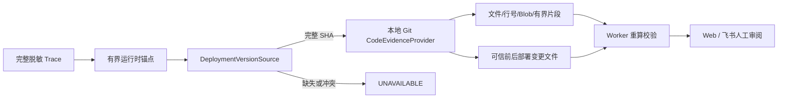

# 可信部署版本与只读代码证据

| 项目 | 内容 |
| --- | --- |
| 版本 | `deployment-evidence-v1` / `code-evidence-v1` |
| 状态 | 主体代码与离线验收完成；真实 DAM 部署目录待配置 |
| 触发条件 | 完整 `trace_search_v1` 时间线且存在安全运行时锚点 |
| 首个 Provider | 管理员允许的本地 Git 仓库，只读不可变 Commit |
| 非目标 | 不自由遍历仓库、不读取工作区、不发代码给 LLM、不修改代码、不确认根因 |

## 1. 解决什么问题

日志证明“运行时发生了什么”，但只有结合当时实际部署的代码版本，才能解释某个错误分支为什么可能出现。直接搜索 `HEAD` 或当前工作区存在两个根本问题：它们可能不是事故时运行的版本，而且未提交修改会污染证据。

第四阶段把这条链拆成两个可替换端口：



- `DeploymentVersionSource` 回答调查结束时间点实际运行哪个 Repository/Commit；
- `CodeEvidenceProvider` 只消费完整 Commit 和第三阶段锚点，返回有限代码位置；
- Worker 在持久化前再次校验部署指纹、锚点绑定、代码内容指纹、预算和排序。

任何一步缺失都只会把代码增强降级，不会抹掉已经成立的 Trace 事实。

## 2. 管理员目录

示例位于 `config/code-resources.example.json`。目录包含两类配置：

1. `deployments`：逻辑服务/环境、Repository ID、完整 Commit SHA、可选上一部署 SHA、制品摘要、生效和退役时间；
2. `repositories`：Repository ID、本机 Git 根目录、允许路径和额外禁止路径。

部署记录按 `[deployed_at, retired_at)` 解析事故时间：零条命中为 `UNAVAILABLE`，多条重叠为 `CONFLICT`。系统绝不会用分支、`HEAD`、“最新提交”或当前工作区补齐缺失 Commit。

目录使用严格 JSON，拒绝未知字段、重复仓库、非法 SHA、相对/不存在的仓库根、路径穿越、错误时间区间和未知 Repository ID。目录只在进程启动时加载，修改后需要显式重启。

实际接入时必须从部署平台、GitOps、镜像标签/摘要或发布记录获得 Commit，不能运行 `git rev-parse HEAD` 后把它冒充为部署版本。

## 3. 固定代码能力和预算

首个适配器位于 `internal/adapters/gitcode`，所有命令都通过 `exec.CommandContext` 传固定参数数组，不经过 Shell。

允许的 Git 能力只有：

- `rev-parse --show-toplevel`：确认配置根就是仓库顶层；
- `cat-file -e <sha>^{commit}`：确认当前/上一部署 Commit 存在；
- `grep -F -n -e <锚点> <sha> -- <允许路径>`：精确文本搜索；
- `show <sha>:<path>`：读取匹配文件在目标 Commit 中的内容；
- `rev-parse <sha>:<path>`：绑定不可变 Blob；
- `diff --name-only <previous> <current> -- <允许路径>`：只列可信部署间的变更文件，不读取任意 Diff。

固定预算为：

| 项目 | 上限 |
| --- | ---: |
| 进入代码阶段的锚点 | 16 |
| 代码匹配 | 16 |
| 读取文件 | 8 |
| 返回代码行 | 480 |
| 返回片段总字节 | 64 KiB |
| 单个匹配上下文 | 前后各 10 行 |
| Git 子命令 | 48 |
| 单命令输出 | 默认 512 KiB，配置范围 64 KiB～4 MiB |
| 部署解析/代码搜索超时 | 默认各 8 秒，最大 30 秒 |

只支持 `.go/.java/.py` 证据文件。`.env`、Git 元数据、Vendor、Node modules、生成目录，以及名称含 secret/credential/private key 的文件会被拒绝。片段如果出现私钥、AccessKey、Bearer 或强凭据赋值形态会整段跳过并把结果降级为 `PARTIAL`；邮箱和 IPv4 会在持久化前替换。

## 4. Evidence 合同

部署 Evidence 保存逻辑服务/环境、Repository ID、完整 Commit、可选上一部署 Commit、时间区间、来源版本和内容指纹，不保存仓库物理根路径。

每条代码 Evidence 保存：

- 来源运行时 Anchor ID；
- Repository ID 与完整部署 Commit；
- 安全仓库相对路径和匹配行；
- 有界代码上下文；
- Git Blob Hash；
- 查询和内容 SHA-256 指纹；
- 该文件是否在可信前后部署版本间发生变化。

代码调查状态为：

- `COMPLETE`：搜索完整且至少有一个匹配；
- `NO_MATCH`：搜索完整但没有命中，不能解释为“仓库没有相关代码”；
- `PARTIAL`：预算截断或敏感片段被跳过；
- `SKIPPED`：Trace 不完整或没有安全锚点，Provider 调用为零；
- `UNAVAILABLE`：部署缺失/冲突、目录/Commit/Provider 不可用或返回合同非法。

状态只描述证据收集质量。代码命中、变更文件重叠和部署时间相邻都不等于根因。

## 5. 运行与配置

默认关闭：

```powershell
$env:LOG_AGENT_CODE_MODE = "disabled"
```

配置真实本地仓库：

```powershell
Copy-Item .\config\code-resources.example.json .\config\code-resources.json
# 编辑文件：填写部署系统确认的完整 SHA、有效时间和批准目录
$env:LOG_AGENT_CODE_MODE = "localgit"
$env:LOG_AGENT_CODE_CATALOG = ".\config\code-resources.json"
$env:LOG_AGENT_GIT_PATH = "git"
$env:LOG_AGENT_CODE_TIMEOUT = "8s"

# 只检查目录、仓库顶层和 Commit 是否存在，不读取代码正文
go run ./cmd/logagent code-check dam-server test
```

启用后，`worker`、`web` 和显式 `trace-smoke` 会在完整 Trace 之后自动运行该阶段。聚合型 `error_count_v1/error_analysis_v2` 不会触发代码读取。

## 6. 恢复、LLM 与展示边界

本地 Git 对不可变 Commit 的读取没有远端副作用和按次云费用，Worker 崩溃后可以在复用 Trace Checkpoint 的基础上重新执行，因此本阶段没有增加独立代码 Checkpoint。将来接入 GitHub/GitLab 网络 Provider 时，必须补充调用审计、结果未知状态、限流和 Checkpoint，不能直接复用本地假设。

代码 Evidence 不进入现有 `ReportSummarizer`，方舟不会收到代码片段、文件名或 Commit。Web 回环页面可展示最多 8 个片段；飞书只展示最多 4 个文件/行号和变更标志，不发送代码正文。

## 7. 离线验收

自动测试使用临时 Git 仓库和两个真实本地 Commit，验证：

- 调查时间解析唯一部署版本，重叠记录 fail closed；
- 仓库根必须等于 Git 顶层；
- 精确文本和堆栈帧只读取指定 Commit；
- 未提交工作区内容不会命中；
- 上一部署 Diff 只返回允许范围内文件；
- 邮箱/IP 脱敏，凭据片段和禁止文件跳过；
- 匹配、Blob、查询/内容指纹、锚点引用和预算可重算；
- Trace Worker 持久化代码增强；
- 代码正文不会进入 LLM 或飞书卡片。

这些结果证明本地合同，不代表 DAM 当前部署 Commit 已接通，也不代表自动根因准确率。真实验收需要管理员提供实际部署目录，并用代表性 TraceID 跑完整链路。
