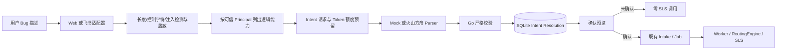

# 受治理自然语言接单

| 项目 | 内容 |
| --- | --- |
| 状态 | 主体代码与离线验收完成；真实方舟 Intent Smoke 待执行 |
| 日期 | 2026-09-02 |
| 父规格 | [`natural-language-rca-and-code-evidence-spec.md`](natural-language-rca-and-code-evidence-spec.md) |

## 1. 解决的问题

旧入口要求用户填写 `service / environment / duration / template`，适合验收查询底座，但不能直接描述 Bug。本能力允许用户输入：

```text
帮我看 DAM 测试环境最近半小时错误有没有增加
```

系统先生成逻辑预览，不访问 SLS。只有用户点击“确认并调查”，预览才会转换成现有 `InvestigationRequest` 并进入 Intake、SQLite、Worker 和 Eino。

这不是“自然语言生成 SLS 查询”。模型只做语义分类，Project、Logstore、字段、模板和 SPL 都不在模型输出合同里。

## 2. 调用链



## 3. 当前能力边界

当前只开放：

| Intent | 行为 |
| --- | --- |
| `error_spike` | 必须匹配当前身份允许的 service/environment，并固定映射 `error_count_v1` |
| `trace_search` | 必须带安全 TraceID、已授权逻辑范围和不超过 30 分钟的窗口，并固定映射 `trace_search_v1` |
| `unknown` | 不创建调查，只返回当前不支持 |

关键字自由检索、根因结论、代码搜索和任意 SPL 仍不开放；含 Trace 的问题不会退化成错误计数调查。Trace 执行合同见 [`traceid-multi-logstore-timeline.md`](traceid-multi-logstore-timeline.md)。

## 4. 关键实现

- 领域合同：`internal/domain/intent.go`。
- 应用服务：`internal/application/intent.go`。
- 端口：`internal/ports/intent.go`。
- 确定性离线 Parser：`internal/adapters/intentmock`。
- 火山方舟 Parser：`internal/adapters/volcark/intent.go`。
- ACL 能力投影：`internal/adapters/resourcecatalog/catalog.go`。
- SQLite Resolution、确认幂等与独立 Intent 额度：`internal/adapters/sqlite/intent.go`、`intent_quota.go`。
- Web 两步入口：`internal/adapters/localweb`。
- 飞书普通文本预览与确认卡：`internal/adapters/feishu`。
- 启动组装和 Smoke：`cmd/logagent/intent.go`。

`InvestigationRequest` 增加可选 `problem`、`intent_resolution_id` 与仅供异步执行的 `trace_id`。旧 JSON、`/investigate`、结构化 Web 表单和既有 Worker 保持可用。

## 5. 安全和恢复

- Problem 最大默认 500 个 Unicode 字符；常见 AK、Bearer、JWT、邮箱和 IPv4 在存储及模型出站前脱敏。
- 明显 Prompt Injection、SPL/SQL/Shell 执行诱导在调用模型前拒绝。
- 方舟只看到脱敏问题和当前 Principal 已获授权的逻辑能力，不看到物理 SLS 资源和身份。
- Provider 返回后，Go 再校验关闭 Intent、ACL、模板、时间窗、置信度、Token 和元数据。
- 解析使用 `(app_id, tenant_key, source_message_id)` 幂等；重复请求不重复调用模型。
- Provider 调用失败或落库结果未知时记为 `OUTCOME_UNKNOWN`，不自动重试。
- Resolution 默认 15 分钟过期，只允许原 Principal 确认；重复确认复用同一调查。
- Intent 使用独立于报告摘要的请求/Token 固定窗额度，不能消耗摘要预算。
- SQLite 使用事务迁移；当前 `PRAGMA user_version=2`（第二阶段增加 Trace Checkpoint/审计表），旧数据库打开时幂等创建新增表并记录版本，更高未知版本拒绝打开。

## 6. 配置

默认关闭，不改变旧行为：

```powershell
$env:LOG_AGENT_INTENT_MODE = "disabled" # disabled | mock | volcengine
```

离线演示：

```powershell
$env:LOG_AGENT_INTENT_MODE = "mock"
$env:LOG_AGENT_SLS_CATALOG = ".\config\sls-resources.json"
go run ./cmd/logagent intent-check
go run ./cmd/logagent web
```

真实方舟解析：

```powershell
$env:LOG_AGENT_INTENT_MODE = "volcengine"
$env:ARK_API_KEY = Read-Host "粘贴方舟 API Key" -MaskInput
$env:LOG_AGENT_INTENT_MODEL = "doubao-seed-2-0-mini-260428"
$env:LOG_AGENT_SLS_CATALOG = ".\config\sls-resources.json"
go run ./cmd/logagent intent-check
go run ./cmd/logagent intent-smoke "帮我看 DAM 测试环境最近半小时错误有没有增加"
```

`intent-check` 的网络调用和 SLS 调用都是 0。`intent-smoke` 最多调用一次方舟，只解析意图，不确认调查，SLS 调用为 0。

其他配置：

| 变量 | 默认值 |
| --- | --- |
| `LOG_AGENT_INTENT_TIMEOUT` | `8s` |
| `LOG_AGENT_INTENT_MAX_INPUT_CHARS` | `500` |
| `LOG_AGENT_INTENT_MAX_OUTPUT_BYTES` | `16384` |
| `LOG_AGENT_INTENT_MIN_CONFIDENCE` | `0.80` |
| `LOG_AGENT_INTENT_MAX_TOKENS` | `512` |
| `LOG_AGENT_INTENT_RESOLUTION_TTL` | `15m` |
| `LOG_AGENT_INTENT_QUOTA_WINDOW` | `1h` |
| `LOG_AGENT_INTENT_QUOTA_MAX_REQUESTS` | `100` |
| `LOG_AGENT_INTENT_QUOTA_MAX_TOKENS` | `51200` |
| `LOG_AGENT_INTENT_QUOTA_RESERVED_TOKENS` | `512` |

## 7. 验收证据与边界

离线测试已经覆盖：

- 自然语言解析后、确认前 Investigation/Job 均为 0；
- 确认后完整经过 Web、Intake、SQLite、Worker、Eino、Mock SLS、Mock 摘要和 Delivery；
- 重复解析和重复确认幂等；
- Prompt Injection 在 Provider 前拒绝；
- Trace 不降级、授权 Trace 可确认并保留准确查询参数、低置信度不执行、超额度不调用 Provider；
- 飞书普通文本只生成预览卡，确认值只有 `action + resolution_id`；
- 方舟严格 JSON Schema、未知字段拒绝、错误正文和 Key 不外泄；
- 旧数据库迁移、旧结构化入口和全仓回归。

当前尚未执行新的真实 `intent-smoke`，所以只能称为“方舟 Intent 适配器代码与离线协议测试完成”。此前真实摘要 Smoke 不能代替本能力的真实解析验收。
