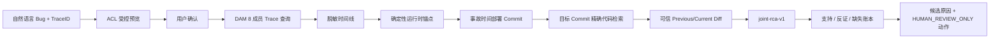

# 日志、部署代码与变更的联合根因候选

## 1. 当前结论

第五阶段实现了 `joint-rca-v1`：在完整 Trace、运行时锚点、事故时部署 Commit 和有界代码证据之后，用纯 Go 固定规则生成可审计的根因候选、支持/反证/缺失证据账本及人工验证动作。

它能回答：

- 哪个运行时锚点精确对应到实际部署版本中的哪个文件和行；
- 这个文件是否与可信上一部署版本相比发生变化；
- 为什么该路径值得优先检查；
- 目前还缺哪些证据，人工下一步该验证什么。

它不能回答“根因已经确认”。自动结论最高为 `SUPPORTED_CANDIDATE`；`COMPLETE` 只表示联合投影完整，不表示因果闭环。

## 2. 为什么不让 LLM 自由推理根因

当前链路中的代码片段、Diff 和运行时事件具有不同证明能力：

| 证据 | 能证明什么 | 不能证明什么 |
| --- | --- | --- |
| Trace 事件与锚点 | 运行时出现了某个已脱敏错误、符号或堆栈位置 | 完整业务输入、具体条件分支和依赖内部状态 |
| 部署 Commit | 事故时运行的是哪个不可变代码版本 | 事故一定由本次发布引起 |
| 代码精确匹配 | 目标版本中存在可解释该现象的静态路径 | 运行时一定执行了附近每个分支 |
| 可信 Commit Diff | 相关文件在前后部署间是否变化 | 时间和文件重叠等于因果 |

如果直接把这些材料交给模型自由裁决，输出很难稳定复算，也容易把“相关”升级成“根因”。因此首版使用确定性证据账本形成机器候选；LLM 摘要输入继续显式排除代码证据与联合 RCA。以后如果允许模型解释，只能消费单独批准的安全投影，且不能改变候选 Verdict、分数或权限。

## 3. 调用链

`JointRCAService` 位于 Worker 的受治理后处理阶段：

1. TraceEngine 返回并通过第一次报告校验；
2. `CodeEvidenceService` 解析部署并检索代码；
3. Worker 再次校验部署、Anchor、Commit、Blob 和代码内容指纹；
4. `JointRCAService` 只读取上述已校验对象，生成确定性投影；
5. Worker 重新计算整份投影并逐字段比较后才允许持久化；
6. 本地 Web 和飞书卡片展示候选与人工动作，但不执行修复。

调查 Engine 无权预填 `CodeInvestigation` 或 `JointRCA`。发现预填内容时 Worker 直接拒绝，防止不可信编排层绕过后处理边界。

## 4. 数据合同

### 4.1 状态

| 状态 | 含义 |
| --- | --- |
| `COMPLETE` | 完整 Trace 和完整代码检索至少形成一个有界候选 |
| `INCONCLUSIVE` | 没有精确代码命中，或代码结果被预算截断 |
| `UNAVAILABLE` | 部署或代码数据源不可用/无效 |
| `NEEDS_REVIEW` | 事故时间同时匹配多个部署版本，需要人工消除冲突 |
| `SKIPPED` | Trace 或安全锚点不满足进入条件 |

报告内 `NEEDS_REVIEW` 表示联合判断需要人工处理；外层调查状态的 `NEEDS_REVIEW` 仍专用于外部查询结果未知和防重复付费语义，两者不能混用。

### 4.2 候选 Verdict

| Verdict | 首版规则 |
| --- | --- |
| `SUPPORTED_CANDIDATE` | 完整 Trace 锚点、唯一部署 Commit 与目标 Commit 精确代码位置共同支持 |
| `INCONCLUSIVE` | 代码检索部分完成，已有位置可展示但覆盖不完整 |
| `REFUTED` | 合同保留；首版不会仅用“文件未变化”把整个代码路径判为被否定 |

候选 Kind 当前固定为 `DEPLOYED_CODE_PATH`。它表示“值得验证的已部署代码路径”，不是“发布回归已证实”。

### 4.3 固定证据账本

每个候选固定生成五项：

| Code | Role / Result | 说明 |
| --- | --- | --- |
| `runtime_anchor_observed` | `SUPPORT/PASS` | 完整 Trace 中存在绑定锚点 |
| `deployed_commit_bound` | `SUPPORT/PASS` | 代码来自事故时唯一部署 Commit |
| `exact_code_match` | `SUPPORT/PASS` | 锚点与目标 Commit 的文件/行精确对应 |
| `recent_change_overlap` | 动态 | 文件已变化为支持；未变化为软反证；无上一版本为缺失 |
| `runtime_branch_execution` | `MISSING/UNKNOWN` | 仍缺具体分支、输入与下游状态证明 |

每项都绑定 Candidate ID，并按需要引用 Runtime Anchor ID、Code Match ID 和 Deployment Fingerprint。Candidate、Factor ID 由版本化内容指纹确定生成，相同证据会得到相同 ID。

### 4.4 固定证据评分

评分方法为 `deterministic-joint-evidence-score-v1`，不是统计概率：

- 精确文本对应基础分 `0.60`；
- 堆栈帧直达基础分 `0.65`；
- 可信前后 Commit 中相关文件发生变化加 `0.10`；
- 已比较且相关文件未变化减 `0.05`；
- 最大 `0.75`；
- 代码检索被截断时最大 `0.45`，Verdict 强制为 `INCONCLUSIVE`。

分数只用于候选排序和说明证据完备度，不能被展示成“75% 概率就是根因”。

## 5. 人工验证动作

每个候选最多三个动作，全部固定为 `HUMAN_REVIEW_ONLY`：

- `VERIFY_BRANCH_PRECONDITIONS`：核对目标行附近错误分支的前置条件，与 Trace 输入/下游状态对照；
- `REPRODUCE_AT_DEPLOYED_COMMIT`：用相同 Commit 和脱敏等价输入复现；
- `REVIEW_TRUSTED_DIFF`：仅在文件与上一部署版本有变更时人工审阅 Diff 并补回归测试；
- `VERIFY_RUNTIME_DEPENDENCIES`：未发现最近文件变更时优先核对配置、数据和下游依赖。

这些动作不会触发 Shell、修改代码、回滚发布、写数据库或改变生产环境。

## 6. 有界与安全规则

- 每份报告最多 8 个候选、40 个账本项、24 个人工动作；
- 同一文件同一行的多个锚点合并为一个候选，避免重复结论；
- 只使用第四阶段已经批准和脱敏的 Repository ID、Commit、文件、行和引用 ID；
- 联合 RCA 不新增外部调用、凭据、网络或查询费用；
- 代码正文不进入飞书卡片，也不进入现有方舟摘要；
- 本地 Web 使用 `textContent` 展示，深拷贝持久化投影，避免页面修改共享对象；
- 飞书只展示有界文件/行、判定、证据账本和人工动作；
- 自动输出禁止 `HUMAN_CONFIRMED`，也没有自动处置接口。

## 7. 失败与降级

| 前置情况 | 联合结果 | 是否保留已有证据 |
| --- | --- | --- |
| Trace 不完整 | `SKIPPED/trace_incomplete` | 是 |
| 部署目录无记录或代码 Provider 不可用 | `UNAVAILABLE/code_evidence_unavailable` | 是 |
| 部署时间记录重叠 | `NEEDS_REVIEW/deployment_requires_review` | 是 |
| 完整搜索但无命中 | `INCONCLUSIVE/no_code_match` | 是 |
| 代码预算截断 | `INCONCLUSIVE/code_evidence_partial` | 是，并保留部分候选 |

联合分析失败不会删除 Trace、锚点和代码收集状态，也不会把调查自动扩大到其他环境、仓库、时间窗口或任意关键词搜索。

## 8. 源码位置

| 职责 | 位置 |
| --- | --- |
| 联合 RCA 领域合同 | `internal/domain/joint_rca.go` |
| 确定性候选构建 | `internal/application/joint_rca.go` |
| 生产输出重算校验 | `internal/application/joint_rca_validation.go` |
| Worker 阶段编排 | `internal/application/worker.go` |
| 正式 Worker / Trace Smoke 装配 | `cmd/logagent/main.go`、`cmd/logagent/trace.go` |
| 本地 Web 投影与展示 | `internal/adapters/localweb` |
| 飞书卡片有界展示 | `internal/adapters/feishu/renderer.go` |

## 9. 当前验收

离线测试覆盖：

- Trace、部署、代码、Diff 四类证据形成一个候选；
- 堆栈直达和变更重叠得到固定上限分；
- 文件未变化成为软反证并切换人工验证方向；
- 代码截断强制 `INCONCLUSIVE` 和分数上限；
- 无匹配、部署冲突和 Trace 不完整的 fail-closed 状态；
- 修改已构建候选 Verdict 后被 Worker 的确定性重算校验拒绝；
- 8 成员 Mock Trace 经 Worker 串联到代码命中和 `SUPPORTED_CANDIDATE`；
- 本地 Web 深拷贝与飞书无代码正文展示；
- 代码和联合 RCA 哨兵均不会进入现有 LLM 摘要输入。

这证明的是实现合同和合成链路，不是 DAM 真实根因准确率。真实验收仍需要：真实 TraceID、事故时间部署记录、对应本地仓库完整 Commit，以及熟悉事故的工程师对候选和缺失项进行盲评。

## 10. 下一步

阶段六将补充脱敏历史事故集、专家反馈表、真实 `intent/trace/code` 试点操作手册和发布门禁。没有真实样本与 Reviewer 结论前，不声明根因准确率、MTTR 改善或生产可用。
