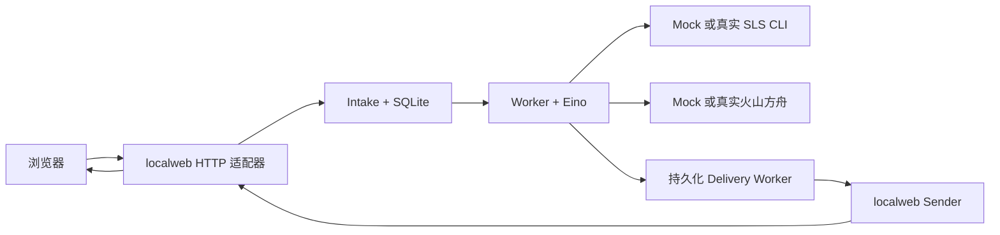

# 本地 Web 排障台：飞书 Mock 下的应用链路验收

## 结论

飞书应用权限暂时拿不到时，运行 `go run ./cmd/logagent web`。它保留真实飞书 Receiver、Sender 和卡片代码不变，用一个只监听本机的 Web 适配器替代交互层，并在单进程内启动正式 Intake、SQLite、Worker、Eino、SLS、LLM、ActionService 和 Delivery Worker。

这能验证日志 Agent 应用链路，不能宣称真实飞书链路已经验收。



## 已实现范围

| 能力 | 实现位置 | 验证含义 |
| --- | --- | --- |
| `web` 单进程装配 | `cmd/logagent/web.go` | 同时运行 HTTP、调查 Worker 和 Delivery Worker |
| 复用正式 Worker | `cmd/logagent/main.go` 的 `buildInvestigationWorker` | Web 和独立 `worker` 使用相同 Eino/SLS/LLM 装配 |
| 本地 HTTP 入口 | `internal/adapters/localweb/server.go` | 可接收有界问题描述或严格 service/environment/duration/template；均不接收身份或物理资源 |
| 安全报告投影 | `internal/adapters/localweb/projection.go` | 展示治理后的 Finding、Evidence、摘要和增强状态，隐藏请求者与物理查询元数据 |
| 本地页面 | `internal/adapters/localweb/assets.go` | 提交、轮询状态、报告、Evidence 和动作按钮 |
| Mock 投递边界 | `internal/adapters/localweb/sender.go` | 仍经过持久化 Delivery 队列、租约、顺序和卡片重绑，不调用飞书 API |
| 持久化交互查询 | `internal/adapters/sqlite/delivery.go` | ActionService 从 SQLite 读取服务端绑定的本地卡片目标 |
| 自然语言预览 | `internal/application/intent.go`、`internal/adapters/localweb/server.go` | 只解析 ACL 允许的逻辑范围；确认前不创建调查、不访问 SLS |

飞书代码 `internal/adapters/feishu` 与 `internal/adapters/feishumock` 均保留，不由 Web 包导入，也没有被弱化。

## 第一步：完全离线验收

在 `D:\日志agent` 的 PowerShell 中执行：

```powershell
$env:LOG_AGENT_SLS_MODE = "mock"
$env:LOG_AGENT_LLM_MODE = "mock"
$env:LOG_AGENT_INTENT_MODE = "mock"
$env:LOG_AGENT_WEB_ADDR = "127.0.0.1:8080"
$env:LOG_AGENT_WEB_DB_PATH = ".\data\web-pilot.db"
go run ./cmd/logagent web
```

浏览器打开：

```text
http://127.0.0.1:8080
```

页面不再硬编码 `order-service / prod`。它从固定服务端身份可访问的逻辑 Capability 中填充结构化表单。可以先输入“帮我看 DAM 测试环境最近半小时错误有没有增加”，点击“解析问题”，确认预览中的服务、环境、窗口和模板，再点击“确认并开始调查”。确认前数据库中没有 Investigation/Job，SLS 调用数为 0；确认后预期状态依次经过 `QUEUED`、`RUNNING`、`SUCCEEDED`，页面出现两份 Evidence 和 `MOCK` 摘要。

若想跳过自然语言解析，仍可直接使用同页结构化表单提交。两种入口最终复用同一个 `Intake`、Worker 和 ActionService。

自然语言方舟解析只做单独联调，不需要 SLS 或飞书：

```powershell
$env:LOG_AGENT_INTENT_MODE = "volcengine"
$env:ARK_API_KEY = Read-Host "粘贴方舟 API Key" -MaskInput
$env:LOG_AGENT_INTENT_MODEL = "<已开通的模型 ID>"
go run ./cmd/logagent intent-check
go run ./cmd/logagent intent-smoke "帮我看 DAM 测试环境最近半小时错误有没有增加"
```

`intent-check` 网络调用为 0；`intent-smoke` 只调用一次意图模型，保存受治理解析记录，不确认、不访问 SLS、不调用摘要模型。当前仓库仅完成协议和 Mock 链路验证，不能把未执行的真实 `intent-smoke` 说成已通过。

## 第二步：配置 DAM 真实 SLS 身份

本地 Web 默认固定身份如下：

| 字段 | 默认值 |
| --- | --- |
| App ID | `local-web` |
| Tenant Key | `local-pilot` |
| User ID | `operator` |
| Chat ID | `local-console` |

HTTP 请求中没有这些字段，调用方无法伪造身份。真实资源目录 `config/sls-resources.json` 的 Binding 应配置为：

```json
{
  "principal": {
    "app_id": "local-web",
    "tenant_key": "local-pilot",
    "user_id": "operator"
  },
  "resource_ids": ["dam-server-test-count"]
}
```

资源本身继续固定为 `dam-server / test / error-count-v1`，物理 Project 和 Logstore 只能由管理员目录提供，不能从页面提交。

先单独复验连接：

```powershell
$env:LOG_AGENT_SLS_MODE = "aliyun"
$env:LOG_AGENT_SLS_CATALOG = ".\config\sls-resources.json"
$env:LOG_AGENT_SLS_CLI_PROFILE = "default"
$env:LOG_AGENT_SMOKE_APP_ID = "local-web"
$env:LOG_AGENT_SMOKE_TENANT_KEY = "local-pilot"
$env:LOG_AGENT_SMOKE_USER_ID = "operator"
go run ./cmd/logagent sls-check
go run ./cmd/logagent sls-smoke dam-server test 10m
```

## 第三步：真实 SLS + 真实火山方舟联合运行

确认 STS 仍有效、方舟专用 Key 只在当前终端注入后执行：

```powershell
$env:LOG_AGENT_SLS_MODE = "aliyun"
$env:LOG_AGENT_SLS_CATALOG = ".\config\sls-resources.json"
$env:LOG_AGENT_SLS_CLI_PROFILE = "default"
$env:LOG_AGENT_LLM_MODE = "volcengine"
$env:ARK_API_KEY = "<仅放当前 PowerShell 环境>"
$env:LOG_AGENT_ARK_MODEL = "doubao-seed-2-0-mini-260428"
$env:LOG_AGENT_WEB_DB_PATH = ".\data\web-pilot-real.db"
go run ./cmd/logagent web
```

页面提交 `dam-server / test / 10m / error_count_v1`。成功报告应满足：

- current 与 baseline 均来自真实 SLS 固定计数模板；每个窗口两次 count 一致才是完整 Evidence。
- 摘要的 `mode` 为 `MODEL`、Provider 为 `volcengine_ark`；模型失败时调查仍可 `SUCCEEDED`，摘要明确为 `FALLBACK`。
- 页面没有 AK、STS、Ark Key、Project、Logstore、原始 `msg`、SQL/SPL、请求者、Query ID/Hash 或 Provider 原始错误。
- Delivery 最终投影为 `SUCCEEDED`，但其含义是本地 Sender 已消费持久化事件，不是飞书消息发送成功。

## 安全边界

- 地址必须是字面量回环 IP，默认 `127.0.0.1:8080`；`0.0.0.0`、局域网 IP 和 `localhost` 均拒绝，避免误暴露和 DNS 重绑定。
- 每次进程启动生成随机 CSRF Token；修改请求必须携带自定义 Header，并通过 Host、Origin、Content-Type 和 8 KiB 严格 JSON 检查。
- `request_id` 驱动 Intake 幂等，同一个 ID 重放只返回原调查；动作 ID 同样进入持久化回放门禁。
- Web 使用独立数据库 `data/web-pilot.db`，避免本地 Sender 和未来飞书 Sender 竞争同一投递队列。不要让 `web` 与 `feishu` 进程共享一个数据库运行。
- 页面使用 `textContent` 渲染动态文案，并启用 CSP、禁止 iframe、禁止缓存和 Referrer。
- 这仍是单机单操作者试点，不包含公司 SSO、多人 RBAC、TLS、反向代理、全局限流或生产数据库。

## 仍未验收的飞书部分

- `im.message.receive_v1` WebSocket 事件。
- 真实 App ID、Tenant Key、OpenID 与可用范围。
- Reply/Patch OpenAPI 和飞书服务端错误分类。
- JSON 2.0 卡片在客户端的视觉效果。
- `card.action.trigger` 回调及真实事件去重。
- 飞书权限申请、审批、机器人进群和群内 @ 行为。

## 自动化验收

`internal/adapters/localweb` 的测试覆盖回环监听、固定身份、CSRF、Host 重绑定、严格 JSON、接单幂等、安全投影、持久化卡片绑定和取消动作。`cmd/logagent/web_test.go` 还会运行完整 Mock 应用链路：

```text
HTTP submit
  -> Intake/SQLite
  -> QUEUED local delivery
  -> Worker/Eino
  -> Mock SLS current/baseline
  -> Mock LLM summary
  -> RUNNING/SUCCEEDED local delivery
  -> HTTP report projection
```

这条自动化链路的外部网络调用为 0。真实 SLS + 真实方舟联合结果必须单独记录，不能用 Mock 测试替代。

## 2026-09-01 本轮实际验收记录

- `gofmt -w .`、`go test -count=1 ./...` 和 `go vet ./...` 通过。
- 自动化 Web E2E 完成 `HTTP -> Intake/SQLite -> Worker/Eino -> Mock SLS -> Mock LLM -> Delivery -> HTTP`，最终 `SUCCEEDED`、两份 Evidence、本地 Delivery `SUCCEEDED`。
- 实际启动 `127.0.0.1:18080` 后，用 HTTP 提交默认调查，得到 `spike_detected`、两份 Evidence 和 `MOCK` 摘要；该次没有外部网络调用。
- Playwright 实际打开页面，无脚本/资源控制台错误；提交按钮完成调查，“扩大窗口”通过现有 ActionService 创建派生调查并把 30 分钟窗口扩大为 60 分钟。浏览器 QA 发现并修复了 favicon 404 和隐藏空状态仍显示的问题。
- 使用本地固定身份目录复验真实 `sls-check` 与 `sls-smoke dam-server test 10m`，Schema、ACL 和两次固定 count 完整通过。
- 实际启动 `127.0.0.1:18081`，完成 `本地 Web -> SQLite -> Worker/Eino -> 真实阿里云 SLS -> Mock LLM -> 本地 Delivery`；最终 `SUCCEEDED/data_insufficient`，current/baseline Evidence 均完整、Delivery 为 `SUCCEEDED`。当次 current=0、baseline=4 只是易变连接样本，不归档为故障事实。
- 随后使用仅允许 `Doubao-Seed-2.0-mini` 的临时 Key，实际启动 `127.0.0.1:18082`，完成 `本地 Web -> SQLite -> Worker/Eino -> 真实阿里云 SLS -> 火山方舟真实 LLM -> 本地 Delivery` 的同调查联合调用。调查 `inv_2cc5dbaa35cf387a5cb8ef82ba79b18c` 最终为 `SUCCEEDED/no_significant_spike`，current/baseline 两份 Evidence 均 `Complete`，模型摘要为 `GENERATED/MODEL`，Provider 为 `volcengine_ark`，模型为 `doubao-seed-2-0-mini-260428`，Token 为 `725 + 182 = 907`，模型耗时 `1771 ms`，本地 Delivery 为 `SUCCEEDED`。
- 该实时 10 分钟样本的 current=19、baseline=38 只用于证明联合链路，不归档为故障事实、模型质量结论或生产基线；`error_count_v1` 仍不能输出错误类型、实例或根因。
- 临时 Key 未进入仓库、配置、SQLite、日志或文档；仅经一次性本机传递注入验收进程，传递文件随即删除，进程停止后从方舟控制台删除 Key。此次验收仍未覆盖飞书真实链路、Prompt/费用/留存审批和真实样本模型质量门禁。
- `CGO_ENABLED=0`，且本机没有 `gcc`、`clang` 或 `cl`，所以本轮无法执行 `go test -race ./...`。
