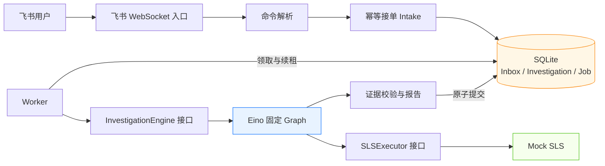
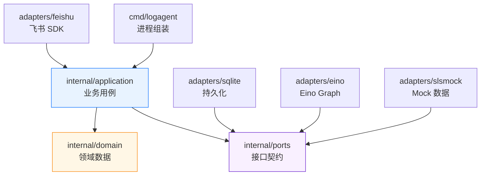
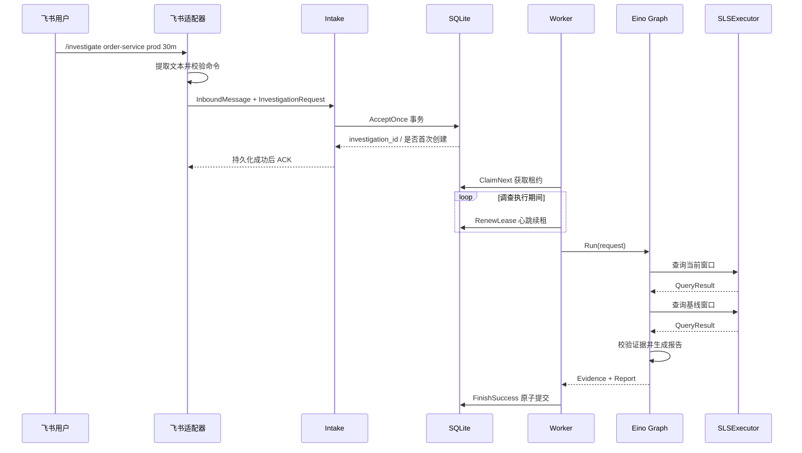
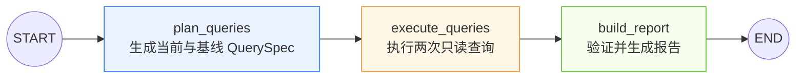
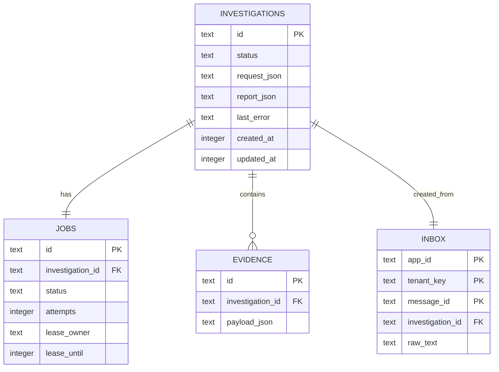
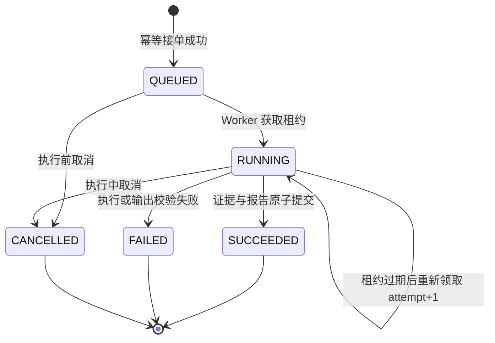

# Log Agent 第一期（M0）实现归档

> 历史归档说明：本文记录 M0 当时的设计与验收，不是当前运行规范。M0 没有独立 Git 源码快照，文中的文件路径会指向后续阶段演进后的当前工作树；当前行为以 [`spec.md`](spec.md) 为准。

| 项目 | 内容 |
| --- | --- |
| 阶段 | M0：技术竖切 |
| 状态 | 已实现，待接入真实飞书与 SLS 环境验证 |
| 日期 | 2026-08-18 |
| 主体语言 | Go 1.26 |
| 编排框架 | Eino v0.9.14 |
| 飞书 SDK | larksuite/oapi-sdk-go v3.9.10 |
| 本地存储 | modernc SQLite v1.56.0 |

## 一句话概括

第一期实现了一条可以离线运行的日志调查骨架：接收一个调查请求，可靠地创建任务，由 Worker 通过 Eino 固定流程查询 Mock SLS 数据，最终生成一份“结论必须引用证据”的调查报告。

这里的重点不是让 Agent 立刻具备自由问答能力，而是先证明入口、任务、编排、查询、证据和报告可以在清晰边界下可靠协作。

## 业务背景：第一期解决什么问题

最终产品希望让内部用户在飞书中提出类似请求：

```text
/investigate order-service prod 30m
```

系统需要调查 `order-service` 在生产环境最近 30 分钟是否发生错误突增，并给出可追溯的证据。

如果一开始就直接接入大模型和真实日志，会同时面对权限、重复消息、慢查询、错误结论、任务恢复和成本失控等问题。因此 M0 先搭建“不会因为更换框架或数据源而推倒重来”的技术骨架。

## 第一期实现范围

| 能力 | 当前实现 | 达到的效果 |
| --- | --- | --- |
| 飞书入口 | WebSocket 长连接适配器 | 能解析 `im.message.receive_v1` 文本事件并持久化任务 |
| 命令解析 | 严格命令格式 | 只接受服务、环境和不超过 24 小时的时间窗 |
| 幂等接单 | SQLite 唯一键与事务 | 同一条飞书消息重复投递不会创建多个任务 |
| 异步任务 | Inbox、Investigation、Job | 飞书回调不执行耗时调查，Worker 独立处理 |
| 任务可靠性 | Lease、Heartbeat、Attempt fencing | 慢任务可续租，旧 Worker 不能提交过期结果 |
| 流程编排 | Eino `compose.Graph` | 固定执行计划查询、数据查询、报告生成三步 |
| 日志查询 | `SLSExecutor` 接口和 Mock 实现 | 无阿里云凭证也能跑通完整链路 |
| 证据模型 | Query ID、查询哈希、范围和完整性 | 每条结论都能追溯到具体查询证据 |
| 质量门禁 | 完整性、截断、样本量和数据一致性检查 | 证据不足时不输出高置信根因 |
| 状态持久化 | SQLite 原子事务 | 证据、报告和成功状态一起提交，避免半完成状态 |
| 自动化验证 | 单元、集成、架构边界测试 | 覆盖幂等、恢复、取消、证据和 SDK 隔离 |

## 项目全景图



可以把这套结构理解成一家调查事务所：

- 飞书入口是前台，只负责登记诉求。
- SQLite 是案件档案柜，也是待办任务簿。
- Worker 是办案人员，负责领取和执行案件。
- Eino 是办案流程模板，规定先做什么、再做什么。
- SLSExecutor 是取证窗口，当前窗口后面接的是 Mock 数据。
- Evidence 是证据原件，Report 是引用这些证据写出的结案报告。

## 技术栈速览

| 维度 | 技术选型 | 大白话解释 |
| --- | --- | --- |
| 语言 | Go 1.26 | 编译快、并发和服务端生态成熟，适合长期运行的 Agent 服务 |
| 编排 | Eino `compose.Graph` | 把固定调查步骤连接起来，但不拥有业务状态 |
| 飞书接入 | 官方 Go SDK WebSocket | 不需要暴露公网回调地址即可接收企业自建应用事件 |
| 本地持久化 | SQLite WAL | 第一期用一个本地数据库文件验证幂等和恢复语义 |
| 数据源 | Mock SLS Executor | 用固定数据验证流程，真实 SLS 接口留到 M1 |
| 证据指纹 | SHA-256 | 给查询条件生成稳定指纹，便于审计和复现 |

## 代码分层与职责



| 模块 | 关键文件 | 职责 | 阅读优先级 |
| --- | --- | --- | --- |
| 进程入口 | `cmd/logagent/main.go` | 组装 Demo、Worker、飞书入口三种运行模式 | ⭐⭐⭐ |
| 领域模型 | `internal/domain/types.go` | 定义请求、任务、证据、结论和报告 | ⭐⭐⭐ |
| 应用接口 | `internal/ports/ports.go` | 隔离存储、Eino 和 SLS 的实现细节 | ⭐⭐⭐ |
| 接单用例 | `internal/application/intake.go` | 生成业务 ID 并调用原子幂等接单 | ⭐⭐⭐ |
| Worker | `internal/application/worker.go` | 领取、续租、执行、校验和完成任务 | ⭐⭐⭐ |
| Eino 编排 | `internal/adapters/eino/engine.go` | 编译并运行固定调查 Graph | ⭐⭐⭐ |
| SQLite | `internal/adapters/sqlite/store.go` | 实现事务、幂等、租约、取消和报告存储 | ⭐⭐⭐ |
| 飞书入口 | `internal/adapters/feishu/receiver.go` | 把 SDK 事件转换成应用自己的请求 | ⭐⭐ |
| Mock SLS | `internal/adapters/slsmock/executor.go` | 提供确定性的当前/基线数据 | ⭐⭐ |
| 命令解析 | `internal/command/parser.go` | 校验 `/investigate` 命令和时间窗 | ⭐⭐ |
| 架构约束 | `internal/architecture/boundaries_test.go` | 防止 Eino、飞书 SDK 泄漏到其他层 | ⭐⭐ |

## 一条调查请求如何流转

> 用户故事：作为值班研发，我想调查某个服务最近一段时间的错误是否突然增加，以便快速判断是否需要继续排查。



### 第 1 跳：飞书事件进入系统

- 文件：`internal/adapters/feishu/receiver.go`
- 关键函数：`New`、`Run`、`handleMessage`
- 做了什么：
  1. 使用官方 `ws.Client + EventDispatcher` 订阅 `im.message.receive_v1`。
  2. 只处理文本消息，并从飞书消息 JSON 中提取 `/investigate` 命令。
  3. 将飞书 SDK 类型转换成系统自己的 `InboundMessage`。
  4. 给持久化操作设置 2 秒预算，确保回调不会被耗时调查阻塞。

永久无法修复的坏事件会被忽略并确认，避免飞书不断重试；真实存储失败则返回错误，让飞书有机会重新投递。

⭐ 重点：`handleMessage` 不调用 Eino，也不查询日志。飞书回调只负责“可靠登记”。

### 第 2 跳：解析确定性命令

- 文件：`internal/command/parser.go`
- 关键函数：`ParseInvestigation`
- 当前格式：

```text
/investigate <service> <environment> <duration>
```

例如：

```text
/investigate order-service prod 30m
```

解析后得到：

```text
service      = order-service
environment  = prod
start_time   = 当前时间 - 30 分钟
end_time     = 当前时间
```

时间窗必须大于 0 且不超过 24 小时。M0 故意不做自然语言解析，使测试结果可重复，也避免模型误解调查范围。

### 第 3 跳：原子幂等接单

- 文件：`internal/application/intake.go`
- 存储实现：`internal/adapters/sqlite/store.go`
- 关键函数：`Intake.Accept`、`Store.AcceptOnce`

系统以以下三列作为入站消息唯一键：

```text
(app_id, tenant_key, message_id)
```

`AcceptOnce` 在一个事务中处理三件事：

1. 创建 `investigations` 调查记录。
2. 插入 `inbox` 消息记录。
3. 创建 `jobs` 待执行任务。

如果 `inbox` 唯一键冲突，事务会回滚新生成的调查记录，然后返回之前已经存在的 `investigation_id`。因此飞书即使重复投递，同一条消息仍然只有一个调查和一个任务。

### 第 4 跳：Worker 领取和保护任务

- 文件：`internal/application/worker.go`
- 持久化实现：`internal/adapters/sqlite/store.go`
- 关键函数：`RunOne`、`ClaimNext`、`RenewLease`

Worker 不是简单地把任务状态改成 RUNNING，而是获得一个有过期时间的 **Lease**（租约）。租约可以理解为“这段时间内由我负责”。

调查运行期间，Worker 按“租约时长的三分之一，最长 5 秒”发送一次心跳：

```text
ClaimNext -> Engine.Run -> 周期性 RenewLease -> FinishSuccess/Failure
```

每次重新领取任务都会增加 `attempt`。这个数字同时充当 **fencing token**（旧执行者隔离令牌）：续租和完成任务时必须同时匹配 `lease_owner + attempt`。即使新旧进程使用同一个 Worker ID，旧进程也不能覆盖新进程的结果。

其他可靠性行为：

- 租约过期：任务可被重新领取。
- 用户取消：数据库将任务标为 `CANCELLED`；下一次心跳续租失败并取消 Eino/SLS context。
- 进程关闭：不使用已经取消的 context 写错误终态，而是保留 RUNNING，等待租约到期后恢复。
- 执行错误：M0 直接进入 `FAILED`，暂不自动重试。

⚠️ 自动重试尚未实现，是有意的边界。真实 SLS 查询可能产生费用；在没有步骤幂等键和错误分类前，不应承诺查询不会重复。

### 第 5 跳：Eino 执行固定调查 Graph

- 文件：`internal/adapters/eino/engine.go`
- 关键函数：`New`、`Run`、`planQueries`、`executeQueries`、`buildReport`

M0 使用三个节点：



当前窗口与基线窗口长度相同。例如调查 `10:00–10:30`，基线就是 `09:30–10:00`。

Eino 只存在于 `internal/adapters/eino`。应用层依赖的是自己的 `InvestigationEngine` 接口，因此未来可以替换编排框架，而不影响任务和证据模型。

### 第 6 跳：通过 SLSExecutor 查询数据

- 接口：`internal/ports/ports.go` 中的 `SLSExecutor`
- 当前实现：`internal/adapters/slsmock/executor.go`

接口只有一个只读方法：

```go
Execute(ctx context.Context, spec domain.QuerySpec) (domain.QueryResult, error)
```

Mock 返回固定结果：

| 窗口 | ErrorCount | TopError | TopErrorCount |
| --- | ---: | --- | ---: |
| 当前窗口 | 120 | `payment_timeout` | 90 |
| 基线窗口 | 20 | `payment_timeout` | 5 |

因此 Demo 得到 `120 / 20 = 6.0`，输出 `spike_detected`。

⭐ 这里是 M1 的主要替换点：保留接口，用真实阿里云 SLS 只读实现替换 Mock。

### 第 7 跳：形成证据而不是直接写结论

- 数据结构：`internal/domain/types.go`
- 生成逻辑：`internal/adapters/eino/engine.go`
- 最终校验：`internal/application/worker.go` 中的 `validateEngineOutput`

每条 Evidence 至少记录：

| 字段 | 作用 |
| --- | --- |
| `id` | 供 Finding 引用的证据 ID |
| `query_id` | 数据源返回的查询标识 |
| `query_spec_hash` | 查询条件 SHA-256 指纹 |
| `start_time/end_time` | 实际查询时间范围 |
| `complete` | 查询是否完成 |
| `truncated` | 结果是否被截断 |
| `error_count` | 错误总数 |
| `top_error/top_error_count` | 主要错误模式及数量 |

系统在两个位置做质量控制：

1. Eino 适配器检查 Query ID、负数计数、TopError 数量矛盾等问题。
2. Worker 检查报告的调查 ID、证据唯一性，以及每个 Finding 引用的 Evidence 是否真实存在。

形成确定性错误突增结论的当前条件：

- 当前和基线两条证据都存在。
- 两次查询均 `complete=true`。
- 两次查询均 `truncated=false`。
- 基线不是无法计算倍率的 0。
- 当前与基线达到最低样本量。
- 当前错误数至少是基线的 2 倍。

不满足条件时，报告输出 `data_insufficient`，并将：

```text
confidence = 0
conclusive = false
```

### 第 8 跳：原子保存证据和报告

- 文件：`internal/adapters/sqlite/store.go`
- 关键函数：`FinishSuccess`

成功提交在一个事务中完成：

1. 验证当前 Worker 的 `lease_owner + attempt + lease_until`。
2. 将 Job 更新为 `SUCCEEDED`。
3. 插入所有 Evidence。
4. 将 Report 写入 Investigation，并更新为 `SUCCEEDED`。
5. 提交事务。

任何一步失败，整个事务都会回滚，不会出现“任务显示成功但证据没保存”的状态。

## 数据库模型



| 表 | 作用 |
| --- | --- |
| `inbox` | 记录入站消息，并承担消息幂等 |
| `investigations` | 保存调查范围、状态、报告和错误 |
| `jobs` | 保存待执行任务、租约和 attempt |
| `evidence` | 独立持久化每条查询证据 |

文件数据库启用 WAL 和 5 秒 busy timeout。每个 Store 实例限制为一个数据库连接；测试额外验证了两个 Store 连接同时接单时仍能正确去重。

## 状态机



M0 中 `SUCCEEDED`、`FAILED` 和 `CANCELLED` 都是终态，不会重新回到 RUNNING。

## 三种运行方式

### 1. 本地 Demo

```powershell
go run ./cmd/logagent demo
```

Demo 使用：

- 内存 SQLite，因此进程结束后数据消失。
- 固定调查时间，确保结果稳定。
- 直接构造领域请求，不经过真实飞书连接。
- Mock SLS，不访问阿里云。

它验证的是从 `Intake -> Job -> Worker -> Eino -> Mock SLS -> Evidence -> Report` 的完整主体链路。

### 2. 独立 Worker

```powershell
$env:LOG_AGENT_DB_PATH = ".\data\logagent.db"
go run ./cmd/logagent worker
```

Worker 轮询文件数据库、领取任务并执行调查。当前仍然使用 Mock SLS。

### 3. 飞书入口

```powershell
$env:FEISHU_APP_ID = "cli_xxx"
$env:FEISHU_APP_SECRET = "your-secret"
$env:LOG_AGENT_DB_PATH = ".\data\logagent.db"
go run ./cmd/logagent feishu
```

飞书入口只创建任务。需要同时启动 Worker，任务才会被执行。M0 尚未实现向飞书回复进度卡或最终报告。

`.env.example` 只是变量示例，程序当前不会自动读取 `.env` 文件；运行前需要像上面一样设置操作系统环境变量。

## 如何理解 Demo 输出

| 输出字段 | 示例 | 含义 |
| --- | --- | --- |
| `status` | `SUCCEEDED` | 整个调查链路成功结束 |
| `outcome` | `spike_detected` | 当前窗口相对基线满足突增规则 |
| `statement` | 错误增长 6 倍 | 根据 120 与 20 计算出的报告文字 |
| `confidence` | `0.95` | 在当前规则下的置信度，不是模型概率 |
| `conclusive` | `true` | 数据质量门禁允许形成确定性结论 |
| `evidence_ids` | 两个 `ev_...` | Finding 引用的当前/基线证据 |
| `query_spec_hash` | SHA-256 字符串 | 当时用于标识查询请求；M0 Mock 将 `investigation_id` 纳入哈希，因此跨调查并不稳定 |
| `complete` | `true` | Mock 查询返回完整 |
| `truncated` | `false` | Mock 查询未被截断 |

调查 ID 每次运行都会变化，所以 Evidence ID 也会变化。历史 M0 Mock 对完整 `QuerySpec` 哈希并包含 `investigation_id`，因此不同调查即使业务范围相同，`query_spec_hash` 也可能不同；真实 Gateway 的当前指纹契约见 `spec.md`。

## 测试与验收

| 验收点 | 覆盖位置 |
| --- | --- |
| 严格命令与时间窗限制 | `internal/command/parser_test.go` |
| 飞书事件映射、持久化错误和 2 秒预算 | `internal/adapters/feishu/receiver_test.go` |
| 同一消息并发投递只创建一个任务 | `internal/adapters/sqlite/store_test.go` |
| 两个 Store 连接之间仍能幂等 | `internal/adapters/sqlite/store_test.go` |
| SQLite 文件关闭重开后任务仍存在 | `internal/adapters/sqlite/store_test.go` |
| 租约过期重领与旧租约禁止提交 | `internal/adapters/sqlite/store_test.go` |
| 相同 Worker ID 下 attempt 仍能隔离旧执行者 | `internal/adapters/sqlite/store_test.go` |
| 长任务心跳续租 | `internal/application/worker_test.go` |
| 执行中取消传播到 Engine context | `internal/application/worker_test.go` |
| 进程停止后任务可通过租约恢复 | `internal/application/worker_test.go` |
| 不完整证据、零基线和非法 QueryResult | `internal/adapters/eino/engine_test.go` |
| Finding 必须引用真实 Evidence | `internal/application/worker_test.go` |
| Eino 和飞书 SDK 不泄漏出适配层 | `internal/architecture/boundaries_test.go` |

验证命令：

```powershell
gofmt -w .
go test -count=1 ./...
go vet ./...
go run ./cmd/logagent demo
```

M0 当时的验证结果：上述命令均通过；应用层和 SQLite 并发相关测试额外随机顺序连续执行 20 次通过。

`go test -race ./...` 尚未在当前机器完成，因为 Windows 环境没有启用 CGO，也没有安装 GCC。需要在带 C 编译器的环境或 Linux CI 中补跑。

M0 当时的测试也不等于生产验收：尚未进行真实飞书/SLS 联调、生产级多进程压力测试，`no_significant_spike` 分支也还缺少单独的显式用例。

## 关键设计决策

### 为什么使用 Eino，但不把所有东西交给 Eino

Eino 适合描述调查步骤和后续接入模型、工具调用；但是以下内容属于业务事实，必须掌握在自己的代码和数据库中：

- 一条消息是否已经处理。
- 一个任务当前是什么状态。
- 谁拥有任务租约。
- 哪些证据支持哪条结论。
- 用户是否取消了任务。

因此应用层只依赖自己的 `InvestigationEngine` 接口，Eino 是可替换的编排适配器。架构测试会阻止其他包直接导入 Eino。

### 为什么第一期不用 LLM

M0 要验证的是可靠链路和证据语义。固定 Graph 和固定规则更容易测试，也能分清“系统工程问题”和“模型效果问题”。LLM 后续可以负责命令理解和报告表达，但不能绕过权限、查询预算和证据门禁。

### 为什么使用 SQLite

SQLite 让本地开发不依赖外部数据库，同时能真实验证事务、唯一约束、文件重启和多连接竞争。生产数据库仍隐藏在 `Store` 接口后面，M1/M4 可以替换为组织批准的关系型数据库。

## M0 当时没有实现的能力

这些不是遗漏，而是阶段边界：

- 真实阿里云 SLS Project、LogStore 和索引查询。
- SLS Schema 校验、RAM/资源 ACL、查询扫描量和费用预算。
- 飞书接单回执、进度卡、结果卡和取消按钮。
- 自然语言转 QuerySpec。
- LLM 摘要和多轮追问。
- 指标、Trace、发布和 Kubernetes 事件关联。
- 瞬时错误分类、退避重试、步骤级 Checkpoint、Outbox。
- 自动处置和高风险操作审批。
- 真实飞书应用与真实 SLS 凭证的端到端连通性验证。

另外，虽然内部已经实现 `RequestCancel` 语义，但 M0 还没有对用户开放飞书取消按钮或 CLI 取消命令。

当前 Mock Executor 也不会真正使用 service、environment 和时间范围筛选数据；它只根据 `current/baseline` 返回固定结果。这些字段会在 M1 的真实 SLS 适配器中生效。

## 当时计划：M1 如何在现有结构上继续

M1 不需要推翻 M0，主要是在现有接口后补生产能力：

| M1 工作 | 主要改动位置 | M0 保留内容 |
| --- | --- | --- |
| 接入真实 SLS | 新增 `internal/adapters/sls` | `SLSExecutor`、Eino Graph、Evidence |
| 服务到 LogStore 映射 | 新增资源目录模块 | `InvestigationRequest` 主体流程 |
| 读取索引 Schema | SLS 适配器和查询策略层 | Worker 与持久化状态机 |
| 权限与查询预算 | 新增 Policy Gateway | 飞书幂等接单 |
| 飞书结果回复 | 新增 Outbound/Outbox 适配器 | Feishu 入站适配器 |
| 真实环境验证 | 集成测试与试点配置 | 现有离线测试全部保留 |

## 推荐阅读顺序

| 顺序 | 文件 | 目的 | 预计耗时 |
| ---: | --- | --- | ---: |
| 1 | `internal/domain/types.go` | 先认识系统里流动的数据 | 5 分钟 |
| 2 | `internal/ports/ports.go` | 理解模块边界和可替换点 | 5 分钟 |
| 3 | `cmd/logagent/main.go` | 看三个运行模式如何组装 | 10 分钟 |
| 4 | `internal/application/worker.go` | 理解任务主流程和可靠性 | 15 分钟 |
| 5 | `internal/adapters/eino/engine.go` | 理解调查规则与证据生成 | 15 分钟 |
| 6 | `internal/adapters/sqlite/store.go` | 深入事务、租约和状态机 | 20 分钟 |
| 7 | `internal/adapters/feishu/receiver.go` | 理解真实入口如何接入 | 10 分钟 |
| 8 | 对应的 `*_test.go` | 用测试确认每个设计承诺 | 20 分钟 |

## 验证理解

读完后，可以用下面三个问题自检：

1. 为什么飞书回调不直接运行 Eino Graph？
2. 为什么完成任务既要校验 `lease_owner`，又要校验 `attempt`？
3. 为什么 `complete=true` 仍然不一定能生成高置信结论？

如果能解释这三个问题，就已经掌握了第一期最重要的设计思想：入口快速持久化、执行可恢复、结论必须受证据约束。
