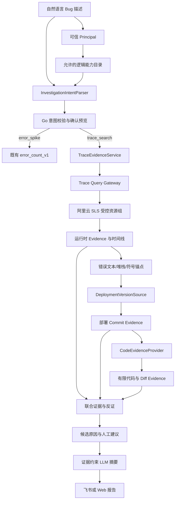

# 自然语言 RCA 与代码证据能力规格

| 元数据 | 值 |
| --- | --- |
| Version | `0.4` |
| Status | `ACTIVE_INCREMENTS` |
| Date | `2026-09-02` |
| Parent Spec | [`spec.md`](spec.md) |

## 1. Overview

本规格定义 Log Agent 从“受治理的错误数量调查”演进到“自然语言 Bug 描述驱动、Trace 定位、部署版本确认、有限代码检索和联合根因候选”的完整行为边界。

目标不是把阿里云 SLS、Git 仓库或 Shell 直接交给大模型，而是增加三类相互独立、可审计的证据：

1. **运行时证据**：日志、TraceID 和跨 Logstore 时间线，回答“当时发生了什么”；
2. **部署证据**：环境实际运行的 Commit、制品或镜像身份，回答“当时运行的是哪一版”；
3. **代码证据**：错误文本、堆栈、函数和目标 Commit 的有限代码片段，回答“为什么这条代码路径可能产生该现象”。

三类证据共同支持候选原因。代码片段本身不能证明运行时执行过，时间相邻的变更也不能单独证明因果关系。

## 2. Goal

用户提交类似问题：

```text
DAM 测试环境今天 14:20 左右上传音频超时，TraceID 是 abc123456，帮我找原因和处理建议。
```

系统应能够：

- 从自然语言提取逻辑服务、环境、时间、调查类型和 TraceID；
- 只在当前 Principal 被授权的逻辑能力范围内形成调查计划；
- 使用固定、版本化模板查询 DAM 受控 Logstore；
- 将跨来源事件归一化、脱敏并形成有界 Trace 时间线；
- 从日志中提取静态错误文本、堆栈帧、函数符号和路由等代码锚点；
- 确认目标环境实际部署的不可变 Commit；
- 只在管理员允许的仓库和该 Commit 上进行精确、有限、只读检索；
- 将运行时、部署、代码和变更证据绑定到候选原因；
- 输出支持证据、反证、数据缺口、置信度来源和人工处理建议；
- 当证据不足、版本未知或外部结果不确定时进入 `INCONCLUSIVE` 或 `NEEDS_REVIEW`，不编造根因。

## 3. Scope

最终能力范围包括：

- 本地 Web 与飞书共用的自然语言 Bug 描述入口；
- Provider-neutral 的 `InvestigationIntentParser`；
- `error_spike`、`trace_search` 和后续受控 `keyword_search` 意图；
- 独立于聚合信号源的 `TraceEvidenceProvider`；
- 管理员维护的 Trace 资源组和成员字段能力；
- 主 Logstore 优先、受限并发的跨 Logstore Trace 查询；
- 事件脱敏、错误指纹、堆栈和代码锚点提取；
- Provider-neutral 的 `DeploymentVersionSource`；
- Provider-neutral 的 `CodeEvidenceProvider`；
- 首个本地 Git 只读适配器，以及未来 GitHub/GitLab 适配器入口；
- 运行时、部署、代码、变更和 Runbook 的联合证据账本；
- 候选原因和人工修复建议；
- 独立评测数据集、Trace、回放、专家反馈和真实试点门禁。

## 4. Non-goals

本能力不包含：

- 让 LLM 直接输出并执行任意 SLS SQL/SPL；
- 让用户或模型选择物理 Project、Logstore、仓库路径或任意 Git Ref；
- 把整个代码仓库、完整原始日志或完整 Diff 发送给外部模型；
- 允许模型运行 Shell、测试命令、数据库写操作、发布、回滚、重启或修改配置；
- 默认遍历所有仓库、分支和历史 Commit；
- 把代码静态路径、时间相关或单一变更称为已确认根因；
- 未经用户授权自动修改代码、创建分支、提交或发起 PR；
- 在没有真实事故集和专家验收前声明根因准确率、MTTR 改善或生产可用。

## 5. Core design and architecture



### 5.1 边界原则

- 自然语言只产生**逻辑调查意图**，不产生 Provider 查询语句；
- Trace 查询使用独立合同，不改变现有聚合 `SLSExecutor/QueryResult` 语义；
- 代码查询使用独立合同，不把 Git 命令、Token 或仓库对象暴露给 Eino/LLM；
- 所有物理资源、仓库和部署映射来自管理员配置或可信平台；
- Eino 只编排固定阶段，权限、预算、审计、校验和结论仍在应用层；
- 每个外部调用均有超时、数量、字节、结果状态和 Checkpoint；
- 模型不可提升确定性、不可新增 Evidence、不可越过人工授权执行修复。

## 6. User and system workflows

### 6.1 自然语言接单

1. 入口从飞书信封或本地 Web 固定配置派生 `Principal`；
2. 系统根据 Principal 得到可用的逻辑服务、环境和调查能力，不暴露物理资源；
3. 用户问题经过长度、字符和常见凭据脱敏检查；
4. Intent Parser 只允许返回严格结构化意图；
5. Go 重新校验服务、环境、时间窗、TraceID、能力和置信度；
6. 页面或卡片展示解析预览，用户确认或修正逻辑范围；
7. 只有确认后的意图才进入现有 Intake、Inbox、Job 和幂等状态机。

### 6.2 Trace 调查

1. `trace_search` 必须包含通过格式校验的 TraceID；
2. Trace Resource Catalog 将逻辑服务和环境映射到一个受控资源组；
3. 先查询主服务 Logstore，成功后其余成员最多并发 2；
4. 每个成员和全任务都有限定行数、字节数、调用数和时间窗；
5. 每条事件先脱敏，再归一化时间、逻辑来源、级别、操作、消息指纹和代码锚点；
6. 成员失败、超时、截断或字段不兼容必须进入完整性状态；
7. 时间线不完整时可以展示已有证据，但不得形成确定性根因。

### 6.3 代码证据调查

1. 从运行时 Evidence 提取精确错误文本、堆栈帧、函数或路由；
2. `DeploymentVersionSource` 返回环境对应的不可变 Commit 和可信来源；
3. 没有部署 Commit 时禁止退回默认分支或当前工作树搜索；
4. `CodeEvidenceProvider` 只在允许仓库、目标 Commit 和允许路径中执行固定能力；
5. 首轮优先精确错误文本和堆栈文件，不能从仓库根开始自由遍历；
6. 仅返回匹配位置附近的有限代码、Blob Hash、行号和内容指纹；
7. Diff 只能比较可信部署记录提供的批准 Commit 对；
8. 联合验证器将代码路径与运行时锚点、部署 Commit、变更记录和反证绑定。

## 7. Behavioral contracts and lifecycle

### 7.1 问题描述合同

- `ProblemStatement` 是不可信用户输入；
- 最大长度默认 500 个 Unicode 字符，禁止空白问题；
- 常见 AccessKey、Token、Bearer、JWT、邮箱和 IP 形态在持久化和出站前脱敏；
- 原文不进入 QuerySpec、QueryAudit、物理资源选择或确定性 Finding；
- 页面单独标注“用户描述”，不得渲染为系统确认事实；
- 外部 LLM 只接收经过脱敏、长度限制的版本。

### 7.2 调查意图合同

目标关闭集合如下，但按阶段逐项开放：

| Intent | 必需输入 | 映射能力 | 无法满足时 |
| --- | --- | --- | --- |
| `error_spike` | service、environment、duration | `error_count_v1` | `UNSUPPORTED` 或人工修正 |
| `trace_search` | service、environment、time/window、trace_id | `trace_search_v1` | `INCOMPLETE_INTENT` |
| `unknown` | 无 | 不执行工具 | 返回可支持范围 |

当前已开放 `error_spike`、`trace_search` 与 `unknown`。`trace_search` 已通过第二阶段离线验收及真实 8 库零日志读取 Schema 检查，但代表性真实 TraceID 查询仍待验收；`keyword_search` 在字段合同、脱敏和预算验收完成前不进入关闭集合。

意图解析生命周期使用关闭状态：`PARSING / RESOLVED / UNKNOWN / INCOMPLETE / REJECTED / FALLBACK / OUTCOME_UNKNOWN`。`PARSING` 只表示持久化解析占位；进程在 Provider 调用后失联时不得自动再次调用。只有未过期、属于原 Principal 的 `RESOLVED` 可以确认，确认操作以 Resolution ID 幂等绑定唯一调查。

意图调用使用独立于报告摘要的请求/Token 额度账本。额度在 Provider 前预留，成功后按 Provider Token 结算；外部结果未知或 Token 元数据非法时保留预留成本代理。

Intent Parser 不允许返回：Project、Logstore、仓库路径、Commit、字段、SQL/SPL、Shell、URL、凭据或执行动作。

### 7.3 TraceID 合同

- 长度为 8～256；
- 只允许批准字符集合，不接受查询运算符和换行；
- 使用固定精确短语模板，不能拼接为自由表达式；
- 测试环境默认窗口 10 分钟，首个版本最大 30 分钟；
- 预发和生产必须由当前请求明确表达，且 Principal 通过 ACL；
- 单成员首轮最多 50 条，全任务最多 500 条，成员并发最多 2；
- 只有 Provider 明确 `Incomplete` 时允许受限原样重试；
- 零命中表示连接成功但没有运行时证据，不能自动扩大环境或时间。

### 7.4 Trace Evidence 合同

Trace Evidence 至少包含：

- 本地 Evidence ID；
- 逻辑 Resource Group ID 和成员逻辑 ID；
- 查询模板及治理指纹；
- TraceID 的不可逆指纹，不保存或展示不必要的原值；
- 事件时间、接收时间可用性和排序质量；
- 脱敏消息摘要、消息指纹、级别和操作；
- 代码锚点集合；
- Complete、Truncated、Partial、ZeroHit 状态；
- 调用、返回行、处理字节、耗时和安全原因码。

物理 Project、Logstore、原始消息和 Provider 原始错误不进入用户报告。

### 7.5 部署版本合同

部署证据至少包含：

- 逻辑服务和环境；
- Repository ID；
- 完整 Commit SHA；
- 制品或镜像摘要（可用时）；
- 部署时间和来源版本；
- Previous Commit（只有可信平台明确提供时）；
- Complete/Unavailable/Conflict 状态；
- 内容指纹和审计身份。

分支名、`HEAD`、本地工作树和“最新 Commit”不能替代实际部署 Commit。

### 7.6 CodeEvidenceProvider 合同

Provider 只提供固定能力：

- `SearchExactText`：按完整静态错误文本搜索；
- `LocateStackFrame`：按已校验文件和行号读取；
- `ReadSymbolContext`：读取已定位符号附近的有限上下文；
- `ListTrustedDiff`：比较可信部署记录提供的 Commit 对；
- `FindDirectReferences`：在允许范围内查找直接引用，首版仅支持 Go 可确定解析。

Provider 不提供通用 Shell、自由 Git 参数、任意正则、仓库树遍历、网络 URL 或写操作。

每次调用必须限定：

- 一个管理员允许的 Repository ID；
- 一个完整 Commit SHA；
- 一个允许路径集合；
- 最大文件数、匹配数、代码行数、字节数和超时；
- 禁止文件模式，如凭据、私钥、`.env`、Vendor 和生成制品；
- 结果脱敏及内容指纹。

### 7.7 候选原因合同

候选原因状态保持关闭集合：

- `SUPPORTED_CANDIDATE`：运行时锚点、部署版本和代码路径共同支持，且没有硬反证；
- `REFUTED`：可信运行时或部署证据直接否定该候选；
- `INCONCLUSIVE`：证据部分支持但存在缺口、冲突或不完整；
- `UNAVAILABLE`：所需数据源未配置或调用失败；
- `NEEDS_REVIEW`：外部结果未知、部署版本冲突或需要人工判断。

自动输出不得使用“已确认根因”。只有经过真实 Reviewer 绑定 Evidence 的人工结论才能标记为 `HUMAN_CONFIRMED`。

### 7.8 解决方案合同

系统可以输出：

- 需要检查的文件、函数和错误分支；
- 与当前 Evidence 对应的修改方向；
- 建议补充的日志、指标或测试；
- 经治理 Runbook 返回的人工处理步骤；
- 风险、回归范围和验证建议。

解决方案必须引用 Runtime/Deployment/Code/Runbook Evidence，标记为 `HUMAN_REVIEW_ONLY`。系统不自动修改代码或生产系统。

## 8. Trust and data boundaries

| 数据 | 是否可用于确定性判断 | 是否可发送外部 LLM | 说明 |
| --- | --- | --- | --- |
| 用户 Bug 描述 | 否 | 脱敏、有界后可用于意图解析 | 始终标成用户陈述 |
| SLS 聚合 Evidence | 是 | 现有安全投影可发送 | 已有合同保持不变 |
| Trace 事件 | 经完整性校验后可用 | 默认不发送原始事件 | 先归一化、脱敏、压缩 |
| 部署 Commit | 是 | 可发送逻辑身份/Hash | 来源必须可信 |
| 代码片段 | 只能解释可能路径 | 默认禁止；需公司策略显式允许 | 不读取秘密文件 |
| Git Diff | 只能作为变更候选 | 默认禁止；需显式允许 | 时间相邻不等于因果 |
| Runbook | 只提供人工步骤 | 由内容治理策略决定 | 必须版本化和审批 |

所有外部 LLM 出站内容必须经过独立投影和数据策略。启用代码片段出站不能沿用一个笼统的 LLM 开关，必须有单独配置与审计。

## 9. Persistence, recovery and idempotency

- 意图解析使用独立幂等键，重复提交不得重复调用 LLM；
- 解析结果保存 Prompt 版本/指纹、Provider、模型、Token、耗时、状态和安全原因码，不保存 Prompt 正文；
- Trace Resource Group、模板、字段能力和预算进入治理指纹；
- 每个成员查询有独立 Checkpoint；完整成员可复用，结果未知成员不得自动重查；
- 部署版本解析和代码检索结果绑定 Repository/Commit/Query 指纹；
- 代码仓库变化不能改变历史 Evidence，因为读取目标是不可变 Commit；
- 任何外部调用结果未知都遵循现有 `NEEDS_REVIEW` 语义；
- 数据库 Schema 变化必须引入显式版本和迁移/回滚机制，不能继续只靠隐式建表升级已有试点库。

## 10. Observability and evaluation

新增稳定 Span：

- `intent.resolve`
- `trace.primary`
- `trace.member`
- `trace.normalize`
- `deployment.resolve`
- `code.search_exact`
- `code.read_context`
- `code.diff`
- `rca.verify`

Trace 只保存调用状态、计数、耗时、指纹和安全原因码，不保存问题原文、TraceID、代码正文、日志正文或凭据。

评测至少覆盖：

- 正确解析 `error_spike`；
- TraceID 缺失、非法和 Prompt Injection；
- 未授权服务、环境和超大时间窗；
- 8 成员完整、部分失败、零命中、截断和结果未知；
- 错误文本与堆栈锚点提取；
- 部署 Commit 缺失、冲突和错误默认分支回退；
- 代码命中正确 Commit、禁止路径、结果上限和秘密脱敏；
- 运行时支持但代码反证、代码支持但运行时缺失；
- 变更时间相邻但不构成因果；
- LLM 失败、虚构代码引用和危险修复建议；
- Checkpoint 恢复、费用保留、重复请求和旧 Worker fencing。

离线合成评测、脱敏历史故障、真实单次试点和生产灰度必须分开报告。

## 11. Compatibility and failure behavior

- 既有 `/investigate <service> <environment> <duration> [template]` 保持兼容；
- 自然语言入口使用独立开关，默认关闭，不改变现有真实 count-only 链路；
- Intent Parser 不可用时退回结构化表单/命令，不自动猜测；
- `error_count_v1` 的 QuerySpec、Evidence、审计和 Checkpoint 合同保持不变；
- 新 Trace 证据不复用仅支持聚合的 `OperationalSignalSource`；
- 新代码证据不进入现有 `ReportSummarizer`，直到独立出站策略批准；
- 可选增强失败不能抹掉已经成立的运行时事实；
- 任何不完整或冲突都降低结论，不得提高置信度。

## 12. Acceptance checklist

- [x] 用户可以提交自然语言 Bug 描述并看到结构化解析预览；
- [x] LLM 不能提交 SPL、物理资源、仓库路径、Commit 或执行动作；
- [x] `unknown`、低置信度和未授权意图产生零 SLS/代码调用；
- [x] 既有结构化命令和 `error_count_v1` 行为无回归；
- [x] TraceID 查询按主库优先、并发 2、每库 50、全局 500 的预算执行；
- [x] 8 个成员的成功、零命中、失败和截断状态可独立审计；
- [x] Trace 时间线只使用脱敏归一化事件，不向用户暴露物理资源；
- [x] 脱敏事件可确定性提取五类有界运行时锚点，且锚点完整性可由 Worker 重算；
- [x] 代码调查前必须获得可信完整部署 Commit；
- [x] Code Provider 只访问允许仓库、Commit、路径和固定能力；
- [x] 当前 Trace 链路中的代码正文、原始日志、TraceID、Prompt 和凭据不进入 Agent Trace；
- [ ] 候选原因同时展示支持证据、反证、数据缺口和限制；
- [x] 当前代码证据阶段不会仅凭代码、Diff 或时间相关输出确认根因；
- [x] 当前代码证据只供人工审核，不存在自动修改或生产操作；
- [ ] Mock、离线、真实单次和生产验收边界在报告中可辨识；
- [ ] 全仓测试、静态检查、重点恢复测试和安全评测通过；
- [ ] 脱敏历史故障和真实 Reviewer 门禁通过后才允许扩大试点。

## 13. Decisions

以下决策在本规格中已经固定：

1. 自然语言生成结构化意图，不生成 SPL；
2. 自然语言当前开放 `error_spike`、`trace_search` 与 `unknown`，深挖必须有合法 TraceID；
3. TraceID 是进入跨库和代码调查的首个深挖入口；
4. Trace 证据使用独立端口，不污染现有聚合查询合同；
5. 部署 Commit 未确认时禁止代码检索；
6. 首个代码适配器优先读取管理员允许的本地 Git 仓库和不可变 Commit，不引入 GitHub Token；
7. 代码片段默认不发送外部 LLM；
8. 根因自动输出最高只能是 `SUPPORTED_CANDIDATE`；
9. 修复始终需要人工确认，当前不建设自动处置；
10. 先完成运行时定位，再接代码和知识，不建设通用多 Agent 平台。

## 14. Open questions

当前没有阻塞规格设计的开放问题。真实实现前需要以配置输入确认以下事实，但它们不改变架构：

- DAM 8 个 Logstore 最新成员和字段能力；
- TraceID 的真实字段/全文索引方式；
- 测试环境部署 Commit 的可信来源；
- 允许接入的仓库、目录和禁止文件模式；
- 代码片段是否允许发送火山方舟；
- 脱敏历史故障集和 Reviewer 人选。
