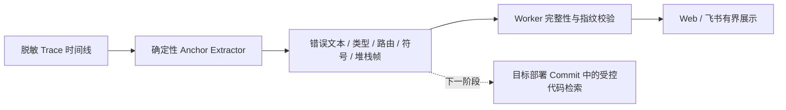

# 运行时错误锚点

| 项目 | 内容 |
| --- | --- |
| 版本 | `runtime-anchor-v1` |
| 状态 | 主体代码与离线验收完成 |
| 输入 | 已经过 Trace Gateway 脱敏和窗口校验的 `TraceEvent` |
| 输出 | 有界 `RuntimeAnchorSet`，以及绑定到来源事件的锚点 |
| 非目标 | 不读取代码仓库，不确认根因，不生成修复动作 |

## 1. 为什么需要这一层

第二阶段已经能把 DAM 8 个 Logstore 的事件整理成时间线，但“某条日志在什么时间出现”还不能直接告诉系统应该看哪段代码。如果立即把整个仓库交给模型遍历，会带来范围过大、成本不可控、秘密文件泄露和搜索错版本等问题。

第三阶段在运行时证据和代码仓库之间增加一个纯 Go、无 I/O 的提取层：只从已经脱敏的事件中找出少量、稳定、可校验的检索线索。下一阶段只能拿这些线索去目标部署 Commit 中做精确只读搜索。

## 2. 锚点合同

关闭的锚点类型只有五种：

| 类型 | 示例 | 下一阶段用途 |
| --- | --- | --- |
| `STACK_FRAME` | `internal/payment/client.go:87` | 直接读取目标 Commit 对应行附近上下文 |
| `SYMBOL` | `example.com/dam/internal/payment.(*Client).Charge` | 精确定位函数或方法 |
| `ERROR_TYPE` | `payment_timeout`、`TimeoutException` | 搜索稳定错误类型或错误码 |
| `ERROR_TEXT` | `payment timeout` | 精确搜索静态错误短语 |
| `ROUTE` | `POST /dam/job` | 缩小到路由处理链 |

每个锚点都绑定来源事件 ID 和逻辑成员 ID、关闭的 Kind、规范化内容、SHA-256 内容指纹，以及由来源事件身份和内容指纹派生的稳定 ID。

路径只接受 Go、Java、Python 的安全仓库相对路径。绝对路径只有在能裁剪到 `internal/`、`cmd/`、`pkg/` 或 `src/` 后才会保留；`..`、Vendor、生成目录、密钥和凭据特征路径都会被拒绝。

## 3. 提取和预算

实现位于 `internal/application/anchors`，不调用网络、文件系统、Git、Shell 或 LLM。

1. 从 Go、Java、Python 常见堆栈格式中提取帧；
2. 从 Go 堆栈上一行提取完整函数符号；
3. 从消息中提取稳定错误类型和 `error/failed/panic/exception` 后的短语；
4. 只在 Operation 完全符合批准 HTTP 方法和安全路径时生成路由锚点；
5. 按堆栈、符号、错误类型、错误文本、路由的优先级排序并去重；
6. 每个事件最多 4 个，全调查最多 64 个；超限会增加 `dropped_count` 并把集合降级为 `PARTIAL`。

集合状态只有：

- `COMPLETE`：上游 Trace 完整、至少一个锚点且没有因预算丢弃；
- `PARTIAL`：上游不完整或发生预算丢弃；
- `NO_ANCHORS`：完整 Trace 中没有安全、稳定的可用锚点。

`COMPLETE` 只说明提取过程完整，不表示根因已经得到证明。

## 4. 校验与展示

TraceEngine 在全局事件预算生效后提取锚点，避免从最终不会进入 Evidence 的日志产生线索。生产输出校验器重新检查锚点形状、来源绑定、ID/指纹、数量、去重、排序、状态，以及 Timeline/Evidence 的精确一致性。

本地 Web 最多展示 12 个、飞书最多展示 8 个，并固定提示“只用于定位，不代表根因”。物理 Logstore、原始 TraceID、原始未脱敏日志仍不会进入投影。

## 5. 本阶段验收与边界

离线测试覆盖 Windows/Unix Go 路径规范化、三种语言堆栈、错误/路由提取、占位符与危险值拒绝、预算、去重、篡改拒绝，以及 TraceEngine、Web 和飞书投影集成。

Mock `trace-smoke` 能证明 8 成员时间线可产生并持久化有界锚点，但不能证明真实 DAM 日志必然包含可解析堆栈。本阶段没有读取任何代码仓库，也没有实现部署 Commit 解析和代码证据；这些属于第四阶段。

## 6. 下一阶段入口

- `DeploymentVersionSource`：从可信部署目录或平台解析服务/环境当时实际部署的完整 Commit；
- `CodeEvidenceProvider`：只在管理员允许的仓库、目标 Commit 和安全路径内消费本阶段锚点，执行精确搜索和有限上下文读取。

没有可信部署 Commit 时必须停止为 `UNAVAILABLE/INCONCLUSIVE`，禁止回退到 `HEAD`、默认分支或当前工作树。
