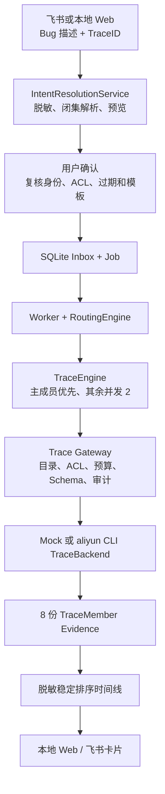

# DAM TraceID 多 Logstore 脱敏时间线

## 1. 阶段结论

第二阶段实现了一个独立于错误计数模板的 `trace_search_v1` 调查路径：用户可在自然语言中提供 DAM、环境、时间窗和 TraceID，系统先生成逻辑预览；同一可信身份确认后，才按管理员目录依次查询 DAM 的 8 个 Logstore，并把结果合并成一条受治理、已脱敏的时间线。

这不是“自然语言生成 SPL”，也不是分布式追踪平台。模型只能选择 ACL 已允许的 `service/environment/trace_search_v1` Capability；Endpoint、Project、Logstore、字段和查询表达式全部由管理员配置及 Go 代码生成。

当前已完成代码、全离线测试和 Mock 端到端验收。2026-09-02 的真实 `trace-check` 已验证 8 个成员的 Logstore/索引元数据，日志读取为 0；真实 `trace-smoke` 尚未执行，因此不能把 Mock 时间线表述为 DAM 的真实故障结果。

## 2. 调用链



普通 `error_count_v1/error_analysis_v2` 调查仍走原 Eino 固定 Graph。`RoutingEngine` 只在 `TemplateID=trace_search_v1` 时切换到 TraceEngine，避免把原有计数和原因分析合同改成一个巨型流程。

## 3. 资源模型

一个逻辑 `(service, environment)` 对应一个管理员拥有的 `TraceResourceGroup`：

- 一个 `primary_member_id`，DAM 当前为主 Server Logstore；
- 1～16 个固定成员，DAM 示例为 8 个；
- 每个成员独立声明 Trace 查询模式、环境过滤模式和允许投影的字段；
- Principal 只能访问目录 `bindings` 显式授权的组；
- 用户、LLM 和 HTTP 参数都不能提交 Project、Logstore、Endpoint 或字段名。

示例目录为 [`../config/trace-resources.example.json`](../config/trace-resources.example.json)。前 6 个成员使用结构化 `env/level/msg` 字段；后 2 个使用全文环境条件和受限消息占位合同。真实启用前必须以 `trace-check` 核对当前索引和实际消息字段，不能仅复制样例后宣称可用。

## 4. 查询与成本边界

默认策略：

| 项目 | 默认值 | 上限语义 |
| --- | ---: | --- |
| 时间窗 | 10 分钟（自然语言 Trace 默认） | 最大 30 分钟 |
| 单成员事件 | 50 | 达到上限即标记 `TRUNCATED` |
| 全调查事件 | 500 | 超出后截断并降级为部分证据 |
| 成员并发 | 2 | 主成员完成后，其余成员才并行 |
| 处理字节 | 256 MiB | Provider 元数据缺失或超限均不产生完整结论 |
| `Incomplete` 重试 | 1 | 只有明确返回 `Incomplete` 才原样重试一次 |
| Provider 超时 | 20 秒/成员 | 结果不明进入人工复核，不自动重查 |

每个成员的查询表达式只有两种固定形态：精确字段短语或全文精确短语，再与目录拥有的环境条件组合。阿里云 CLI 由 `exec.CommandContext` 以参数数组调用，不经过 Shell；TraceID 只允许 `[A-Za-z0-9._:-]` 且长度为 8～256，不能注入 SPL。

## 5. Evidence 和隐私

每个成员生成一份 `TraceMemberResult`，状态只能是：

- `COMPLETE`：有可排序事件且元数据完整；
- `ZERO_HIT`：查询完成但没有命中；
- `INCOMPLETE/TRUNCATED/INVALID_SCHEMA`：证据可以展示，但不能支持确定性完整结论；
- 外部调用结果不明不会伪装成成员失败，而是使整个 Job 进入 `NEEDS_REVIEW`。

原始 TraceID只在持久化任务请求中保留，以便异步 Worker 执行精确查询；Evidence、报告、页面和卡片只使用 SHA-256 指纹或短提示。日志离开 Gateway 前会：

- 把原始 TraceID替换为 `[TRACE_ID]`；
- 脱敏 Bearer/JWT、阿里云 AK 形态、邮箱和 IPv4；
- URL 只保留 scheme、host 和 path，移除 query/fragment；
- 限制消息、级别和操作字段长度；
- 对脱敏后的消息计算指纹；
- 校验事件时间必须落在请求窗口，否则成员降级为不完整。

物理 Logstore 名不会进入用户侧投影，页面和卡片只展示逻辑成员 ID、状态、用量和最多 100/12 条脱敏事件。

## 6. 持久化与恢复

SQLite Schema 当前为 `user_version=2`，新增：

- `trace_query_steps`：每个 `(investigation_id, member_id)` 一个有 fencing 的 Checkpoint；
- `trace_audit`：记录 DENIED/STARTED/SUCCEEDED/INCOMPLETE/OUTCOME_UNKNOWN 及安全元数据；
- Intent Resolution 的 TraceID、指纹和预览提示字段。

已成功写入的成员结果可复用；如果进程在 `STARTED` 后、结果落库前消失，下一次租约接管会把该成员标为外部结果未知，整个调查进入 `NEEDS_REVIEW`。这是为了避免对可能已经收费的 SLS 请求进行静默重复查询。

## 7. 配置和命令

完全离线：

```powershell
$env:LOG_AGENT_TRACE_MODE = "mock"
$env:LOG_AGENT_INTENT_MODE = "mock"
go run ./cmd/logagent trace-smoke dam-server test 10m trace-12345678
go run ./cmd/logagent web
```

真实阿里云只读试点：

```powershell
Copy-Item .\config\trace-resources.example.json .\config\trace-resources.json
# 将 bindings 和每个成员的字段合同改成真实批准值
$env:LOG_AGENT_TRACE_MODE = "aliyun"
$env:LOG_AGENT_TRACE_CATALOG = ".\config\trace-resources.json"
$env:LOG_AGENT_SLS_MODE = "aliyun"
$env:LOG_AGENT_SLS_CLI_PROFILE = "default"

# 只读 Schema 检查，不读日志
go run ./cmd/logagent trace-check

# 明确提供一个可用于测试的 TraceID 后，才执行真实 8 库查询
go run ./cmd/logagent trace-smoke dam-server test 10m <trace-id>
```

`trace-check` 证明目录、CLI、STS、权限和字段合同可以读取；`trace-smoke` 才证明 8 个成员在同一次真实调查中返回了可用结果。两者都不能证明根因定位准确。

## 8. 本阶段实测

2026-09-02 已执行：

- `go test -count=1 ./...`：通过；
- `trace-smoke`（Mock）：`SUCCEEDED`，覆盖 8 个逻辑成员，构建 2 条脱敏事件，8 次 Mock API 调用；
- 集成测试验证主成员第一个调用、其余最大并发为 2、8 个 Checkpoint 和 16 条开始/终止审计；
- 测试验证 TraceID、Bearer、邮箱、IPv4 和 URL 查询参数不会进入 Evidence；
- 测试验证旧 `user_version=1` 数据库可升级到版本 2，未知外部结果不会自动重试。
- 真实 `trace-check`：`READY`，8/8 成员通过，`log_reads=0`；其中前 6 个成员识别到 3～4 个所需字段索引，后 2 个成员识别为全文索引且字段索引数为 0。

真实检查只读取 Logstore/索引元数据，不读取日志；Mock 事件数量只证明本地合同，不代表真实 DAM 日志命中。

## 9. 下一阶段

第三阶段已经完成：系统会从已脱敏时间线提取有界错误锚点，包括静态错误短语、异常类型、文件/函数符号、路由/操作和 Go/Java/Python 堆栈帧。锚点用于缩小代码检索范围，本身不能被表述为根因，也不会触发代码库读取。完整合同见 [`runtime-error-anchors.md`](runtime-error-anchors.md)。

下一阶段只在获得可信、完整的实际部署 Commit 后，才允许受控代码 Provider 消费这些锚点。
