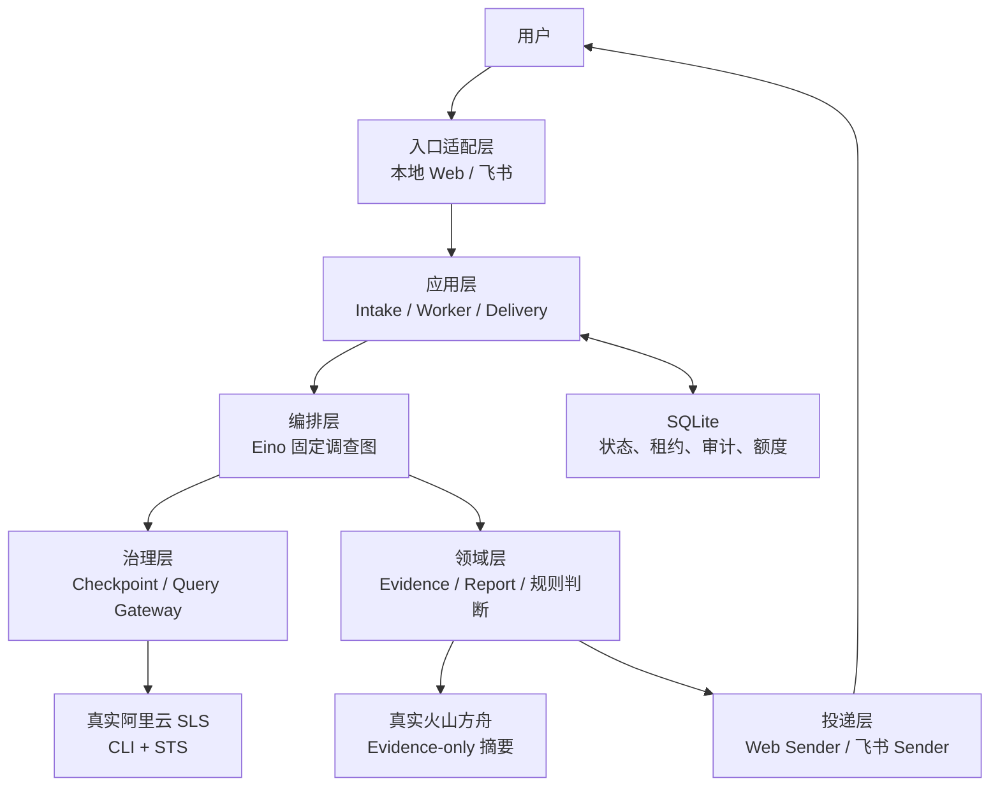
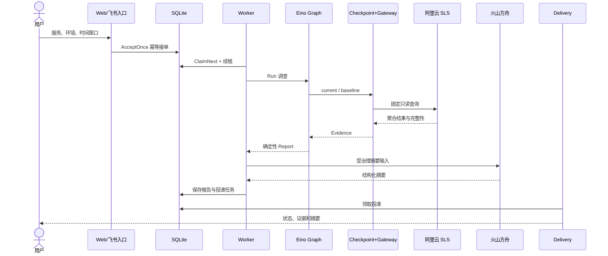
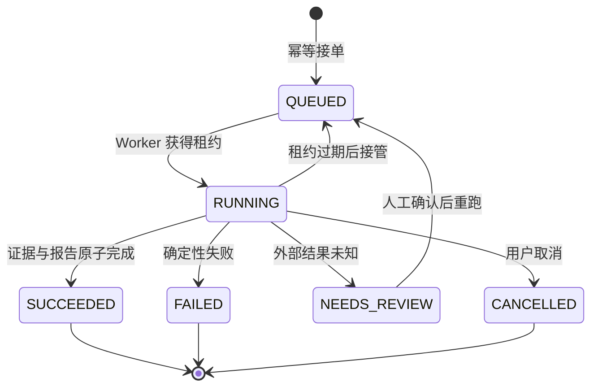

# Log Agent 项目架构：把排障经验做成一条可审计的调查流水线

> 面向岗位：校招 Agent 开发 / Go 后端
> 源码基线：`e115d4dcd7993b1c25e0001be951dad2c2cc1f1c`
> 阅读目标：能在面试中讲清“项目解决什么问题、一次调查怎样流转、为什么这样分层、哪些已经真实验证”。

## 1. 先用一个办案故事理解项目

想象值班工程师凌晨收到一句“测试环境错误是不是变多了”。
他不能只搜几条带 `error` 的日志就下结论，
而要先确认提问者有没有权限、查询哪个服务、观察多长时间，
再把当前窗口与基线窗口放在一起比较，
最后保留查询范围、结果完整性和证据编号。

这个 Log Agent 就像一名“拿着授权清单办案的值班工程师”。
入口负责登记案件，SQLite 保存案卷，Worker 领取任务，
Eino 按固定调查步骤推进，Query Gateway 像门禁一样审查每次查询，
阿里云 SLS 提供真实观测，Evidence 形成可追溯证据，
规则引擎先做确定性判断，火山方舟只负责把已有证据讲得更易读。

一句话业务目标是：

> 把“收到排障请求—查询日志—比较基线—形成证据—给出摘要—投递结果”做成一条可恢复、可审计、默认只读的 Go Agent 流水线。

## 2. 技术栈与设计边界

| 层面 | 当前选择 | 主要职责 |
| --- | --- | --- |
| 主体语言 | Go | 领域模型、应用服务、并发 Worker、适配器和测试 |
| Agent 编排 | Eino Graph | 编排固定调查节点，不保存业务状态 |
| 状态存储 | SQLite | 幂等接单、调查状态、租约、Checkpoint、审计、额度和投递 |
| 日志来源 | 阿里云 CLI + SLS 插件 | 使用本机 STS Profile 发起只读查询 |
| LLM | 火山方舟 Responses API | 只基于受治理 Evidence 生成结构化摘要 |
| 交互入口 | 本地 Web；飞书适配器保留 | Web 已用于联合验证，真实飞书仍待权限验收 |
| 测试与评测 | Go test + Golden/Replay | 验证合同、失败关闭、回放比较和架构边界 |

这套架构有三个明确的“不做”：

1. 不让 LLM 自由拼 SLS 查询语句。
2. 不把原始日志、凭据、物理资源名直接发给 LLM。
3. 不自动执行重启、回滚或变更操作。

入口命令和各运行模式集中在 [main.go](file:///D:/日志agent/cmd/logagent/main.go#L33-L132)，
领域对象集中在 [types.go](file:///D:/日志agent/internal/domain/types.go#L58-L188)，
框架与外部系统通过端口隔离在 [ports.go](file:///D:/日志agent/internal/ports/ports.go#L54-L116)。

> 📦 **额外知识：什么是六边形架构？**
>
> 业务核心只依赖接口，数据库、Agent 框架和云服务放在外围适配器中。
> 这样替换 Eino、SLS 调用方式或交互入口时，调查规则不必跟着重写。
> 本项目的 `domain / application / ports / adapters` 就是在落实这一思路。

## 3. 整体分层图

依赖方向从外向内看很重要：

- `domain` 不知道 Eino、SQLite、飞书和方舟的存在；
- `application` 只依赖 `ports` 中的接口；
- `adapters` 把 Eino、CLI、HTTP 和 SQLite 翻译成端口合同；
- `cmd/logagent` 负责选择 Mock 还是真实实现，并把对象组装起来。

真正的装配入口在 [main.go](file:///D:/日志agent/cmd/logagent/main.go#L228-L285)：
它先构建受治理查询执行器和 Checkpoint，
再编译 Eino Graph，随后按配置挂载摘要服务与可选 Runbook。
本地 Web 入口则在 [web.go](file:///D:/日志agent/cmd/logagent/web.go#L21-L91)
同时启动调查 Worker、投递 Worker 和 HTTP Server。

这意味着 Eino 是“流程编排器”，不是“整个 Agent 应用”。
即使未来更换框架，幂等、权限、状态机、证据和恢复语义仍由 Go 应用层持有。

## 4. 一次调查怎样完整流转

下面按照真实调用顺序，一步一步走完。

### Step 1：入口把自然请求收敛成受控参数

**这一步在干嘛：**
用户只提交服务、环境、时间窗口和允许的模板标识。
入口不接受 Project、Logstore、查询语句或用户身份等高风险字段。

本地 Web 适配器的边界在 [server.go](file:///D:/日志agent/internal/adapters/localweb/server.go#L54-L92)，
它要求身份由服务端固定配置；
可调用的接口也只有提交、查询状态和受控动作，见
[server.go](file:///D:/日志agent/internal/adapters/localweb/server.go#L113-L138)。

**为什么这么做：**
如果让浏览器或聊天文本直接指定身份和物理日志库，
攻击者就可能越权或绕过管理员维护的资源目录。
入口只表达“业务意图”，资源解析留给服务端 Catalog。

### Step 2：Intake 做可信身份绑定和幂等接单

**这一步在干嘛：**
Intake 从适配器信封提取 App、Tenant 和 User，覆盖请求体里的身份，
再生成调查 ID、任务 ID，通过 `AcceptOnce` 原子接单。

实现位于 [intake.go](file:///D:/日志agent/internal/application/intake.go#L12-L42)。

**为什么这么做：**
消息平台或浏览器可能重复投递同一请求。
幂等键让重复消息返回同一个调查，而不是重复查询 SLS；
可信信封又避免用户在文本里伪造另一个人的权限。

> 📦 **额外知识：幂等不是简单“去重”**
>
> 去重只说“不要多一条记录”，幂等还要求重复调用得到一致结果。
> 接单时把入站消息和调查任务放进同一持久化语义，
> 才能在入口超时重试时避免产生两个独立调查。

### Step 3：SQLite 保存调查和待执行任务

**这一步在干嘛：**
接单成功后，调查进入 `QUEUED`，任务等待 Worker 领取。
同一个存储还保存查询步骤、审计、摘要额度和投递任务。

存储端口对生命周期的要求定义在
[ports.go](file:///D:/日志agent/internal/ports/ports.go#L54-L73)，
包括接单、领取、续租、成功、失败、待复核和取消。

**为什么这么做：**
Agent 调查不是一次 HTTP 请求内就能可靠完成的短操作。
入口与执行解耦后，即使网页关闭或进程短暂重启，
任务仍在数据库里，而不是丢在内存 Channel 中。

### Step 4：Worker 用租约领取任务

**这一步在干嘛：**
Worker 原子领取一个任务，创建运行上下文并周期续租，
然后调用 `InvestigationEngine.Run`。
执行结束后，它根据结果持久化 `SUCCEEDED`、`FAILED` 或 `NEEDS_REVIEW`。

主流程见 [worker.go](file:///D:/日志agent/internal/application/worker.go#L70-L148)，
心跳续租见 [worker.go](file:///D:/日志agent/internal/application/worker.go#L151-L175)。

**为什么这么做：**
如果多个 Worker 同时扫描任务，没有租约会重复执行昂贵查询；
如果进程崩溃，永久锁又会让任务永远卡住。
有期限租约在“避免并发重复”和“允许故障接管”之间取平衡。

### Step 5：Eino 按固定图制定并执行调查

**这一步在干嘛：**
Eino Graph 只有四个确定节点：
规划当前/基线查询、执行查询、构建报告、关联变更与运维信号。
节点顺序在编译期固定，不由 LLM 临场决定。

节点和边定义在 [engine.go](file:///D:/日志agent/internal/adapters/eino/engine.go#L90-L159)，
运行时只把调查 ID 和标准化请求送入已编译 Runner，见
[engine.go](file:///D:/日志agent/internal/adapters/eino/engine.go#L162-L182)。

**为什么这么做：**
日志查询有费用、权限和数据泄露风险。
开放式 ReAct 虽然更灵活，却可能反复试探、扩大窗口或生成不可审计查询。
固定图更适合第一阶段：每一步可测、调用上界可估、失败位置可定位。

> 📦 **额外知识：固定 Graph 仍然是 Agent**
>
> Agent 的关键不是“无限自主”，而是围绕目标感知、决策并调用工具。
> 本项目把自主范围收窄到批准的调查合同内，
> 用确定性换取安全、可复现和工程可控性。

### Step 6：Checkpoint 先判断能不能复用

**这一步在干嘛：**
当前窗口和基线窗口都是计费、耗时的外部调用。
CheckpointExecutor 为每个逻辑步骤计算输入哈希，
并把资源、策略、模板和 Schema 的治理指纹一起绑定。

它位于 Eino 与 Query Gateway 之间，设计说明和接口见
[checkpoint_executor.go](file:///D:/日志agent/internal/application/checkpoint_executor.go#L23-L55)，
执行、复用与未知结果处理见
[checkpoint_executor.go](file:///D:/日志agent/internal/application/checkpoint_executor.go#L55-L137)。

**为什么这么做：**
只按“服务 + 时间”缓存很危险：管理员可能已修改权限、索引或模板。
治理指纹不一致时必须重新执行。
若外部请求是否成功无法判断，则进入人工复核，不能盲目重试。

### Step 7：Query Gateway 审批查询再访问 Provider

**这一步在干嘛：**
Gateway 依次校验请求、解析逻辑资源、检查 ACL、绑定固定模板、
检查时间窗和水位线、占用并发额度、验证 Schema，最后才调用后端。
调用前后都写审计，并把 Provider 返回值归一化。

执行骨架在 [gateway.go](file:///D:/日志agent/internal/application/query/gateway.go#L95-L132)，
完整审批路径在 [gateway.go](file:///D:/日志agent/internal/application/query/gateway.go#L150-L200)，
时间窗与日志摄入水位检查在 [gateway.go](file:///D:/日志agent/internal/application/query/gateway.go#L202-L225)。

**为什么这么做：**
“用户能调用 Agent”不等于“用户能查任意日志”。
所有外部查询都必须经过同一个窄门，
才能统一落实默认拒绝、费用上限、超时、并发限制与审计失败关闭。

### Step 8：SLS CLI 适配器执行固定模板

**这一步在干嘛：**
真实模式下，适配器找到本机 `aliyun` 命令，
CLI 从指定 Profile 读取 STS 临时凭据并签名请求。
适配器不接收用户拼接的查询，而是根据批准资源编译固定模板。

CLI 可执行文件、Profile 与输出上限校验见
[backend.go](file:///D:/日志agent/internal/adapters/aliyuncli/backend.go#L33-L76)，
模板调用和结果合并见
[backend.go](file:///D:/日志agent/internal/adapters/aliyuncli/backend.go#L89-L129)。

**为什么这么做：**
项目从 SDK 改为 CLI，是为了复用公司已有 SSO → STS → 本机 Profile 的认证路径，
让 Agent 进程不长期保存 AK/SK。
代价是必须严格限制可执行路径、参数、输出大小和错误回显。

### Step 9：QueryResult 变成可引用 Evidence

**这一步在干嘛：**
Provider 中立的 QueryResult 保存请求哈希、模板版本、治理指纹、
完整性、截断状态、用量和聚合计数。
随后系统生成 Evidence ID，报告中的 Finding 必须引用 Evidence ID。

这些合同定义在 [types.go](file:///D:/日志agent/internal/domain/types.go#L68-L157)，
Finding、Recommendation 和 Report 的引用关系见
[types.go](file:///D:/日志agent/internal/domain/types.go#L159-L188)。

**为什么这么做：**
一段“错误增加了”的自然语言无法回答“查了什么、是否完整、依据在哪”。
Evidence 像案卷中的证物编号，
把结论与可验证观测连接起来，也为回放和反证测试提供稳定输入。

### Step 10：规则先定结论，LLM 后做摘要

**这一步在干嘛：**
确定性逻辑先比较当前与基线并生成 Findings 和 Recommendations。
SummaryService 再从已脱敏、结构化 Evidence 构造最小输入，
调用方舟后校验证据引用、建议代码和内容安全；失败则保留规则报告并回退。

摘要端口明确禁止原始日志、查询语句、凭据、资源和身份，见
[ports.go](file:///D:/日志agent/internal/ports/ports.go#L75-L89)。
方舟适配器使用 `store=false`、输出 Token 上限和严格 JSON Schema，见
[summarizer.go](file:///D:/日志agent/internal/adapters/volcark/summarizer.go#L131-L190)。

**为什么这么做：**
如果 LLM 同时负责查数和下结论，幻觉会污染事实层。
把模型放在“证据解释层”，即使模型超时、额度不足或输出不合规，
调查仍能返回可验证的确定性报告。

> 📦 **额外知识：Evidence-grounded 不等于普通提示词**
>
> 普通提示词只是在文字上要求“不要胡编”。
> 受治理摘要还要限制输入字段、约束输出结构、校验证据引用，
> 并在验证失败时回退，因此边界由代码合同而不是模型自觉保证。

### Step 11：投递与调查分开恢复

**这一步在干嘛：**
报告落库后生成独立 Delivery 任务。
DeliveryWorker 领取投递、设置发送超时，
临时错误指数退避，永久错误或超过次数进入死信。

实现位于 [delivery.go](file:///D:/日志agent/internal/application/delivery.go#L13-L94)。

**为什么这么做：**
飞书或网页投递失败，不代表日志调查失败。
将两者拆开后，报告可以成功保存，投递可以独立重试或人工重放，
避免为了补发一张卡片重新查询 SLS 和再次消耗 LLM。

## 5. 调查时序图

这张图里最值得面试时强调的是：
用户请求不会直达 SLS，LLM 也不会直达 SLS。
所有查询都穿过 Catalog、ACL、模板、预算、Schema 和审计；
所有摘要都发生在 Evidence 已形成之后。

## 6. 状态与故障恢复

恢复设计不是“所有错误自动重试”。
系统先区分三类情况：

- 明确没有执行成功：可以记录稳定失败原因；
- 明确成功且 Checkpoint 完整：后续重跑可以安全复用；
- 请求已发出但结果未知：进入 `NEEDS_REVIEW`，避免重复付费或重复查询。

`QueryStep` 的状态和 fencing 信息定义在
[types.go](file:///D:/日志agent/internal/domain/types.go#L200-L236)，
Worker 对未知外部结果的失败关闭处理见
[worker.go](file:///D:/日志agent/internal/application/worker.go#L107-L139)。

> 📦 **额外知识：为什么要有 NEEDS_REVIEW？**
>
> 网络超时只说明客户端没收到答案，不代表服务端一定没执行。
> 对外部付费或有副作用的调用，盲目重试可能重复消费。
> `NEEDS_REVIEW` 是把“不知道”诚实地建模，而不是伪装成普通失败。

## 7. Mock、真实与待接入边界

| 能力 | 代码状态 | 验证状态 | 面试中的准确说法 |
| --- | --- | --- | --- |
| Eino 固定调查图 | 已实现 | 单元与集成测试 | 已实现并测试 |
| SQLite 状态、租约、Checkpoint | 已实现 | 自动化测试 | 本地单实例技术预览 |
| Query Gateway 治理 | 已实现 | 自动化测试 | 固定模板、ACL、预算和审计已验证 |
| 阿里云 SLS CLI | 已实现 | 真实 DAM 单库联合 E2E | 真实接通，但当前 Agent 试点是单 Logstore |
| 火山方舟摘要 | 已实现 | 独立 Smoke + 联合 E2E | 真实 API 已验证，摘要失败可回退 |
| 本地 Web | 已实现 | 联合 E2E | 用于替代飞书验证应用主链 |
| 飞书适配器 | 已实现 | Mock E2E | 真实权限、事件与卡片回调未验收 |
| Metrics/Trace | 接口与 Mock | Mock/测试 | 真实数据源待接入 |
| Runbook | 接口与 Mock/静态 | Mock/测试 | 企业知识库待接入 |
| 自动变更 | 未实现 | 不适用 | 只给建议，不自动修复 |

真实联合样本记录在
[local-web-pilot-console.md](file:///D:/日志agent/docs/local-web-pilot-console.md)
和 [development-process.md](file:///D:/日志agent/docs/development-process.md)。
该样本证明本地 Web → SQLite → Worker/Eino → 真实 SLS → 真实方舟 → 本地投递串联成功，
但它不是生产上线证明，也不能替代真实飞书验收。

当前 DAM 试点采用 `error_count_v1`：
只比较当前窗口和基线窗口错误数量，
不会在缺少 `error_type`、`instance_id` 时虚构错误分组、实例热点或根因。
8 个 Logstore 的 CLI 连接曾被人工验证，
但 Agent 尚未实现跨 8 库统一 Evidence 与时间线。

## 8. 为什么 Eino 只放在适配层

项目使用 Eino，但没有让业务代码继承它的状态类型。
应用层只看到 `InvestigationEngine.Run`，
接口定义在 [ports.go](file:///D:/日志agent/internal/ports/ports.go#L75-L89)。

这样设计有三点收益：

1. Graph 负责节点编排，状态真相仍在 SQLite；
2. 测试可替换 Engine，不需要启动真实云服务；
3. 若未来换成自研状态机或其他框架，应用层合同保持稳定。

这也回答了“为什么不全部自己写”：
Eino 提供成熟的 Graph 组合和可观测回调，减少编排样板；
但权限、可靠性、Evidence 和费用控制是业务核心，必须自己掌握。

## 9. 推荐源码阅读顺序

第一次阅读不要从 SQLite 的表结构开始钻。
按一次调查的生命线阅读更容易形成整体感：

1. 从 [main.go](file:///D:/日志agent/cmd/logagent/main.go#L33-L132) 看有哪些运行模式；
2. 从 [web.go](file:///D:/日志agent/cmd/logagent/web.go#L21-L91) 看真实对象怎样组装；
3. 从 [types.go](file:///D:/日志agent/internal/domain/types.go#L58-L188) 认识请求、证据和报告；
4. 从 [intake.go](file:///D:/日志agent/internal/application/intake.go#L21-L42) 看请求如何入队；
5. 从 [worker.go](file:///D:/日志agent/internal/application/worker.go#L70-L148) 看状态如何推进；
6. 从 [engine.go](file:///D:/日志agent/internal/adapters/eino/engine.go#L118-L159) 看固定调查图；
7. 从 [gateway.go](file:///D:/日志agent/internal/application/query/gateway.go#L150-L200) 看治理门禁；
8. 从 [checkpoint_executor.go](file:///D:/日志agent/internal/application/checkpoint_executor.go#L55-L137) 看故障恢复；
9. 从 [backend.go](file:///D:/日志agent/internal/adapters/aliyuncli/backend.go#L89-L129) 看真实 SLS 边界；
10. 从 [summarizer.go](file:///D:/日志agent/internal/adapters/volcark/summarizer.go#L131-L190) 看 LLM 最小输入和结构化输出；
11. 最后读测试，验证失败路径而不只看 happy path。

## 10. 面试时怎样用一张图讲清楚

如果面试官只给一分钟，可以沿着五个关键词讲：

“入口收敛请求” → “SQLite 持久化任务” → “Eino 固定编排” →
“Gateway 治理真实 SLS 查询” → “Evidence 约束规则与 LLM 摘要”。

然后补一句边界：

“真实 SLS 和火山方舟已经在本地 Web 联合链路跑通；
飞书保留了适配器和 Mock E2E，但由于应用权限尚未获批，不能说真实飞书已经上线。”

这会同时体现三类能力：

- Agent 能力：工具调用、编排、证据约束和 LLM 回退；
- Go 工程能力：接口分层、状态机、租约、并发和故障恢复；
- 工程判断：知道什么应交给框架，什么必须由应用自己控制。

> 💡 **一句话记住**：这个 Log Agent 不是让大模型自由翻日志，而是让一名“有授权、按流程、留证据”的数字值班工程师，在固定调查图里安全调用真实工具。
