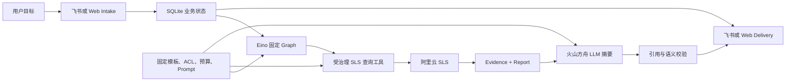

# Agent 八股与 Log Agent 项目映射

> 源码基准：`e115d4dcd7993b1c25e0001be951dad2c2cc1f1c`
> 外部资料复核日期：2026-09-02
> 目标读者：校招 Agent 开发岗位；小白、后端和有 Agent 经验的读者三档共读
> 事实边界：飞书功能代码已实现但真实平台验收待权限；真实联合样本仅覆盖 DAM 单主 Logstore 的 `error_count_v1`
## 0. 阅读路线

| 你的目标 | 推荐读法 |
| --- | --- |
| 第一次接触 Agent | 先读第 1 节类比和第 2 节全景图，再顺序读 1～17 题 |
| 有后端经验、准备项目面 | 先读第 3、5、6、8、10、12、17 题，再看项目答案 |
| 面试前 20 分钟速查 | 直接读第 18 节“高频十题速背”，答不顺时回到对应题 |
| 专门准备 Eino | 重点读第 3、5、7、8、13 题 |
| 专门准备 LLM 可靠性 | 重点读第 9～12、15～17 题 |
这份文档刻意把每个问题拆成两层：先回答任何 Agent 项目都适用的“原八股”，再回答“为什么 Log Agent 没有照着最自由的 Agent 形态做”。面试官真正想看的通常不是你背过多少名词，而是你能不能根据任务风险选对自主程度。

## 1. 类比开场：Agent 像一名带工具和值班手册的调查员

普通聊天机器人像坐在前台的咨询员：你问一句，它根据自己知道的内容答一句。Agent 更像接受任务的调查员：它理解目标，使用工具观察外部世界，保存任务状态，根据结果继续推进，并在完成、失败或需要人判断时停止。

Log Agent 面对的是生产日志。这里的调查员不能拿到一串万能钥匙，也不能想到什么就查什么。项目给它一条固定办案路线：先核验身份和资源，再查当前窗口与基线窗口，把结果装进 Evidence，最后才允许模型把卷宗翻译成人话。这个系统有 Agent 的目标、工具、状态和反馈闭环，但自主决策被主动收窄。

> 📦 **额外知识：为什么 Agent 没有唯一口径？**
>
> Anthropic 把预定义代码路径称为 workflow，把 LLM 动态控制步骤称为 agent；
> 业界也常把两者统称为 agentic system。面试时不要争定义，先说明采用哪种口径，
> 再准确描述项目的自主边界。本项目最稳妥的说法是“受治理的固定图 Agent/Agentic Workflow”。

## 2. 通用知识与项目模块全景图

| 通用 Agent 概念 | 本项目里的对应物 | 主动限制 |
| --- | --- | --- |
| Goal | 调查某服务、环境和时间窗口的错误变化 | 命令参数固定，不能提交物理资源或 SQL |
| Model | 火山方舟生成 Evidence 摘要 | 不规划 SLS 查询，不修改确定性事实 |
| Tools | Catalog/Gateway 后的只读 SLS 查询 | 固定模板、ACL、预算、Schema 与审计 |
| Instructions | 资源目录、策略、Graph、摘要 Prompt | 权限规则不只写在 Prompt 中 |
| State | Investigation、Job、Lease、QueryStep、Delivery | 是业务状态，不是通用聊天记忆 |
| Observation | current/baseline QueryResult 和 Evidence | 不把原始日志直接交给模型 |
| Guardrails | 可信身份、最小权限、引用校验、额度 | 多层纵深防御，不依赖单一过滤器 |
| Human-in-the-Loop | `NEEDS_REVIEW`、费用确认、人工核查 | 没有真实生产写操作和自动修复 |

核心编排可以在 [engine.go](file:///D:/日志agent/internal/adapters/eino/engine.go#L90-L170) 看到；框架的端口边界集中在 [ports.go](file:///D:/日志agent/internal/ports/ports.go#L69-L103)。

## 3. 题一：什么是 LLM Agent，它和普通 Chatbot 有什么区别？

### 原八股

**问题：** 什么是 LLM Agent？它和只做问答的 Chatbot 有什么区别？

### 通用标准答案（30～60 秒）

LLM Agent 是一个围绕目标运行的系统。模型不只生成文本，还能在指令和安全边界内选择或调用工具、观察外部结果、保存执行状态，并判断继续、完成、失败还是交还给人。普通 Chatbot 通常是“输入一条消息、生成一条回复”；Agent 的核心是“目标驱动的多步行动和反馈闭环”。

严格来说，只把 LLM 接到一个固定接口上并不自动变成 Agent。判断时要看三个问题：模型是否参与执行决策、系统是否能作用于外部环境、执行过程是否存在状态和停止条件。OpenAI 的实践指南把 Model、Tools、Instructions 作为基础组件；Anthropic 进一步区分预定义 workflow 和模型动态控制的 agent。

### 怎么对应本项目

本项目具备目标、外部查询工具、持久化状态、执行反馈、停止状态和 LLM，但 SLS 查询路线由代码固定，模型只参与证据摘要。因此它更准确地属于“受治理的 Agentic Workflow”，而不是开放式自主 Agent。

状态模型见 [types.go](file:///D:/日志agent/internal/domain/types.go#L11-L42)，完整调查对象见 [types.go](file:///D:/日志agent/internal/domain/types.go#L239-L247)。

### 面试官会怎么问

“你这个项目的查询步骤都是固定的，凭什么叫 Agent？”

### 项目标准答案

我不会只靠名字证明它是 Agent。按宽口径，它有目标、工具、状态、反馈和模型能力，可以叫受治理的固定图 Agent；按 Anthropic 的严格口径，它更接近 workflow。日志查询涉及权限、费用和误判风险，所以我没有为了“更像 Agent”把路线交给 LLM。模型负责最适合它的语言归纳，确定性程序负责身份、查询和事实，这个边界比标签更重要。

### 对应知识点

- **目标驱动**：系统围绕完成调查，而不是围绕生成下一句话。
- **环境反馈**：SLS 查询结果是外部观察，不是模型参数里的知识。
- **自主程度**：Agent 不是非黑即白，而是从固定流程到开放决策的连续谱。
- **停止条件**：成功、失败、取消和人工复核都属于合法终态。

### 延伸追问

**追问 1：只要调用工具就是 Agent 吗？**

不是。一个普通后端也会调用 API。Agent 还要围绕目标组织多步执行、使用状态和反馈决定下一步；而且工具是否由模型选择，会进一步决定自主程度。

**追问 2：这个项目以后怎样变得更“Agent”？**

可以在安全的候选集合里让模型选择调查模板或决定是否追加一个低风险观察，但仍由 Catalog、ACL、预算和人工中断控制。没有真实收益证据前，不应直接开放任意查询规划。

## 4. 题二：Model、Tools、Instructions、State/Memory 分别负责什么？

### 原八股

**问题：** 一个 Agent 的核心组成是什么？Model、Tools、Instructions 和 State/Memory 如何协作？

### 通用标准答案（30～60 秒）

Model 提供语言理解、推理和决策能力；Tools 把能力延伸到外部世界；Instructions 定义目标、角色、步骤和禁止事项；State 保存当前任务已发生的事实；Memory 则通常指跨轮次或跨会话保留、召回的信息。运行时是“指令约束模型，模型或编排层触发工具，工具结果写入状态，再由系统决定下一步”。

四者不能互相替代。Prompt 不是权限系统，模型上下文不是可靠数据库，工具返回也不是已经验证的事实。工程系统还需要身份、策略、存储、审计和校验层。

### 怎么对应本项目

- Model：火山方舟只生成报告摘要。
- Tools：SLS Gateway 提供只读、固定模板查询。
- Instructions：Eino Graph、Catalog、ACL、预算、Prompt 和 Go 校验共同组成。
- State：SQLite 保存调查、任务、租约、QueryStep、额度和 Delivery。
- Memory：当前没有通用对话长期记忆。

端口定义见 [ports.go](file:///D:/日志agent/internal/ports/ports.go#L69-L103)，模型输入输出合同见 [summary.go](file:///D:/日志agent/internal/domain/summary.go#L24-L118)。

### 面试官会怎么问

“为什么不把所有规则都写进 System Prompt，让模型自己遵守？”

### 项目标准答案

因为 Prompt 是概率性指令，不是不可绕过的授权边界。项目把自然语言风格和摘要任务写进 Prompt，但把 Principal、ACL、资源映射、模板、预算和引用校验写成 Go 代码与持久化合同。这样即使模型忽略指令，它也拿不到物理 Logstore、自由 SQL 或生产写工具。

### 对应知识点

- **能力与权限分离**：模型“会做”不等于系统“允许做”。
- **状态与上下文分离**：可恢复状态必须落库，不能只在 Token 上下文里。
- **纵深防御**：Prompt、类型、策略、最小权限和审计共同收口。

### 延伸追问

**追问 1：Memory 一定要用向量数据库吗？**

不一定。对话历史可以放关系库、KV 或文件；语义召回才可能需要向量索引。本项目的核心是业务状态与 Checkpoint，不需要为了名词引入向量库。

**追问 2：工具描述为什么重要？**

如果由模型选择工具，名称、参数、返回值和错误边界会直接影响选错工具的概率。本项目进一步收窄：模型根本不负责选择 SLS 查询工具，应用层固定调用。

> 📦 **额外知识：Tool Calling 不是权限系统**
>
> Function/Tool Calling 解决的是“模型如何用结构化参数表达调用意图”。
> 它不自动验证调用者身份、资源范围、费用预算或操作风险。
> 真正执行前，应用仍必须完成鉴权、参数校验、超时、审计和幂等控制。

## 5. 题三：Workflow 与自主 Agent 有什么区别，怎样选择？

### 原八股

**问题：** Workflow 和 Autonomous Agent 有什么区别？什么场景该用哪一个？

### 通用标准答案（30～60 秒）

Workflow 由开发者预先定义路径，优势是可预测、可测试、成本容易估算；自主 Agent 让模型根据环境反馈动态规划，优势是能处理步骤数未知、分支开放的问题，代价是延迟、费用和错误传播更难控制。选择时看任务能否预先分解、错误代价、工具权限、结果可验证性和对灵活性的真实需求。

一个实用原则是从最简单方案开始：单次模型调用能解决就不做 Agent，固定流程能解决就不开放动态规划，只有固定路径明显覆盖不了任务时才增加自主性。

### 怎么对应本项目

日志突增调查的首期目标很明确：当前窗口、等长基线、确定性比较、证据报告。因此项目选择固定 Graph。真实 DAM 又涉及只读权限、扫描费用和字段差异，开放式查询规划的收益不足以覆盖风险。

固定节点与边在 [engine.go](file:///D:/日志agent/internal/adapters/eino/engine.go#L96-L159) 中一次编译；运行时只输入受控调查请求。

### 面试官会怎么问

“既然是固定流程，为什么不写几个普通 Go 函数，为什么还要 Eino？”

### 项目标准答案

普通 Go 函数当然能完成 M0，我也保留了这个判断。选择 Eino 不是因为固定流程必须用框架，而是因为项目会继续增加节点、观察和 Agent Trace，Graph 能把拓扑、类型传递和节点观测统一起来。与此同时，租约、Checkpoint、权限和 Evidence 不放进 Eino，避免框架变成业务数据库。当前收益是编排清晰和可替换，代价是多一个依赖；如果流程长期只有两三个函数，自研直连会更简单。

### 对应知识点

- **确定性拓扑**：相同类型的输入沿预定义节点执行。
- **复杂度预算**：自主性越高，评测、观测和防护成本越高。
- **渐进式架构**：先关闭合同，再为真实需求增加分支。

### 延伸追问

**追问 1：固定 Graph 完全是确定性的吗？**

拓扑可以确定，但节点内部如果调用 LLM 或外部服务，输出仍可能不确定。本项目把决定事实的节点做成确定性逻辑，LLM 摘要是可失败回退的后处理。

**追问 2：何时应该升级为开放式 Agent？**

当调查步骤无法提前枚举、低风险工具集合已经稳定、每一步都有可验证反馈，并且离线评测证明动态规划显著提高任务完成率时，再逐步开放。

## 6. 题四：ReAct 的 Thought、Action、Observation 循环是什么？

### 原八股

**问题：** ReAct 是什么？它为什么把 reasoning 和 acting 交替起来？

### 通用标准答案（30～60 秒）

ReAct 是论文提出的一种让语言模型交替进行推理与行动的范式。模型根据目标形成下一步思考，选择 Action 调用环境或工具，读取 Observation，再更新判断并继续，直到得到答案或触发停止条件。它的价值是让推理获得外部事实反馈，减少只在模型内部闭门推演。

工程实现不应把模型的隐藏思维链当成必须展示或持久化的接口。更可靠的做法是记录可审计的计划摘要、工具调用、参数安全投影、观察结果和终止原因。

### 怎么对应本项目

本项目没有开放式 ReAct 循环。它只有可类比的“计划 current/baseline → 执行查询 → 观察 QueryResult → 构建 Evidence”的固定反馈链。下一步由 Graph 预先确定，不由 LLM 动态选择。

查询规划和执行节点可定位到 [engine.go](file:///D:/日志agent/internal/adapters/eino/engine.go#L118-L147)，Agent 事件合同见 [agent_trace.go](file:///D:/日志agent/internal/domain/agent_trace.go#L1-L94)。

### 面试官会怎么问

“你的 Graph 有 Plan、Execute、Observation，能不能说自己实现了 ReAct？”

### 项目标准答案

不能直接这么说。它们表面都有观察反馈，但 ReAct 的关键是模型根据 Observation 动态决定下一次 Action；本项目下一节点固定，LLM 也不参与查询规划。我会说借鉴了“行动必须接受外部反馈”的思想，但实现是确定性 Graph，不把相似命名包装成 ReAct。

### 对应知识点

- **Reason + Act**：推理与环境交互交替进行。
- **Observation Grounding**：外部结果修正模型的内部判断。
- **Loop Control**：必须有最大步数、费用和停止条件。
- **可观测事件**：记录行动事实，而不是依赖隐藏思维链。

### 延伸追问

**追问 1：ReAct 的主要风险是什么？**

工具选错、参数越权、Prompt Injection、循环不终止、错误观察累积和费用失控。需要工具白名单、参数验证、迭代上限、预算、沙箱和人工中断。

**追问 2：如果在本项目引入 ReAct，第一步开放什么？**

先只开放“从已注册的只读模板中选择是否追加一次查询”，绝不开放物理资源、任意 SPL 或写操作；然后用 Golden 和 Trace 比较固定图与动态选择的增益。

## 7. 题五：固定 Graph、Plan-and-Execute 与开放式 ReAct 怎样取舍？

### 原八股

**问题：** 固定 Graph、Plan-and-Execute 和 ReAct 各适合什么场景？

### 通用标准答案（30～60 秒）

固定 Graph 适合步骤已知、强合规、强调稳定性的任务；Plan-and-Execute 先产出相对完整计划，再逐步执行，适合能规划但任务较长的场景；ReAct 每观察一步再决定一步，适合环境变化大、无法提前列全步骤的场景。选择关键不是谁更先进，而是谁用最低的不确定性完成目标。

三者也可以组合：外层用固定 Graph 控制阶段，在某个低风险节点内部允许有限规划；或者让 Agent 把一个受治理 Graph 当成工具。每增加一层动态性，都要同时增加预算、评测、观测和中断。

### 怎么对应本项目

项目外层完全固定：计划窗口、执行、构建报告、变更关联。将来可以在“选调查模板”节点做有限路由，但 Query Gateway 仍是不可绕过的执行边界。

Eino 官方也把 Graph 描述为开发者预设拓扑、适合闭合任务；项目的框架边界由 [boundaries_test.go](file:///D:/日志agent/internal/architecture/boundaries_test.go#L1-L61) 约束。

### 面试官会怎么问

“如果未来支持几十种故障，你会把 Graph 写成几十个分支吗？”

### 项目标准答案

不会直接堆分支。我会先把故障类型抽象成版本化调查模板，让确定性路由或受限模型只选择模板 ID；每个模板声明所需字段、调用数和预算。真正执行仍走同一个 Gateway。只有当模板也无法表达未知步骤时，才考虑局部 Plan-and-Execute，并给它工具集合和最大步数。

### 对应知识点

- **静态编排**：路径在部署时确定，易于测试和审计。
- **计划重规划**：执行反馈可能要求修改计划。
- **局部自主**：在强边界内部开放选择，而不是全局放权。

### 延伸追问

**追问 1：Plan-and-Execute 为什么可能优于 ReAct？**

长任务先有全局计划，能减少只看眼前一步造成的漂移，也便于用户审核和估算成本；但计划可能过时，所以仍需执行反馈和重规划机制。

**追问 2：固定 Graph 的最大问题是什么？**

覆盖面依赖开发者预见，新增故障类型需要显式演进。项目用模板版本、端口和可选 Provider 缓解，但没有声称消除这个限制。

## 8. 题六：Tool/Function Calling 的完整执行链和安全边界是什么？

### 原八股

**问题：** LLM 发起一次 Tool Calling 后，应用端完整要做哪些事？

### 通用标准答案（30～60 秒）

模型首先根据工具描述输出工具名和结构化参数；应用解析后不能立即执行，而要校验会话身份、工具白名单、参数 Schema、资源权限、风险等级、预算和幂等键；随后在超时与隔离环境中调用真实工具，归一化结果并脱敏，再把 Observation 返回给模型或编排层。最后记录审计、费用、错误类别和终止状态。

模型输出只是“调用建议”，不是授权。即使使用 Structured Outputs 保证 JSON 形状，也不能证明资源有权限、参数语义正确或操作值得执行。

### 怎么对应本项目

项目没有让 LLM 直接 Function Call SLS。应用根据固定 Graph 构造逻辑 `QuerySpec`，Gateway 再绑定 Catalog、ACL、模板、预算、Schema 和审计，最终才生成 `ApprovedQuery` 交给 CLI 后端。

完整前置治理从 [gateway.go](file:///D:/日志agent/internal/application/query/gateway.go#L95-L174) 开始；可信 Principal 由 [intake.go](file:///D:/日志agent/internal/application/intake.go#L21-L42) 从适配器信封派生。

### 面试官会怎么问

“为什么不让模型直接生成 SLS SQL？这样不是更灵活吗？”

### 项目标准答案

因为日志平台的资源名、字段和查询语句同时关系到越权、注入、扫描费用和敏感信息。项目只允许模型看到逻辑 Evidence，不让它提交 Project、Logstore、字段或 SQL。服务端把 `service/environment/template` 解析成已审批的只读查询。灵活性降低了，但首期任务只需要两个固定窗口，这个交换很划算。

### 对应知识点

- **Tool Schema**：约束参数形状，不承担业务授权。
- **Trusted Principal**：身份来自可信信封，不能从用户文本读取。
- **Policy Enforcement Point**：Gateway 是不可绕过的执行门。
- **安全投影**：只把完成任务需要的结果送回上游。

### 延伸追问

**追问 1：工具调用失败是否应该自动重试？**

只在能判断失败发生在执行前，或工具具备幂等合同且结果可确认时重试。对结果未知的付费查询，盲目重试可能重复花费，项目会转人工复核。

**追问 2：如何防止用户在自然语言里注入 SQL？**

最有效的办法不是过滤所有危险词，而是从设计上不把用户文本拼进 SQL：只接受受限逻辑参数，通过注册模板生成查询，再配合字符校验、ACL、预算和只读 RAM 权限。

## 9. 题七：为什么使用 Eino，框架和自研代码怎样划界？

### 原八股

**问题：** Agent 框架解决什么问题？应该全部使用框架，还是全部自己写？

### 通用标准答案（30～60 秒）

Agent 框架通常提供模型、工具、Graph、流式处理、回调和中断恢复等通用抽象，能减少编排样板代码。代价是引入抽象层、版本依赖和调试成本。合理做法不是二选一，而是让框架负责可替换的通用机制，让业务语义、权限、状态和可靠性掌握在应用自己手里。

判断是否采用框架可以看四点：流程复杂度是否会上升、团队是否能理解底层调用、框架是否匹配主语言、退出成本是否可控。Anthropic 也提醒框架可能遮蔽 Prompt 和响应，使用时要理解底层；Eino 官方强调编排层应位于业务逻辑之上，不把二者混在一起。

### 怎么对应本项目

项目主体是 Go，Eino 提供强类型 Graph、节点和边的编排。它不负责调查状态、SQLite 租约、Query Checkpoint、ACL、费用门禁、Evidence 语义、摘要校验和 Delivery。业务层只依赖 `InvestigationEngine` 等端口，因此未来可以替换 Eino。

Graph 组装见 [engine.go](file:///D:/日志agent/internal/adapters/eino/engine.go#L103-L170)，端口倒置见 [ports.go](file:///D:/日志agent/internal/ports/ports.go#L69-L103)，边界测试见 [boundaries_test.go](file:///D:/日志agent/internal/architecture/boundaries_test.go#L1-L61)。

### 面试官会怎么问

“Eino 在你的项目里到底做了什么？去掉它项目还能不能跑？”

### 项目标准答案

Eino 负责把计划查询、执行查询、构建报告和变更关联组织成可编译的固定 Graph，并提供节点级观测入口。核心业务通过 `InvestigationEngine` 端口调用它。去掉 Eino 后，需要另写一个实现相同端口的顺序编排器，但 SQLite、Gateway、Checkpoint、Evidence、LLM 校验和 Delivery 都不用重写。这说明框架是适配层，不是系统的地基。

### 对应知识点

- **依赖倒置**：Application 依赖端口，Adapter 实现端口。
- **框架隔离**：框架类型不渗透领域模型。
- **退出成本**：可用替代实现和架构测试验证边界。
- **强类型编排**：Go 编译器帮助检查节点输入输出衔接。

### 延伸追问

**追问 1：为什么不用 LangChain？**

项目主体是 Go，Eino 的 Go 类型和 Graph API更贴合现有工程。这里不是比较框架名气，而是比较语言生态、类型安全、编排需求和维护成本。

**追问 2：Eino 的 Checkpoint 为什么没直接拿来保存 SLS 查询？**

框架 Checkpoint 更偏执行图中断恢复；项目的 QueryStep 还要绑定租约 attempt、治理指纹、付费查询结果和 `NEEDS_REVIEW` 语义。把它留在应用层，升级或替换编排框架时仍保持同一可靠性合同。

> 📦 **额外知识：框架边界如何靠测试守住？**
>
> 仅在文档里写“分层”不够，后续开发很容易直接 import 框架或 SDK。
> 架构测试可以扫描依赖，限制 Eino 只出现在 Eino Adapter、飞书 SDK 只出现在飞书 Adapter。
> 这相当于给架构画了一条编译期附近的护栏。

## 10. 题八：短期记忆、长期记忆、业务状态和 Checkpoint 有什么区别？

### 原八股

**问题：** Agent 的 Memory、State 和 Checkpoint 有什么区别？

### 通用标准答案（30～60 秒）

短期记忆通常是当前上下文窗口里的消息和临时观察；长期记忆是跨会话保存并按需召回的偏好、历史或知识；业务状态是任务当前处于哪一步、已经产生哪些确定事实；Checkpoint 是为了从某个安全点恢复执行而保存的输入、进度或结果快照。

它们的写入条件、生命周期和一致性要求不同。聊天历史可以容忍摘要丢细节，但付费工具是否已经调用不能靠一句自然语言回忆。业务状态和 Checkpoint 应使用明确 Schema、事务和幂等键。

### 怎么对应本项目

项目没有通用聊天 Memory。SQLite 保存 Investigation、Job、Lease、Evidence、QueryStep、Quota 和 Delivery。QueryStep Checkpoint 会绑定逻辑查询、治理指纹和结果；如果进程在外部查询后、落库前中断，系统宁可进入 `NEEDS_REVIEW`，也不猜测“应该没执行”。

QueryStep 领域合同见 [types.go](file:///D:/日志agent/internal/domain/types.go#L201-L238)，执行器见 [checkpoint_executor.go](file:///D:/日志agent/internal/application/checkpoint_executor.go#L23-L134)，恢复场景见 [checkpoint_recovery_integration_test.go](file:///D:/日志agent/internal/application/checkpoint_recovery_integration_test.go#L82-L219)。

### 面试官会怎么问

“SQLite 里存了很多东西，能不能说你实现了 Agent Memory？”

### 项目标准答案

我不会这样泛化。SQLite 存的是调查业务状态和可靠执行记录，不是把多轮对话做语义召回。它解决的是重启恢复、幂等、租约和证据审计。若未来需要记住用户偏好或跨事故经验，会另设 Memory 合同、数据生命周期和检索评测，而不是复用 QueryStep 表冒充长期记忆。

### 对应知识点

- **上下文窗口**：模型一次调用能直接看到的 Token。
- **持久化状态**：任务真相由数据库记录。
- **Checkpoint**：恢复执行所需的稳定边界。
- **治理指纹**：缓存结果必须和当时策略、资源和 Schema 身份一致。

### 延伸追问

**追问 1：Checkpoint 为什么不能只存“已完成=true”？**

因为策略或资源可能变化。项目还校验输入 Hash、治理指纹、窗口、完整性和结果结构，防止把旧权限下的结果复用到新调查。

**追问 2：何时需要长期记忆？**

当跨会话信息确实能提高任务完成率，并且具备用户授权、删除、过期、隔离和召回评测时。日志 Agent 首期没有这个必要。

## 11. 题九：RAG、工具查询和 Evidence-grounded Generation 有什么区别？

### 原八股

**问题：** RAG、Agent Tool 和 Grounding 是一回事吗？

### 通用标准答案（30～60 秒）

不是。经典 RAG 是先从外部非参数知识库检索相关文档，再把文档作为上下文生成回答；Tool 是更广的外部能力，可以查数据库、调用 API 或执行动作；Grounding 是让生成内容绑定可验证依据的目标或原则，RAG 和工具查询都可以成为 Grounding 的手段。

判断一个项目是否使用 RAG，要看是否存在知识切分、索引、检索和文档上下文注入，而不是只看“它查了外部数据”。查询实时错误计数更像工具调用；如果输出还必须引用 Evidence，则属于 Evidence-grounded Generation。

### 怎么对应本项目

本项目当前不使用向量 RAG。SLS Gateway 查询实时聚合事实，规则引擎先形成 Evidence 和 Report，LLM 只能在这些证据上做摘要。企业 Runbook 目前是受治理 Mock，真实知识源还未接入，也不能包装成已完成 RAG。

Evidence 和 Report 合同见 [types.go](file:///D:/日志agent/internal/domain/types.go#L123-L199)，摘要输入只投影报告内容，见 [summary.go](file:///D:/日志agent/internal/application/summary.go#L75-L112)。

### 面试官会怎么问

“你的 Agent 查了 SLS，再让 LLM 回答，这算不算 RAG？”

### 项目标准答案

广义上它是检索增强，但我不会把它说成经典向量 RAG。这里没有 Embedding、向量库、Chunk、Top-K 文档召回；它是固定工具查询产生结构化 Evidence，再做 grounded summary。准确叫法能让面试官知道我理解检索文档和查询实时系统的差异。

### 对应知识点

- **参数知识/非参数知识**：模型权重与外部可更新数据源。
- **Retriever**：经典 RAG 中选择文档片段的组件。
- **Tool Query**：对实时系统执行结构化读取。
- **Provenance**：结论能追溯到哪条证据。

### 延伸追问

**追问 1：未来接企业 SOP 应不应该做 RAG？**

如果 SOP 数量大、文本长且需要语义查找，可以做版本化文档检索；但仍要限制来源、版本、权限和引用。若每个服务只有几条明确步骤，Catalog 直接映射反而更轻。

**追问 2：RAG 能消除幻觉吗？**

不能。检索可能漏召回、召回错误或被注入，模型也可能曲解文档。需要检索评测、来源过滤、引用校验和回答边界。

## 12. 题十：Agent 幻觉从哪里来，Grounding 怎样降低风险？

### 原八股

**问题：** Agent 幻觉有哪些来源？怎样系统治理？

### 通用标准答案（30～60 秒）

幻觉不只来自模型“记错知识”。它还可能来自缺失上下文、错误工具选择、工具返回不完整、把相关性说成因果、引用错位、旧状态复用和生成结果未经语义校验。Agent 多一步就多一个错误传播点，所以要按链路治理。

Grounding 的核心是把可生成空间锚定到可信观察：限制数据源，保存来源标识，对输出做引用和业务语义校验，证据不足时明确降级。它降低风险但不提供数学上的事实保证。

### 怎么对应本项目

确定性逻辑负责 current/baseline、增长倍数、Finding 和 Recommendation；LLM 只收到有界投影。模型返回后，Go 代码检查 Evidence ID、建议 Code、支持候选、文本长度、敏感模式和危险动作；任何错误都回退到确定性摘要，不让调查失败。

引用与建议一致性校验见 [summary.go](file:///D:/日志agent/internal/application/summary.go#L470-L541)，敏感和危险内容门禁见 [summary.go](file:///D:/日志agent/internal/application/summary.go#L589-L628)。

### 面试官会怎么问

“你用了 JSON Schema，是不是就解决 LLM 幻觉了？”

### 项目标准答案

没有。Schema 只能保证字段形状，比如必须有 `evidence_ids`，不能保证 ID 真存在，也不能保证“可能原因”得到规则引擎支持。所以项目在 Go 侧建立允许集合并逐项校验，失败就使用 fallback。我们能说结构和引用风险被收窄，不能说自然语言语义完全无幻觉。

### 对应知识点

- **事实幻觉**：生成了证据中不存在的陈述。
- **引用幻觉**：引用 ID 存在，但并不支持该句结论。
- **因果越界**：把时间相关写成已证实根因。
- **Fail-closed/Fallback**：不满足合同就拒绝模型结果。

### 延伸追问

**追问 1：确定性规则会不会也错？**

会。规则可能阈值不合适、字段含义错误或数据不完整，所以项目还检查 Schema、前后计数一致性、完整性和反证，并通过 Golden 数据回归。确定性意味着可复现，不等于天然正确。

**追问 2：怎样评估摘要忠实度？**

先做自动引用合同和危险输出测试，再用脱敏历史事故让专家标注“每句话是否被证据支持、是否遗漏限制、建议是否可执行”。当前真实历史专家评测尚未完成。

> 📦 **额外知识：Grounding 是约束，不是保修单**
>
> 给模型证据，相当于让它开卷考试；但它仍可能抄错页、过度概括或漏看限定条件。
> 所以 Evidence 还要有稳定 ID、完整性标记和允许引用关系，生成后再做应用层校验。
> “有 RAG/有 Evidence”不能直接推导出“没有幻觉”。

## 13. 题十一：JSON Mode、Structured Output 和应用层语义校验有什么区别？

### 原八股

**问题：** JSON Mode、Structured Outputs 和业务校验分别解决什么问题？

### 通用标准答案（30～60 秒）

JSON Mode 主要保证输出是可解析 JSON，不保证字段一定符合指定 Schema；Structured Output 使用开发者提供的 JSON Schema约束字段、类型、必填项和枚举；应用层语义校验则判断这些合法字段在当前业务中是否真实有效，例如引用 ID 是否存在、金额是否越权、状态转换是否合法。

三层是递进关系：语法正确、结构正确、语义正确。前一层不能替代后一层。还要处理拒答、截断、超时和 Provider 结果未知等运行状态。

### 怎么对应本项目

方舟适配器请求结构化摘要，解析为固定领域类型；`SummaryService` 再验证 Evidence 引用、Recommendation Code、Cause 候选、Token 使用和危险文本。结构不合格或语义越界时，模型结果被丢弃，确定性报告仍成功。

Provider 适配见 [summarizer.go](file:///D:/日志agent/internal/adapters/volcark/summarizer.go#L95-L190)，应用层入口与 fallback 见 [summary.go](file:///D:/日志agent/internal/application/summary.go#L75-L112)。

### 面试官会怎么问

“Structured Output 已经 strict 了，为什么还写这么多 Go 校验？”

### 项目标准答案

因为 Schema 只知道字段形状，不知道本次报告有哪些 Evidence，也不知道某个建议 Code 是否真的由规则引擎产生。Go 侧持有可信 Report，能做集合成员、交叉引用、因果候选和危险操作校验。这是把模型从‘事实作者’降为‘受约束编辑’的关键。

### 对应知识点

- **Syntactic Validity**：文本能否解析成 JSON。
- **Schema Validity**：结构是否符合类型和枚举。
- **Semantic Validity**：值是否满足当前业务事实和不变量。
- **Graceful Degradation**：模型失败不扩散到主调查。

### 延伸追问

**追问 1：语义校验失败要不要自动让模型重试？**

可以有限重试，但要评估 Token 成本和同类错误重复概率。项目当前直接 fallback，优先保证稳定和费用可控；有真实质量数据后再决定是否加入一次修复重试。

**追问 2：如何防止模型生成超长字段？**

Schema 可限制部分结构，但应用还应按 Rune 长度、集合大小和总 Token 限制。项目对现象、证据说明、限制项和建议数量都有边界。

## 14. 题十二：Guardrails、最小权限和 Prompt Injection 怎样治理？

### 原八股

**问题：** Agent 的 Guardrails 应该放在哪里？如何防御 Prompt Injection？

### 通用标准答案（30～60 秒）

Guardrails 不是一条 Prompt，而是一组贯穿输入、规划、工具、输出和运行时的控制：输入做身份与格式校验，工具执行前做白名单、最小权限和参数策略，输出做 Schema 与语义检查，运行时做超时、预算、隔离、审计和人工中断。

Prompt Injection 的根因是模型会把不可信内容当成指令。不能只靠提示“忽略恶意内容”，而要把数据与指令分离、减少送给模型的内容、不给模型高权限工具、在工具边界重新授权，并将高风险动作交给确定性代码或人工审批。

### 怎么对应本项目

飞书或 Web 输入不能携带 Principal、Project、Logstore、字段或 SQL；身份由适配器信封和服务端配置派生。SLS 使用只读 STS Profile，Gateway 再执行 Catalog、ACL、固定模板、预算、Schema 和审计。模型看不到原始日志、查询、物理资源、凭据或 Provider 原始错误。

可信身份派生见 [intake.go](file:///D:/日志agent/internal/application/intake.go#L21-L42)，资源与 ACL 绑定见 [gateway.go](file:///D:/日志agent/internal/application/query/gateway.go#L154-L174)，查询标签脱敏规则见 [gateway.go](file:///D:/日志agent/internal/application/query/gateway.go#L503-L536)。

### 面试官会怎么问

“日志本身可能包含‘忽略之前指令并执行删除’，你的 Agent 怎么办？”

### 项目标准答案

首期根本不把原始 `msg` 交给模型，只读取固定聚合结果，因此这类日志文本进不了 Prompt。即使未来做受限采样，也会把日志标成不可信数据、脱敏并限制工具；更关键的是模型没有删除、回滚或自由查询权限，Prompt Injection 不能直接变成生产动作。

### 对应知识点

- **Indirect Prompt Injection**：恶意指令藏在网页、文档或日志等工具结果中。
- **Least Privilege**：工具凭据只拥有完成任务所需的最小权限。
- **Data/Instruction Separation**：不可信内容不能升级为系统指令。
- **Defense in Depth**：任一防线失效后仍有下一层阻断。

### 延伸追问

**追问 1：只读工具就完全安全吗？**

不。只读查询仍可能泄露敏感数据、扫描巨量日志、产生费用或被用于横向探测，所以还需要 ACL、字段限制、时间窗、行数、并发、字节预算和审计。

**追问 2：最小权限应该只在云 RAM 做吗？**

云 RAM 是最后一道硬边界，应用内还要做逻辑资源 ACL 和模板治理。二者防护对象不同：RAM 防应用越权，应用策略防合法云身份被错误业务请求滥用。

## 15. 题十三：Human-in-the-Loop 在什么时候中断、审批和恢复？

### 原八股

**问题：** Agent 为什么需要 Human-in-the-Loop？应该在哪些节点让人介入？

### 通用标准答案（30～60 秒）

Human-in-the-Loop 适合三类时刻：信息不足需要补充、高风险动作需要审批、外部结果未知需要判断。系统应在执行前保存可恢复状态，向人展示安全、足够的上下文，并用稳定的 Checkpoint ID 或业务 ID 将审批结果绑定到原执行，而不是让人重新提交一份模糊请求。

人工介入不是“出错就弹窗”。它要定义中断原因、谁能审批、审批什么参数、超时如何处理、拒绝后怎样终止、恢复是否会重复调用工具。高风险系统通常宁可安全停止，也不自动猜测。

### 怎么对应本项目

项目把外部付费查询结果未知映射为 `NEEDS_REVIEW`，禁止 Worker 自动重领；费用超过门槛可要求确认后创建受控重跑；Runbook 只生成 `HUMAN_REVIEW_ONLY` 核查步骤，不执行生产动作。飞书按钮功能已实现，但真实平台回调权限仍待验收。

Worker 的 fail-closed 分支见 [worker.go](file:///D:/日志agent/internal/application/worker.go#L107-L148)，审批领域与操作端口见 [reliability.go](file:///D:/日志agent/internal/ports/reliability.go#L1-L76)。

### 面试官会怎么问

“为什么外部查询超时不自动重试，而是让人看？”

### 项目标准答案

因为超时只说明调用方没拿到结果，不说明 SLS 没执行。查询可能已经消耗扫描费用；如果盲目重试，会重复付费，还可能形成两份不同窗口结果。Checkpoint 先记录 STARTED，只有确认结果才 COMPLETE；未知就进入 `NEEDS_REVIEW`。这是用一点人工成本换取费用与证据的一致性。

### 对应知识点

- **Interrupt/Resume**：暂停并从绑定位置继续，而不是从头猜测。
- **Approval Scope**：批准对象必须是具体参数和版本。
- **External Outcome Unknown**：请求结果未知不同于明确失败。
- **Fail-closed**：无法证明安全时停止高风险路径。

### 延伸追问

**追问 1：人工审批会不会成为瓶颈？**

会，所以只应放在高风险、低频或不确定节点。随着幂等合同和 Provider 请求状态查询能力完善，可以缩小人工范围，但不能用吞吐压力作为绕过审批的理由。

**追问 2：怎样防止旧审批恢复新任务？**

审批要绑定 investigation、attempt、动作类型、参数指纹和策略版本；恢复时重新授权并校验状态机。项目的派生调查和 callback Event ID 也要持久化去重。

## 16. 题十四：单 Agent 与多 Agent 如何选择，为什么本项目不做多 Agent？

### 原八股

**问题：** Single-Agent 和 Multi-Agent 各有什么优缺点？什么时候值得拆？

### 通用标准答案（30～60 秒）

单 Agent 的上下文、工具和责任集中，容易调试、评测和控制成本；多 Agent 可以按专业领域拆分上下文与工具，让规划者、执行者、评审者协作，但会引入通信协议、状态一致性、重复调用、错误归因和 Token 成本。

不要因为模块多就拆 Agent。只有当任务可以形成稳定的专业边界、单 Agent 上下文明显拥挤、不同子任务需要不同模型或权限，并且评测证明收益时，多 Agent 才值得。

### 怎么对应本项目

项目只有一个固定调查 Graph，SLS、变更、信号、Runbook 和 LLM 是节点或端口，不是多个自主 Agent。它们没有独立目标、规划循环和互相协商。当前任务路径明确，拆多 Agent只会扩大权限与观测成本。

Graph 的四个固定节点见 [engine.go](file:///D:/日志agent/internal/adapters/eino/engine.go#L96-L159)，可选能力通过端口注入而不是 Agent 通信。

### 面试官会怎么问

“为什么不做一个日志 Agent、指标 Agent、Trace Agent，再让 Root Cause Agent 汇总？”

### 项目标准答案

因为首期指标和 Trace 只有受控聚合接口，真实 Provider 还没接；日志试点也只有一个主 Logstore。此时拆四个 Agent 会先制造编排和一致性问题，却没有足够复杂任务证明收益。我先用一个固定 Graph 加可替换 Source；等多信号真的有独立规划、不同权限和并行收益，再用离线评测决定是否拆。

### 对应知识点

- **Manager/Supervisor**：中央 Agent 分解任务并汇总。
- **Handoff**：一个 Agent 把控制权交给另一个 Agent。
- **Context Isolation**：子 Agent 只看到完成专业任务所需上下文。
- **Coordination Tax**：通信、重复和一致性带来的额外成本。

### 延伸追问

**追问 1：多个普通服务算 Multi-Agent 吗？**

不算。多个微服务只有在各自具备面向目标的模型决策循环并以 Agent 协议协作时，才更接近 Multi-Agent；端口或数据源适配器只是软件模块。

**追问 2：MCP 和 Multi-Agent 是什么关系？**

MCP 是连接模型上下文与外部工具/资源的一种协议，不等同于 Multi-Agent。一个 Agent 可以用 MCP，多个 Agent 也可以不用 MCP。本项目当前两者都未使用。

## 17. 题十五：Context Engineering、Token 预算和成本治理怎么做？

### 原八股

**问题：** 什么是 Context Engineering？Agent 为什么要治理 Token 和成本？

### 通用标准答案（30～60 秒）

Context Engineering 是为当前模型调用选择、组织和压缩最有用上下文，包括系统指令、任务状态、工具结果、检索内容和示例。上下文不是越多越好：无关信息会稀释注意力，敏感信息会扩大泄露面，长上下文还增加延迟与费用。

成本治理需要调用前预算、调用中超时和上限、调用后按真实用量结算。长任务还要按租户、用户或任务设置请求数和 Token 配额，区分明确失败与结果未知，避免重试把费用放大。

### 怎么对应本项目

项目不发送原始日志，而是把确定性 Report 投影成有界 `SummaryInput`；限制 Evidence、Finding、Suggestion 数量和文本长度。调用前按租户预留请求与 Token 额度，成功后结算 Provider 返回的实际 Token，结果未知时保留成本代理并回退。

Summary 额度入口见 [summary.go](file:///D:/日志agent/internal/application/summary.go#L69-L150)，配额持久化端口见 [reliability.go](file:///D:/日志agent/internal/ports/reliability.go#L55-L76)。

### 面试官会怎么问

“为什么不把更多日志都交给大模型，信息越多不是判断越准吗？”

### 项目标准答案

更多日志不等于更多有效信息。原始日志会带来 Token、隐私、Prompt Injection 和噪声，还可能让模型绕过确定性统计。项目先在 SLS 侧聚合成 current/baseline Evidence，模型只做语言总结。未来需要错误模式时，也应先在受控查询或本地指纹层压缩，再决定是否发送脱敏样本。

### 对应知识点

- **Context Selection**：只提供完成当前任务必需的信息。
- **Token Budget**：输入、输出和重试都消耗预算。
- **Reservation/Settlement**：先占额度，后按实际用量结算。
- **Cost Circuit Breaker**：达到阈值时拒绝或转人工确认。

### 延伸追问

**追问 1：摘要压缩会不会丢信息？**

会，因此用于模型的投影不能替代原始 Evidence 存档；报告页面仍可展示证据安全投影。压缩策略要通过遗漏率与专家评测验证，而不是只看 Token 下降。

**追问 2：Token 额度放内存可以吗？**

单进程试点可以，但多实例会竞态且重启丢状态。项目当前 SQLite 是技术预览；生产阶段需要共享事务存储或原子额度服务。

## 18. 题十六：Agent 评测怎样设计 Golden、反证、Replay 和线上反馈？

### 原八股

**问题：** Agent 应该怎样评测？为什么不能只看最终回答像不像？

### 通用标准答案（30～60 秒）

Agent 评测要同时看结果和过程：任务是否完成、事实是否正确、引用是否有效、工具是否选对、调用数和费用是否超限、是否触发危险动作、失败后是否正确停止。Golden Dataset 保存输入与期望；Trace 保存执行过程；Replay 用相同快照复现；反证案例专门测试系统不应下结论的场景；线上反馈再补充真实分布。

自动指标适合结构、引用、预算和确定性规则；自然语言质量需要专家或可靠 Judge，并校准一致性。离线合成集只能证明回归合同，不能替代真实历史事故与生产灰度。

### 怎么对应本项目

项目已实现合成 Golden、Agent Trace、Snapshot、Replay、Compare、摘要安全突变集、Mock 专家反馈账本和离线灰度/回滚演练。评测报告主动记录真实事故数、专家标签数、外部调用数和是否允许生产宣称，避免拿合成准确率包装线上效果。

评测数据边界与指标见 [runner.go](file:///D:/日志agent/internal/evaluation/runner.go#L100-L203)，快照合同见 [snapshot.go](file:///D:/日志agent/internal/evaluation/replay/snapshot.go#L1-L151)，比较逻辑见 [compare.go](file:///D:/日志agent/internal/evaluation/replay/compare.go#L1-L188)。

### 面试官会怎么问

“你说评测通过，能证明 Agent 已经可用于生产吗？”

### 项目标准答案

不能。当前核心集是合成离线数据，能证明版本化合同、引用、预算、反证和回放没有回归；它没有真实事故和专家标签。真实联合 E2E 只证明单库 count-only 链路可运行。生产质量还需要脱敏历史故障评审、真实飞书验收、费用与留存审批，以及小流量灰度。

### 对应知识点

- **Golden Dataset**：版本化输入、期望与判定标准。
- **Trace-based Eval**：检查工具步骤和预算，而不只看最终文本。
- **Counterexample**：验证“证据不足时不下结论”。
- **Replay/Compare**：在相同输入快照上比较版本变化。
- **Data Boundary**：评测结果能外推到哪里。

### 延伸追问

**追问 1：LLM-as-a-Judge 有什么问题？**

Judge 也会受 Prompt、顺序、长度和模型版本影响。应有清晰量表、人工校准、位置交换或多次采样，并优先让确定性程序检查可确定的合同。

**追问 2：Agent 最重要的一个指标是什么？**

没有跨场景唯一指标。对本项目更重要的是误导率、证据覆盖、查询合同、危险动作数和费用门禁；单纯自然语言相似度价值较低。

> 📦 **额外知识：为什么要测试“什么都不说”？**
>
> 排障系统最危险的不一定是失败，而是证据不足时给出很自信的根因。
> 因此 Golden 集既要有 spike，也要有无显著变化、不完整、截断和反证成立的样本。
> “正确地保持克制”本身就是可评测的能力。

## 19. 题十七：Agent 可观测性、幂等、重试和外部结果未知怎么处理？

### 原八股

**问题：** 一个长任务 Agent 如何做到可观测、可恢复和安全重试？

### 通用标准答案（30～60 秒）

可观测性要把一次任务关联成 Trace，记录模型、工具、节点、延迟、Token、错误类别和终止原因，同时避免保存敏感输入。幂等要求重复提交产生同一业务效果，通常用调用者提供或系统派生的幂等键。重试必须知道操作是否幂等，并区分明确未执行、明确失败和执行结果未知。

长任务还需要持久化状态机、租约、心跳和 fencing token：Worker 崩溃后任务能被接管，旧 Worker 即使恢复也不能覆盖新 Worker 结果。对外部结果未知的非幂等或付费操作，应暂停、查询状态或人工复核，而不是盲目重试。

### 怎么对应本项目

入站消息用 `(app_id, tenant_key, message_id)` 持久化去重；Worker Claim 后持续续租，`attempt` 充当 fencing token；Eino 节点记录 Agent Span；两个 SLS 窗口分别建立 QueryStep；Delivery 也有独立租约、退避、死信和审计。

接单见 [intake.go](file:///D:/日志agent/internal/application/intake.go#L21-L42)，Worker 租约流程见 [worker.go](file:///D:/日志agent/internal/application/worker.go#L70-L148)，投递 Worker 见 [delivery.go](file:///D:/日志agent/internal/application/delivery.go#L14-L95)，SQLite Claim 见 [store.go](file:///D:/日志agent/internal/adapters/sqlite/store.go#L334-L472)。

### 面试官会怎么问

“如果 SLS 已返回，但进程在写 SQLite 前崩溃，重启后怎么办？”

### 项目标准答案

这是最难的‘外部副作用与本地事务之间的空窗’。QueryStep 在调用前写 STARTED；只有验证结果并持久化后才 COMPLETE。重启看到 STARTED 不能证明 SLS 未执行，所以系统把调查转 `NEEDS_REVIEW`，不再次收费查询。如果 Provider 未来支持用请求 ID查询结果，可以把人工步骤替换为状态对账。

### 对应知识点

- **Idempotency Key**：同一业务意图的稳定唯一标识。
- **Lease**：临时执行权，超时后可被接管。
- **Fencing Token**：拒绝旧执行者的迟到写入。
- **At-least-once**：任务可能被领取多次，业务效果必须受控。
- **Unknown Outcome**：不能把超时简单等同于失败。

### 延伸追问

**追问 1：为什么不追求 Exactly-once？**

跨数据库和外部 API 很难获得端到端 exactly-once。更现实的是 at-least-once 投递加业务幂等、状态查询和未知结果处理，并明确哪些效果可能重复。

**追问 2：Agent Trace 应不应该保存完整 Prompt？**

默认不应该。完整 Prompt 可能含身份、日志和凭据。项目保存版本、阶段、延迟、计数、失败类等安全元数据；若为了调试采样内容，也需要脱敏、权限、保留期和审批。

## 20. 高频十题速背

### 1）这个项目算不算 Agent？

它是带目标、工具、状态、反馈和 LLM 的受治理固定图 Agent；按严格口径更接近 Agentic Workflow，不是开放式 ReAct。

### 2）为什么选择固定 Graph？

日志查询步骤已知，而且涉及权限和费用；固定 Graph 可预测、可测试，模型只做最适合它的摘要任务。

### 3）为什么使用 Eino？

Eino 提供 Go 强类型 Graph 和节点观测；业务状态、权限、Checkpoint 和 Evidence 留在应用层，框架可替换。

### 4）为什么不让 LLM 直接查日志？

自由查询会带来越权、注入、成本和敏感数据风险；项目用 Catalog、ACL 和固定模板生成只读聚合。

### 5）项目是不是 RAG？

不是经典向量 RAG，而是工具查询生成结构化 Evidence，再让 LLM 做 grounded summary。

### 6）怎样降低幻觉？

确定性规则先产出事实，LLM 只读有界 Evidence；返回后校验引用、建议、因果候选和危险文本，失败就 fallback。

### 7）Memory 和 Checkpoint 有什么区别？

Memory 偏跨轮次信息召回；Checkpoint 保存可恢复执行事实。项目实现的是调查状态和 QueryStep，不是通用聊天长期记忆。

### 8）为什么结果未知不重试？

超时不代表 SLS 未执行，盲目重试可能重复收费；先落 STARTED，未知转人工复核。

### 9）怎样评测 Agent？

同时评结果、证据引用、工具调用、预算、反证和危险动作；合成评测不能替代真实事故和生产灰度。

### 10）为什么不做多 Agent？

当前任务和工具边界都明确，多 Agent 的通信、状态和费用成本大于收益；等真实多信号规划需求出现再用评测决定。

## 21. 权威资料索引

以下链接用于支持通用概念，项目实现仍以本地源码和测试为准：

1. [OpenAI：A practical guide to building agents](https://openai.com/business/guides-and-resources/a-practical-guide-to-building-ai-agents/)：Agent 组成、工具、编排与 Guardrails。
2. [Anthropic：Building effective agents](https://www.anthropic.com/engineering/building-effective-agents)：Workflow/Agent 区分、从简单模式开始、工具设计。
3. [ReAct 原论文](https://arxiv.org/abs/2210.03629)：推理与行动交替、环境 Observation。
4. [Eino：Agent or Graph?](https://www.cloudwego.io/docs/eino/overview/graph_or_agent/)：开放任务与闭合任务的选型。
5. [Eino：Chain、Graph 与 Workflow](https://www.cloudwego.io/docs/eino/core_modules/chain_and_graph_orchestration/)：节点、边、类型对齐和编排边界。
6. [Eino：Memory and Session](https://www.cloudwego.io/docs/eino/quick_start/chapter_03_memory_and_session/)：框架层与业务存储层的分工。
7. [Eino：Human-in-the-Loop](https://www.cloudwego.io/docs/eino/core_modules/eino_adk/agent_hitl/)：Interrupt、Checkpoint ID 与跨实例恢复。
8. [Eino：Callback and Trace](https://www.cloudwego.io/docs/eino/quick_start/chapter_06_callback_and_trace/)：节点生命周期观测、Token 与工具延迟。
9. [RAG 原论文](https://arxiv.org/abs/2005.11401)：参数记忆与非参数检索结合。
10. [OpenAI：Structured Outputs](https://openai.com/index/introducing-structured-outputs-in-the-api/)：JSON Mode 与 JSON Schema 约束的差异。
11. [OpenAI：Working with evals](https://developers.openai.com/api/docs/guides/evals)：数据集、测试条件和评测运行。
12. [OWASP LLM01:2025 Prompt Injection](https://genai.owasp.org/llmrisk/llm01-prompt-injection/)：直接与间接 Prompt Injection 风险。
13. [OpenTelemetry：Generative AI 语义约定](https://opentelemetry.io/docs/specs/semconv/gen-ai/)：模型、Agent、工具与 Token 的观测语义。
14. [AWS Builders' Library：Making retries safe with idempotent APIs](https://aws.amazon.com/builders-library/making-retries-safe-with-idempotent-APIs/)：幂等请求与安全重试。

## 22. 项目源码速查

| 主题 | 源码或测试 |
| --- | --- |
| Eino 固定 Graph | [engine.go](file:///D:/日志agent/internal/adapters/eino/engine.go#L90-L175) |
| 可信身份与幂等接单 | [intake.go](file:///D:/日志agent/internal/application/intake.go#L12-L42) |
| Worker 租约和终态 | [worker.go](file:///D:/日志agent/internal/application/worker.go#L70-L148) |
| 查询治理门 | [gateway.go](file:///D:/日志agent/internal/application/query/gateway.go#L95-L174) |
| 查询 Checkpoint | [checkpoint_executor.go](file:///D:/日志agent/internal/application/checkpoint_executor.go#L23-L134) |
| Evidence 与 Report | [types.go](file:///D:/日志agent/internal/domain/types.go#L123-L199) |
| LLM 摘要与额度 | [summary.go](file:///D:/日志agent/internal/application/summary.go#L75-L150) |
| LLM 引用和危险文本校验 | [summary.go](file:///D:/日志agent/internal/application/summary.go#L470-L628) |
| 火山方舟 Adapter | [summarizer.go](file:///D:/日志agent/internal/adapters/volcark/summarizer.go#L95-L190) |
| Delivery Worker | [delivery.go](file:///D:/日志agent/internal/application/delivery.go#L14-L95) |
| Agent 离线评测 | [runner.go](file:///D:/日志agent/internal/evaluation/runner.go#L100-L203) |
| Checkpoint 恢复测试 | [checkpoint_recovery_integration_test.go](file:///D:/日志agent/internal/application/checkpoint_recovery_integration_test.go#L82-L219) |
| 架构依赖边界测试 | [boundaries_test.go](file:///D:/日志agent/internal/architecture/boundaries_test.go#L1-L61) |

> 💡 **一句话记住**：好的 Agent 工程不是让模型拥有最多自由，而是让模型只在它擅长且可验证的范围内行动，把权限、状态、证据和失败恢复牢牢交给系统。
