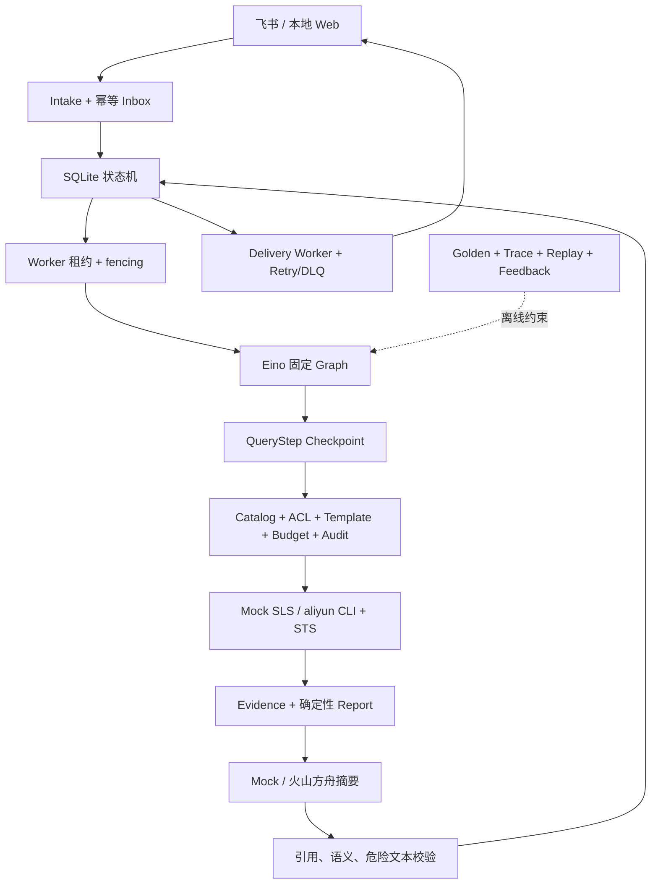
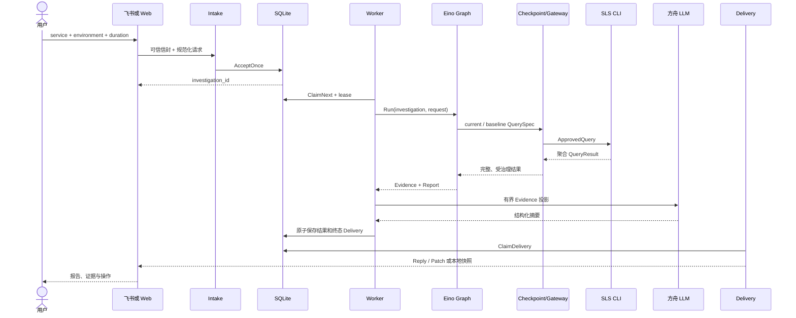
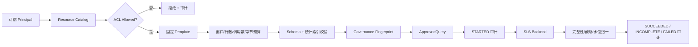
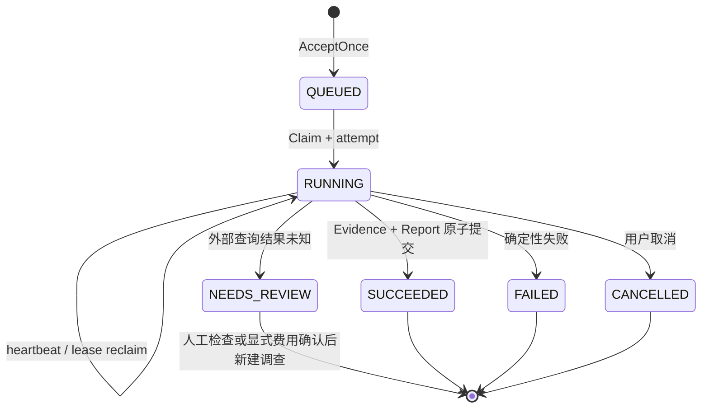
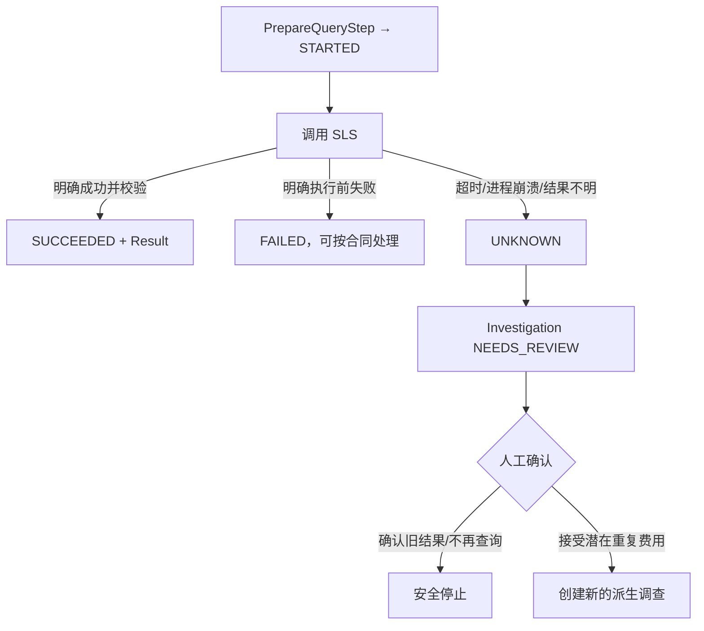
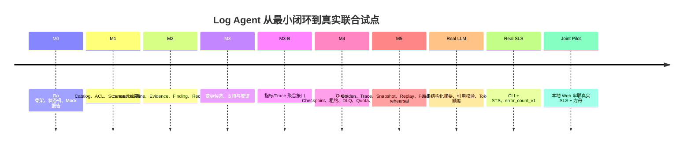

# Log Agent 从 0 到 1：调用链、架构选择与真实演进

> 源码基准：`e115d4dcd7993b1c25e0001be951dad2c2cc1f1c`
> 开发记录截止：2026-09-02
> 面试定位：讲清“为什么长成这样”，而不是背诵最终组件清单
> 事实边界：飞书代码功能已实现、真实平台验收待权限；真实联合样本仅覆盖单主 Logstore 的 count-only 调查

## 0. 阅读路线

| 读者 | 建议读法 |
| --- | --- |
| 第一次看项目 | 先读第 1～5 节，跟着一次请求走完三条链路 |
| 想回答架构选型 | 重点读第 6 节的八项决策 |
| 想回答“从 0 到 1” | 重点读第 7～8 节的时间线和十个阶段 |
| 想回答难点 | 重点读第 9 节的八个困难复盘 |
| 面试前速记 | 直接朗读第 11 节的 90 秒版和 3 分钟版 |

这份文档与 [01-project-architecture.md](./01-project-architecture.md) 的区别是：`01` 回答“现在有哪些组件”，这里回答“为什么先有 A，后来才被问题逼出 B”。一个可信的 0→1 故事，不是“我一开始就设计了完整平台”，而是每一步都能指出当时缺什么、为什么只补这一层、用什么证据确认它有效。

## 1. 类比开场：这座机场不是一天建成的

可以把 Log Agent 想成一座小型机场。M0 只有一条跑道：请求能进来，调查能跑完，结果能落库。很快就会发现，仅有跑道不够：谁能起飞、飞哪条航线、油量够不够，需要安检和塔台，这就是 M1 的查询治理。

有了塔台，还要能解释“为什么允许这次飞行”，于是 M2 建立 Evidence；遇到中断，才发现飞机可能已经离地但本地没记下来，于是 M4 增加 Checkpoint、租约和人工复核；要升级航线，又需要 M5 的回放与评测。最后真实接云时，现有机场条件不支持“大型客机”——DAM 缺少错误类型和实例字段——项目没有伪造条件，而是先让 count-only 的“小飞机”安全起飞。

> 📦 **额外知识：什么叫技术竖切？**
>
> 技术竖切不是先把所有底层平台做完，而是从入口到结果贯通一条最小链路。
> 它的价值是尽早暴露跨层问题：状态、接口、失败和数据合同能否真正衔接。
> M0 就是一条全 Mock 的竖切，证明架构能跑，但不证明真实云和真实飞书可用。

## 2. 最终架构先看一眼，但不要倒因为果

最终有很多组件，但它们不是为了“看起来像 Agent 平台”一起加入的：

| 组件 | 它回答的真实问题 | 首次出现的阶段 |
| --- | --- | --- |
| 状态机与 Worker | 请求怎样脱离入口持续执行 | M0 |
| Eino 固定 Graph | 多步调查怎样保持清晰拓扑 | M0 |
| Query Gateway | 谁能查什么、花多少成本 | M1 |
| Evidence/Report | 结论怎样被复核 | M2 |
| 支持与反证 | 为什么不能把相关性说成根因 | M3 |
| Query Checkpoint | 已付费查询中断后是否重做 | M4-A |
| Delivery/Quota/DLQ | 调查成功后消息失败怎么办 | M4-B |
| Golden/Trace/Replay | 改版本后怎样知道退化了 | M5 |
| 火山方舟摘要 | 确定性报告怎样更易读 | LLM 接入 |
| CLI + STS | 怎样复用企业真实授权方式 | SLS 真实接入 |
| 本地 Web | 飞书权限未到时怎样验收核心链 | 真实联合试点 |

总体原则与阶段表记录在 [development-process.md](file:///D:/日志agent/docs/development-process.md#L23-L62)，最终系统合同见 [spec.md](file:///D:/日志agent/docs/spec.md#L93-L210)。

## 3. 调用链一：一次调查的业务主链路

### 3.1 先看完整时序

### Step 1：入口只接逻辑范围

**输入：** 服务、环境、时长、可选模板 ID，以及适配器拥有的可信身份信封。

**输出：** 规范化 `InvestigationRequest`。用户不能传 Principal、Project、Logstore、字段和 SQL。Web 入口还限制回环地址、Host、CSRF、严格 JSON 与最大时间窗，见 [server.go](file:///D:/日志agent/internal/adapters/localweb/server.go#L97-L225)。

**为什么放在入口：** 入口负责协议和语法，但不负责云资源授权；同一业务请求可以来自飞书或 Web。

### Step 2：Intake 绑定身份并幂等接单

**输入：** 可信 `InboundMessage` 和逻辑调查范围。

**输出：** 一个稳定 investigation ID，以及“新建/重复”的标记。Principal 从信封派生，不接受正文冒充，见 [intake.go](file:///D:/日志agent/internal/application/intake.go#L12-L42)。

SQLite 用 `(app_id, tenant_key, message_id)` 唯一键在同一事务中创建 Investigation、Job 和 QUEUED Delivery；重复消息返回原 ID，见 [store.go](file:///D:/日志agent/internal/adapters/sqlite/store.go#L334-L401)。

### Step 3：Worker 用租约领取长任务

**输入：** SQLite 中可运行的 Job。

**输出：** 带 `lease_owner`、`lease_until` 和递增 `attempt` 的执行权。过期任务可接管，旧 Worker 的迟到写入会因 fencing 条件失败，Claim 逻辑见 [store.go](file:///D:/日志agent/internal/adapters/sqlite/store.go#L404-L488)。

**失败处理：** 进程关闭时不强行写失败，让租约过期后由新 Worker 恢复；用户取消会被心跳观察。

### Step 4：Eino 运行固定调查图

**输入：** investigation ID 与可信请求。

**输出：** 两份 Evidence 和确定性 Report。Graph 固定经过 `plan_queries → execute_queries → build_report → correlate_changes`，见 [engine.go](file:///D:/日志agent/internal/adapters/eino/engine.go#L90-L170)。

**为什么放在 Adapter：** Eino 只组织节点与观测，不拥有数据库事务、权限或 Evidence 真相。

### Step 5：Checkpoint 决定复用、执行还是停止

**输入：** current 或 baseline 的逻辑 `QuerySpec`、当前 Job/attempt 和治理指纹。

**输出：** 已校验的缓存结果、新查询结果，或外部结果未知错误。Checkpoint 独立于 Eino，见 [checkpoint_executor.go](file:///D:/日志agent/internal/application/checkpoint_executor.go#L23-L134)。

**失败处理：** `SUCCEEDED` 且指纹一致才复用；陈旧 `STARTED` 不重查，而是把调查推向 `NEEDS_REVIEW`。

### Step 6：Gateway 把逻辑请求批准成物理查询

**输入：** service、environment、template、时间窗和可信 Principal。

**输出：** 绑定 Resource、Schema、Policy、Budget 与治理指纹的 `ApprovedQuery`。Gateway 统一执行 Catalog、ACL、模板、预算、并发、超时、Schema 与审计，见 [gateway.go](file:///D:/日志agent/internal/application/query/gateway.go#L95-L174)。

### Step 7：CLI Adapter 访问真实 SLS

**输入：** 只能由 Gateway 产生的 `ApprovedQuery`。

**输出：** 规范化 QueryResult，不包含原始日志。`error_count_v1` 每个窗口只做 count-before/count-after，一致才完整；实现见 [backend.go](file:///D:/日志agent/internal/adapters/aliyuncli/backend.go#L89-L129)。

认证由本机 `aliyun` CLI 读取 SSO/STS Profile 并签名；应用不读取或保存 Token。

### Step 8：确定性逻辑形成 Evidence 和 Report

**输入：** current/baseline 聚合结果。

**输出：** 显式 Evidence ID、完整性、Finding、Recommendation 和限制。模型此时尚未参与，因此模型不可用也不影响事实结果。

### Step 9：LLM 只能润色证据

**输入：** 从已校验 Report 构造的有界摘要投影。

**输出：** 带 Evidence 引用的结构化摘要，或者确定性 fallback。`SummaryService` 还处理 Token 额度、超时、引用、建议、危险文本与未知成本，见 [summary.go](file:///D:/日志agent/internal/application/summary.go#L75-L150)。

### Step 10：调查结果与投递分别落地

Worker 原子保存 Evidence、Report、终态和 Delivery 事件；Delivery Worker 再独立领取、发送、退避或进入死信，见 [delivery.go](file:///D:/日志agent/internal/application/delivery.go#L14-L95)。消息平台失败不会推翻已经完成的调查。

> 📦 **额外知识：为什么报告和消息投递要分开？**
>
> 调查成功是业务事实，飞书 Patch 成功是外部通知结果，两者不是一个事务。
> 如果同步绑定，飞书短暂失败会让系统误以为调查失败，重跑又可能重复查询 SLS。
> 使用持久化 Delivery，相当于把“卷宗已写完”和“快递已送达”分别记账。

## 4. 调用链二：同一次查询背后的治理链路

| 关卡 | 输入 | 为什么属于这一层 | 失败或停止方式 | 可验证证据 |
| --- | --- | --- | --- | --- |
| Trusted Principal | 适配器信封 | 文本不能自报身份 | 请求拒绝 | Inbox 与 Requester |
| Catalog | service/environment | 隐藏物理资源 | unknown resource | Catalog 版本 |
| ACL | Principal + resource ID | 云身份内再做业务隔离 | default deny | DENIED Audit |
| Template | template ID + resource version | 禁止任意 SQL/字段 | version mismatch | QuerySpec/Template |
| Budget | 窗口、调用、行、字节、并发 | 约束费用和资源占用 | preflight deny/timeout | policy version |
| Schema | 索引字段能力 | 防止查询语义与真实字段不符 | fail closed | schema fingerprint |
| Fingerprint | 资源+模板+策略+Schema | 防旧 Checkpoint 跨治理复用 | hash mismatch | QueryStep input hash |
| Audit | 开始与终态安全投影 | 查询可追踪、不存 SQL/凭据 | 审计写失败则不执行 | append-only event |
| Normalize | Provider 元数据 | 不完整结果不能变成结论 | INCOMPLETE | Evidence complete=false |

这条链路解释了为什么“只读”仍不等于“可以随便查”：只读操作也会越权读取、扫描巨量数据、产生费用和暴露资源结构。Gateway 是 Policy Enforcement Point，云 RAM 则是更外层的硬权限，两层缺一不可。

## 5. 调用链三：失败、重启和人工复核怎样流转

失败恢复分成三层：

1. **业务任务层**：租约让崩溃 Worker 的任务可接管，attempt 防旧 Worker 迟到提交；
2. **付费查询层**：QueryStep 只复用完整、同治理指纹的结果，外部结果未知不自动重试；
3. **消息投递层**：Delivery 有自己的租约、失败分类、退避和 DLQ，不改变调查终态。

恢复集成测试覆盖“只补 baseline”“两个窗口都复用”和“STARTED 转人工复核”，见 [checkpoint_recovery_integration_test.go](file:///D:/日志agent/internal/application/checkpoint_recovery_integration_test.go#L82-L219)。

## 6. 为什么选择这套架构：八项决策不是“标准答案”

### 决策 1：受治理固定 Graph，而不是开放式 ReAct

**约束：** 首期目标只有当前/基线调查，查询涉及权限和扫描费用。

**备选：** 普通 Go 顺序函数、Eino 固定 Graph、开放式 ReAct。

**选择标准：** 路径是否需要运行时动态规划，以及错误能否被自动验证。

**方案与收益：** 用 Eino 固定节点保持编排可读和可观测；LLM 不决定查询。它比纯函数多一层依赖，但为后续节点演进留下拓扑和 Trace。

**何时重选：** 当固定模板无法覆盖真实故障，并且受限动态规划通过离线评测证明增益时，才在局部开放选择。

### 决策 2：Domain/Application/Ports/Adapters，而不是 Handler 直连 SDK

**约束：** 飞书、SLS、LLM 都可能更换，早期还需要 Mock。

**备选：** HTTP Handler 直接调用 SDK；把业务全写进 Eino Node；端口适配分层。

**方案与收益：** 领域对象表达 Evidence 与状态，应用层表达用例，端口定义依赖方向，外部框架只在 Adapter。Mock/真实 SLS、Mock/方舟、飞书/Web 可以分别替换。

**代价：** 接口和组装代码更多；小 Demo 会显得重。

**何时重选：** 如果系统永远只有一个同步命令和单一 Provider，可减少层数；当前长任务与多外部边界已经证明分层有价值。

### 决策 3：SQLite 状态机、租约和 Checkpoint，而不是模型上下文或纯内存

**约束：** 调查跨越入口请求，进程可能重启，外部调用有费用。

**备选：** 同步执行；内存队列；只保存最终报告；持久化任务和步骤。

**方案与收益：** SQLite 提供本地事务、Inbox 幂等、Job 租约、QueryStep 和 Delivery。单机试点不需要先部署大型基础设施，又能演示可靠语义。

**代价：** 当前多实例、全局配额、备份恢复和容量还未达到生产要求。

**何时重选：** 真实多实例或高吞吐需求出现后，迁移到共享生产数据库和队列，但保持端口与状态机语义。

### 决策 4：受治理 Query Gateway，而不是模型或用户自由生成查询

**约束：** 物理资源、字段、查询语句、费用和权限都属于管理面。

**备选：** 直接传 SQL/SPL；Adapter 各自校验；统一 Gateway。

**方案与收益：** 调用方只提交逻辑范围，Gateway 统一 Catalog、ACL、模板、Schema、预算、并发、审计和结果完整性。Provider 只能收到 `ApprovedQuery`。

**代价：** 每新增调查能力都要注册模板并声明字段合同，灵活性低于自然语言查日志。

**何时重选：** 可增加版本化模板或受限模板路由，但不应移除不可绕过的授权与预算门。

### 决策 5：Evidence-first LLM，而不是原始日志直接喂模型

**约束：** 原始日志包含噪声、敏感数据和潜在注入；模型可能改变事实。

**备选：** LLM 规划查询并读原文；规则完全不使用 LLM；规则产证据后 LLM 摘要。

**方案与收益：** 稳定规则先产生 Evidence、Finding 和 Recommendation，LLM 只把受控投影写成人话。模型失败可以 fallback，不改变调查成败。

**代价：** 模型无法发现结构化 Evidence 之外的新模式；需要额外的引用与语义校验代码。

**何时重选：** 只有脱敏样本的真实质量评测证明有增益，才增加受限日志样本输入。

### 决策 6：CLI + SSO/STS，而不是应用内长期 AK/SK 或继续原 SDK

**约束：** 企业已有 SSO 获取短期 STS、CLI Profile 访问日志的流程。

**备选：** Go SDK 自己管理 Credential Provider；把 AK/SK 写入配置；复用 CLI。

**方案与收益：** Go 启动可信 CLI 子进程，CLI 读 Profile、签名并访问 SLS；应用不读取和保存 STS。查询治理与传输实现解耦。

**代价：** CLI/插件成为部署依赖，STS 过期要续签，当前不适合无人值守 7x24。

**何时重选：** 部署到正式服务后，可在同一 Adapter 端口后换成工作负载身份或组织凭据代理。

### 决策 7：单 Logstore `error_count_v1`，而不是假装已有完整字段或立即做 8 库

**约束：** DAM 主库只有稳定的 `env + level`，缺少 `error_type` 与 `instance_id` 统计字段；8 库字段能力还不同。

**备选：** 伪造字段映射；读取全部 `msg`；推动采集侧立即改造；先缩为 count-only。

**方案与收益：** 每个窗口执行 count-before/count-after，一致才形成 Evidence，只回答错误总量变化。这样在不伪造结论的前提下取得最小真实闭环。

**代价：** 不能回答错误类型、异常实例或根因，也没有 8 库统一时间线。

**何时重选：** 真实需求证明维度分析价值，且采集侧建立索引合同后，升级到 `error_analysis_v2`；跨库 TraceID 是另一条独立需求。

### 决策 8：保留飞书适配器，同时增加本地 Web，而不是等待权限

**约束：** 真实飞书应用权限暂时拿不到，但 SLS 和 LLM 已能联调。

**备选：** 把 Web 当新产品前端；删除飞书；只跑命令行；增加只监听回环的临时适配器。

**方案与收益：** Web 只替代入口和 Sender，复用正式 Intake、SQLite、Worker、Eino、SLS、Summary、Action 与 Delivery。核心链路可以真实联合验收，飞书代码仍保留。

**代价：** 本地 Web 不证明飞书 WebSocket、OpenID、Reply/Patch、卡片视觉和回调权限。

**何时重选：** 获得飞书权限后完成真实平台验收；Web 是否保留由实际本地运维场景决定。

> 📦 **额外知识：架构选择要说“未来何时重选”**
>
> 面试里只说“方案 A 比方案 B 好”容易显得教条。
> 更成熟的回答是：在什么约束下选 A，它付出什么代价，哪个信号出现时应该重选 B。
> 这说明你在管理变化，而不是背固定答案。

## 7. 从 0 到 1 的演进时间线

### 7.1 阶段时间线

路线图的原则从一开始就是“每个阶段交付一条可独立验收的能力”，见 [roadmap.md](file:///D:/日志agent/docs/roadmap.md#L1-L60)。

### 7.2 不是堆功能，而是风险逐层逼出组件

## 8. 十个阶段怎样一步一步搭起来

### 阶段 1：M0——先把调查闭环跑起来

**已有条件：** 只有“做一个 Go 日志 Agent”的目标，没有真实飞书和 SLS 前置权限。

**暴露问题：** 如果直接讨论多 Agent、RAG 或自动根因，连请求能否持久化、重复消息会不会建两次任务都不知道。

**新增组件：** Investigation/Job 状态机、Inbox 幂等、Worker 租约、Eino 固定 Graph、Mock SLS 和 Evidence 雏形。

**为什么不更重：** M0 不用 LLM，不上分布式队列，也不接真实云；先验证跨层数据合同。

**验证与启示：** Demo 和单测证明全 Mock 闭环；只能说明骨架正确。详细归档见 [m0-implementation-archive.md](file:///D:/日志agent/docs/m0-implementation-archive.md#L15-L80)。启示是先建立“能走完”的最小垂直面。

### 阶段 2：M1——给查询加安检和塔台

**前一阶段限制：** `SLSExecutor` 能返回数据，却没有回答谁能查、查哪个资源、扫描多少。

**新增组件：** Resource Catalog、Principal ACL、固定模板、Schema 检查、预算、并发、超时与 Query Audit。

**困难与方案：** 既要让业务只知道 service/environment，又要真实执行物理查询；使用 Gateway 在最后一刻绑定 `ApprovedQuery`。

**为什么不开放自然语言 SQL：** 首期查询固定，自由 SQL 的风险远大于收益。

**验证与启示：** Mock SLS 和 Gateway 测试关闭治理合同，不能证明真实 RAM 与字段。阶段记录见 [m1-readonly-query-foundation.md](file:///D:/日志agent/docs/m1-readonly-query-foundation.md#L12-L86)。

### 阶段 3：M2——让结论带着证据说话

**前一阶段限制：** 有安全查询，不等于有可信排障；单窗口错误多不能说明异常。

**新增组件：** 当前窗口、等长基线、count-before/after、一致性检查、Top-K、Evidence、Finding 和 Recommendation。

**困难与方案：** Top-K 未命中不等于历史从未出现；只有基线分布穷尽且标签可比时才确认“新增”，否则只叫候选。

**为什么不用 LLM 下结论：** 计数与阈值可确定计算，先保证可复现。

**验证与启示：** Mock E2E 证明报告引用与数据质量门禁；阶段记录见 [m2-error-spike-investigation-loop.md](file:///D:/日志agent/docs/m2-error-spike-investigation-loop.md#L5-L61)。启示是 Evidence 应先于漂亮文案。

### 阶段 4：M3——把“像根因”拆成支持与反证

**前一阶段限制：** 检测到突增后，人很容易把最近发布直接当根因。

**新增组件：** 受控 Change Source、候选变更、四项支持测试、三项反证测试、`SUPPORTED/REFUTED/INCONCLUSIVE`。

**困难与方案：** 缺数据时不能把 UNKNOWN 当 PASS；置信度只是最高 0.85 的确定性启发式，不是概率。

**为什么不让模型自由推因：** 变更来源、资源范围和测试规则都需要可信绑定。

**验证与启示：** 静态 Change Catalog 离线通过，真实发布平台未接。实现边界见 [m3-change-correlation-evidence.md](file:///D:/日志agent/docs/m3-change-correlation-evidence.md#L14-L88)。

### 阶段 5：M3-B——为多信号留接口，但不先做重

**前一阶段限制：** 只有日志和静态变更，缺少指标与 Trace 的时间关系。

**新增组件：** 可替换 `OperationalSignalSource`、最多八个聚合观察、确定性异常阈值和统一时间线。

**困难与方案：** 不允许 Provider 返回原始 Span、TraceID、任意标签或自己声明根因，只接受关闭的指标/Trace 聚合合同。

**为什么不拆多 Agent：** 真实 Provider 尚未接，当前只需一个可选数据源节点。

**验证与启示：** `signalmock` 证明接口和降级，不能说接通真实可观测平台。边界见 [m3b-cross-signal-incident-timeline.md](file:///D:/日志agent/docs/m3b-cross-signal-incident-timeline.md#L12-L104)。

### 阶段 6：M4——解决“执行过没有”的可靠性难题

**前一阶段限制：** Worker 崩溃后可以重领，但已付费 SLS 查询可能执行成功而本地没落结果。

**新增组件：** QueryStep、输入 Hash、治理指纹、STARTED/SUCCEEDED/UNKNOWN、`NEEDS_REVIEW`、Delivery 重试/DLQ、租户额度和费用确认。

**困难与方案：** 本地事务无法覆盖外部 API；不追求虚假的 exactly-once，而是识别未知结果并安全停止。

**为什么不统一重试三次：** 重试无法消除结果未知，反而可能重复收费。

**验证与启示：** SQLite 集成测试覆盖恢复和 fencing；仍是单机技术预览。详见 [m4-recoverable-query-steps.md](file:///D:/日志agent/docs/m4-recoverable-query-steps.md#L9-L117) 与 [m4b-reliability-governance.md](file:///D:/日志agent/docs/m4b-reliability-governance.md#L5-L107)。

### 阶段 7：M5——让 Agent 的升级可以比较

**前一阶段限制：** 单测能验证函数，但不能回答 Graph、工具调用、证据和费用整体是否退化。

**新增组件：** 合成 Golden、Agent Trace、版本 Manifest、Snapshot、Replay、Compare、Mock Reviewer 反馈和离线灰度/回滚决策。

**困难与方案：** 不同数据集或版本身份不能硬算数值差异；不兼容时返回 `INCOMPARABLE`，快照 append-only 并做内容 Hash。

**为什么不直接线上 A/B：** 还没有生产流量、真实飞书和历史标注，先关闭离线停止条件更安全。

**验证与启示：** 全合成离线评测只能证明工程回归能力。数据边界写入报告，见 [runner.go](file:///D:/日志agent/internal/evaluation/runner.go#L107-L203)。

### 阶段 8：接入真实 LLM，但只给它编辑权

**前一阶段限制：** 确定性报告可信但不够易读，`summarymock` 不能证明真实模型认证和输出。

**新增组件：** `ReportSummarizer`、火山方舟 Adapter、严格结构、Evidence 引用校验、fallback、Prompt 指纹和 Token 额度。

**困难与方案：** 模型结果结构正确仍可能语义越界；Go 侧重新校验允许引用和建议集合，任何异常都回退。

**验证与启示：** 独立 Smoke 证明认证与合同；真实联合样本证明同调查可调用。它们都不证明历史故障摘要质量。记录见 [llm-evidence-summary.md](file:///D:/日志agent/docs/llm-evidence-summary.md#L105-L164)。

### 阶段 9：真实 SLS 从 SDK 迁到 CLI + STS，并收缩字段合同

**前一阶段限制：** 原 SDK 凭据流程不符合企业 SSO；真实 DAM 又不满足 `error_analysis_v2` 的维度字段。

**新增组件：** `aliyuncli` Adapter、可信 CLI 路径、Profile、响应兼容和 `error_count_v1`。

**困难与方案：** 先验证 8 个 Logstore 的连通性，再只选择主 Logstore 跑 Agent；缺字段时不拉原始 `msg`，只做计数。

**验证与启示：** `sls-check`、`sls-smoke` 与 count-only Worker 已访问真实 SLS；不代表 8 库统一排障。迁移见 [sls-cli-sts-migration.md](file:///D:/日志agent/docs/sls-cli-sts-migration.md#L1-L140)，试点边界见 [dam-single-logstore-pilot.md](file:///D:/日志agent/docs/dam-single-logstore-pilot.md#L3-L68)。

### 阶段 10：飞书权限未到，用本地 Web 完成联合试点

**前一阶段限制：** 真实 SLS 和方舟可以单独调用，但无法在真实飞书里完成一次交互闭环。

**新增组件：** 只监听 `127.0.0.1` 的 Web Adapter、本地安全身份、CSRF/Host/CSP、页面安全投影和本地 Sender。

**困难与方案：** 必须证明 Web 只替换入口，不能另写一套“简化 Agent”；组装代码复用正式 Worker、Eino、Gateway、Summary、Action 和 Delivery，见 [web.go](file:///D:/日志agent/cmd/logagent/web.go#L21-L110)。

**验证与启示：** 同一次调查真实访问 SLS current/baseline、方舟摘要并本地投递成功；飞书仍是待验收外部边界。实际记录见 [development-process.md](file:///D:/日志agent/docs/development-process.md#L250-L280)。

## 9. 八个困难怎样解决：现象、根因、方案、效果和启示

### 困难 1：既想用 Eino，又不想被框架绑住

**现象：** 多步骤调查适合 Graph，但状态、权限和可靠性如果也依赖框架，升级影响面会失控。

**根因：** 把“编排机制”和“业务真相”混成了一个职责。

**被否决方向：** 全部手写会重复编排基础设施；全部托管给 Eino 会让框架类型渗透领域层。

**最终方案：** Eino 只实现 `InvestigationEngine`，状态、Evidence、ACL、Checkpoint 和额度留在 Application/SQLite，并用架构测试守依赖边界。

**验证结果：** Mock/真实 SLS、Mock/方舟和飞书/Web 都能在不修改领域合同的情况下切换；这是代码与测试证据，不是生产规模证明。

**启示：** 引入框架时最重要的问题不是“框架会什么”，而是“退出框架时哪些东西不能丢”。

**尚存限制：** 当前没有真的实现第二套非 Eino Engine，替换成本只通过端口和边界测试间接证明。

### 困难 2：没有外部权限时，怎样继续做而不自欺

**现象：** 早期拿不到真实飞书和稳定云资源，等待会让所有内部设计停住。

**根因：** 外部组织流程和核心代码开发节奏不同。

**被否决方向：** 把固定 Demo 数据叫生产日志；或者等所有权限齐全再写任何代码。

**最终方案：** 为 SLS、飞书、摘要、信号和 Runbook 建端口与确定性 Mock，先关闭 Intake、状态、Graph、证据和 Delivery 合同。

**验证结果：** `mock-e2e` 可以零凭据运行并检查固定调用数、Checkpoint 和投递；它只证明内部闭环。

**启示：** Mock 的价值是把“我们还不知道外部是否可用”和“内部合同是否正确”分开。

**尚存限制：** Mock 无法发现真实字段、认证、限流、客户端视觉和模型语义质量问题。

### 困难 3：原 SDK 方案与企业 SSO/STS 习惯冲突

**现象：** Go SDK 可以调用 SLS，但真实使用者通过 SSO 获取临时 STS 并配置本机 CLI。

**根因：** 技术上可调用不等于符合组织的凭据生命周期和账号切换方式。

**被否决方向：** 让用户把 AK/SK/Token 发进聊天或写进项目配置；继续维护重复的 SDK Credential Provider。

**最终方案：** 迁移到受控 CLI 子进程，Profile 由用户终端配置，应用移除凭据环境覆盖、Shell 拼接、debug 和自动插件安装。

**验证结果：** 8 个 Logstore 元数据查询均 Complete，主 Logstore 的 `sls-check`、`sls-smoke` 和 Worker 查询通过真实 SLS。

**启示：** 外部适配不仅适配 API，也要适配组织的授权方式；最安全的凭据往往是应用根本看不到的凭据。

**尚存限制：** CLI、插件和人工续签是运行依赖，不适合当前形态直接做无人值守服务。

### 困难 4：真实日志字段与原调查模板不匹配

**现象：** `error_analysis_v2` 需要 `error_type` 和 `instance_id`，DAM 主库只有稳定的 `env + level`。

**根因：** 离线设计基于理想化结构字段，真实日志采集合同更弱。

**被否决方向：** 把 `msg` 文本冒充错误类型；假设不存在的索引；为了展示完整功能直接拉取全部原始日志。

**最终方案：** 新增 `error_count_v1`，只做 current/baseline 两窗口计数，每窗口前后计数一致才接受。

**验证结果：** 单主 Logstore count-only 联合 E2E 成功，明确输出趋势而不输出类型、实例和根因。

**启示：** 真实接入时，缩小一个诚实合同比维持一个虚假的完整能力更有价值。

**尚存限制：** 要升级维度分析仍需采集侧字段、索引和真实历史样本评测。

### 困难 5：LLM 提高可读性，却可能改写事实

**现象：** 规则报告可信但生硬；模型摘要更自然，却可能新增原因、引用不存在证据或给危险建议。

**根因：** 结构化生成仍是概率输出，JSON 形状正确不代表业务语义正确。

**被否决方向：** 把原始日志和自由工具全部交给模型；或者因风险完全不用 LLM。

**最终方案：** Evidence-first，模型只读有界报告；Go 侧校验 Evidence ID、建议 Code、支持候选、Token 和危险文本，失败则 fallback。

**验证结果：** Mock 安全突变集、方舟独立 Smoke 和真实联合调用通过；没有真实历史事故专家质量结论。

**启示：** 把模型定位为“受约束编辑”比定位为“事实裁判”更适合首期排障 Agent。

**尚存限制：** 应用校验不能证明所有自然语言句子语义正确，仍需专家标注和留存审批。

### 困难 6：外部查询已经执行，本地却来不及记结果

**现象：** 进程可能在 SLS 返回后、SQLite Commit 前崩溃；重启只看到任务未完成。

**根因：** 本地数据库事务无法原子覆盖远端 API 和扫描费用。

**被否决方向：** 统一重试三次；把超时当成“肯定没执行”；声称实现端到端 exactly-once。

**最终方案：** 调用前落 QueryStep STARTED，成功后验证并 COMPLETE；陈旧 STARTED 转 UNKNOWN 和 `NEEDS_REVIEW`，不自动查询。

**验证结果：** 集成测试证明缺 baseline 时只补一次、完成结果可复用、未知结果不二次调用 Provider。

**启示：** 可靠系统先承认“不知道”，再设计安全停止；错误的确定性比显式不确定更危险。

**尚存限制：** CLI 没有稳定暴露 Provider Request ID，当前不能自动向云端对账未知结果。

### 困难 7：飞书权限未到，但需要完整验证应用链路

**现象：** 已能访问真实 SLS 和方舟，却无法真实收飞书事件和操作卡片。

**根因：** UI 平台授权是独立外部前置条件，不应阻塞核心系统验收。

**被否决方向：** 把 `mock-e2e` 当真实联合验收；删除飞书代码改做另一个产品；等待权限而停止联调。

**最终方案：** 新增回环 Web Adapter，只替代 Receiver/Sender，复用正式 Intake、Worker、Eino、Gateway、Summary、Action 与 Delivery。

**验证结果：** Mock Web、真实 SLS + Mock LLM、真实 SLS + 真实方舟三个层级依次通过。

**启示：** 架构端口不仅方便测试，也能把“某个入口不可用”从“整个 Agent 不可验证”中解耦。

**尚存限制：** Web 成功不能证明飞书 WebSocket、OpenID、卡片视觉、Reply/Patch 和回调权限。

### 困难 8：真实联调中的密钥与 Windows 工具摩擦

**现象：** 方舟页面显示的资源 ID 被误认为 Key；浏览器自动化剪贴板没有进入 Windows PowerShell；`$home` 与只读 `$HOME` 冲突。

**根因：** 控制台展示、自动化沙箱和 PowerShell 变量语义属于三套不同运行边界。

**被否决方向：** 把 Key 写进仓库或聊天；长期保留临时传递文件；使用系统变量名保存任务数据。

**最终方案：** 只操作本次专用 Key，使用一次性本机临时文件传给单次进程，立即删除并停止携带 Key 的进程；变量改为任务专用名称。

**验证结果：** 联合验收后删除临时 Key、传递文件和环境变量，并确认仓库、SQLite、测试输出与文档无凭据。

**启示：** 接入真实 LLM 的难点不只在 HTTP API，凭据从人到进程再到清理的完整生命周期同样属于架构。

**尚存限制：** 正式运行仍需组织密钥系统直接向 Worker 注入，临时文件方法只用于一次受控验收。

## 10. 效果怎样说才不越界

| 证据层级 | 已经证明什么 | 不能证明什么 | 项目中的例子 |
| --- | --- | --- | --- |
| 单元/集成测试 | 函数合同、状态机、失败分支、引用和 fencing | 真实认证、网络、字段与模型质量 | Gateway、Checkpoint、Summary 测试 |
| Mock E2E | 正式应用链从入口到 Delivery 能闭环 | 阿里云、方舟、飞书平台真实可用 | `go run ./cmd/logagent mock-e2e` |
| 合成评测/Replay | 固定数据下版本、Evidence、预算与反证无工程回归 | 真实事故分布、专家满意度、线上收益 | M5 Golden、Trace、Snapshot |
| 独立真实 Smoke | 某个 Provider 的认证和最小合同可用 | 与其他真实系统同事务、长期稳定性 | `sls-smoke`、`llm-smoke` |
| 本地联合样本 | 单库 count-only 的真实 SLS + 方舟能在同一调查闭环 | 真实飞书、8 库、根因、准确率和生产规模 | 2026-09-01 Web 调查 |
| 生产灰度 | 当前尚未进行 | 不能预先声称日常可用或有量化收益 | M5-C C3 待输入 |

> 📦 **额外知识：验证层级不是“通过/失败”二元标签**
>
> 同一条测试通过，在不同环境里能支持的结论不同。
> Mock E2E 对应用合同很有价值，但它不能替真实云；一次真实 Smoke 很重要，但不能代表长期质量。
> 面试时主动说清证据外推边界，通常比报一个没有来源的“准确率”更专业。

真实联合样本是：调查 `SUCCEEDED`，current/baseline 两份 Evidence 均 Complete，规则结果为 `no_significant_spike`，方舟生成摘要，本地 Delivery 成功。计数 19 与 38 只是当时 10 分钟连接样本，不是故障或长期基线；完整安全投影见 [development-process.md](file:///D:/日志agent/docs/development-process.md#L265-L280)。

## 11. 两个可以直接朗读的调用链脚本

### 11.1 60～90 秒全链路版

“这个项目可以理解成一名权限受控的值班工程师。用户从飞书或者本地 Web 提交服务、环境和时间范围，入口不接受 Project、Logstore 或 SQL。Intake 先从可信信封绑定身份，再用消息唯一键幂等接单，把调查和任务写进 SQLite。

Worker 用租约领取任务，Eino 按固定 Graph 依次规划当前窗口和基线窗口。每次查询先经过 Checkpoint，再进入 Query Gateway；Gateway 会解析资源目录、检查 ACL、固定模板、时间和费用预算、索引 Schema，并写审计，最后才让 CLI 使用本机 STS Profile 访问阿里云 SLS。

查询结果先由 Go 代码形成 Evidence 和确定性报告，火山方舟只负责把这些证据总结得更易读，返回后还要检查 Evidence 引用和危险建议，失败就回退。最终结果和投递事件一起落库，Delivery Worker 再独立更新飞书卡片或本地页面。这样即使模型、查询或消息平台失败，系统也知道在哪一层失败、能否重试，以及什么时候必须停下来交给人。”

### 11.2 从用户点击提交开始的 3 分钟故事版

“假设值班同学发现 DAM 有异常，他在页面里选择 `dam-server`、`test` 和最近 10 分钟。第一件事不是去查日志，而是把输入收窄成逻辑范围。身份由服务端固定，用户不能在请求里伪造别人的 OpenID，也不能指定物理日志库。

请求进入 Intake 后，SQLite 会在一个事务里写 Inbox、Investigation、Job 和 QUEUED 投递事件。如果浏览器重复提交同一个 request ID，唯一键会返回同一个调查，不会再查一次日志。随后 Worker 领取任务，得到一段有期限的租约和递增 attempt。即使旧 Worker 卡住后又恢复，它也不能覆盖新 Worker 的结果。

接着 Eino 固定图开始执行。它不会让大模型临场决定 SQL，而是固定产生 current 和 baseline 两个逻辑查询。每个查询先看 QueryStep：完整且治理指纹一致的结果可以复用；如果只看到 STARTED，说明上一次可能已经付费执行但本地没记住结果，系统会转 `NEEDS_REVIEW`，不会盲目再查。

真正访问 SLS 前还要经过 Query Gateway。它把 `dam-server/test` 映射成管理员配置的主 Logstore，校验当前身份 ACL、`error_count_v1` 模板、时间窗、调用数、扫描字节、并发和索引 Schema，然后写 STARTED 审计。CLI 从本机 STS Profile 完成签名，应用自己不读取 Token。因为真实 DAM 缺少 `error_type` 和 `instance_id`，这里没有假装能识别错误类型，只做 count-before/count-after；两次一致才算完整 Evidence。

current 和 baseline 回来后，Go 规则先判断是否明显突增，并生成 Evidence、Finding、Recommendation 和限制。到这一步，模型还没有参与，所以方舟不可用也不影响事实报告。模型只收到脱敏、有界的证据投影，用结构化格式生成摘要；Go 再验证引用 ID、建议 Code 和危险文本，任何越界都换成确定性 fallback。

最后 Worker 原子保存报告和终态投递事件。Delivery Worker 独立发送，所以飞书暂时失败不会把已经完成的 SLS 调查改成失败。2026 年 9 月 1 日我们用本地 Web 入口把真实 SLS 和真实方舟串进同一次调查，证明了这条单库 count-only 应用链可以运行；但飞书真实平台、8 库统一时间线、根因准确率和生产灰度仍然是明确的后续工作。”

## 12. 源码与开发记录索引

| 想验证的问题 | 入口 |
| --- | --- |
| 项目为何按阶段演进 | [development-process.md](file:///D:/日志agent/docs/development-process.md#L46-L219) |
| M0 最小骨架 | [m0-implementation-archive.md](file:///D:/日志agent/docs/m0-implementation-archive.md#L15-L80) |
| M1 查询治理 | [m1-readonly-query-foundation.md](file:///D:/日志agent/docs/m1-readonly-query-foundation.md#L12-L86) |
| M2 证据调查 | [m2-error-spike-investigation-loop.md](file:///D:/日志agent/docs/m2-error-spike-investigation-loop.md#L5-L61) |
| M3 支持与反证 | [m3-change-correlation-evidence.md](file:///D:/日志agent/docs/m3-change-correlation-evidence.md#L14-L88) |
| M4 查询恢复 | [m4-recoverable-query-steps.md](file:///D:/日志agent/docs/m4-recoverable-query-steps.md#L9-L117) |
| M5 评测与回放 | [m5-agent-observability-replay.md](file:///D:/日志agent/docs/m5-agent-observability-replay.md#L13-L117) |
| Eino 固定 Graph | [engine.go](file:///D:/日志agent/internal/adapters/eino/engine.go#L90-L170) |
| 查询治理执行 | [gateway.go](file:///D:/日志agent/internal/application/query/gateway.go#L95-L174) |
| Worker 与未知结果 | [worker.go](file:///D:/日志agent/internal/application/worker.go#L70-L148) |
| CLI SLS 计数模板 | [backend.go](file:///D:/日志agent/internal/adapters/aliyuncli/backend.go#L89-L129) |
| Evidence 约束摘要 | [summary.go](file:///D:/日志agent/internal/application/summary.go#L75-L150) |
| 本地 Web 组装 | [web.go](file:///D:/日志agent/cmd/logagent/web.go#L21-L110) |
| 真实联合验收 | [development-process.md](file:///D:/日志agent/docs/development-process.md#L221-L308) |

> 💡 **一句话记住**：Log Agent 的架构不是一次“设计得很全”，而是每遇到一个真实风险就增加一层最小护栏，最终让模型负责表达，让系统负责权限、状态、证据和停止。
